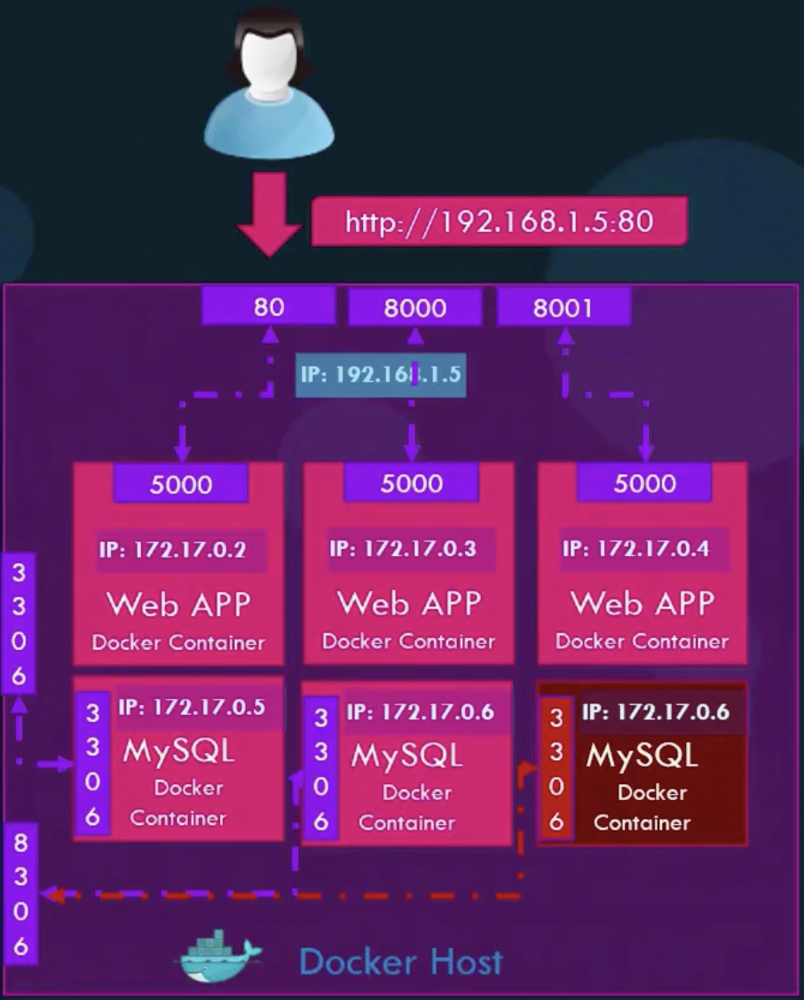
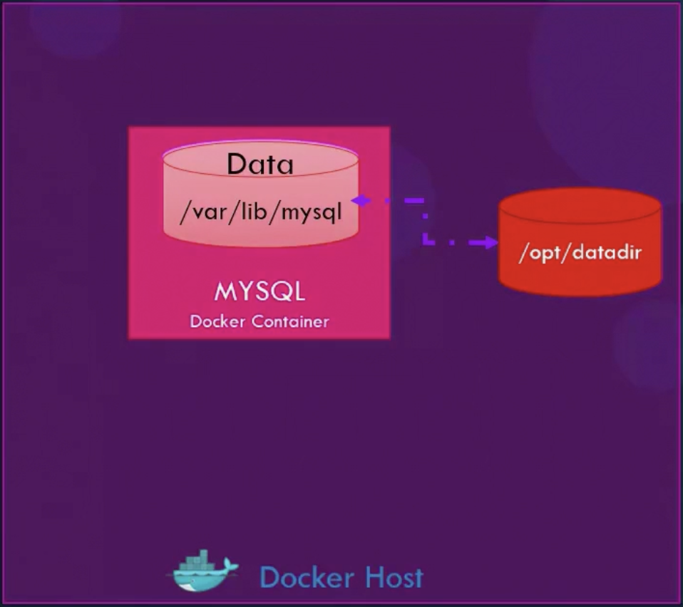
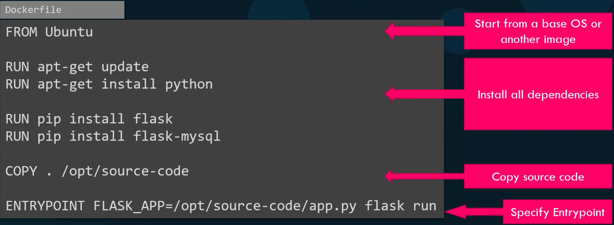
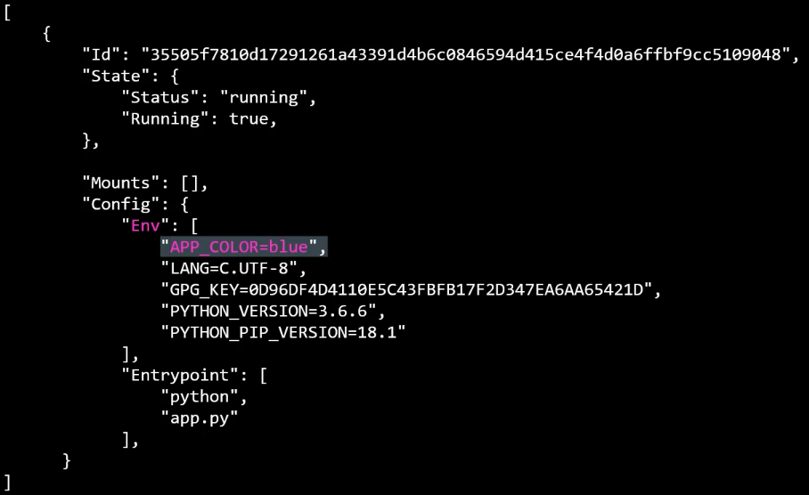
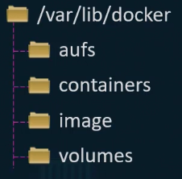
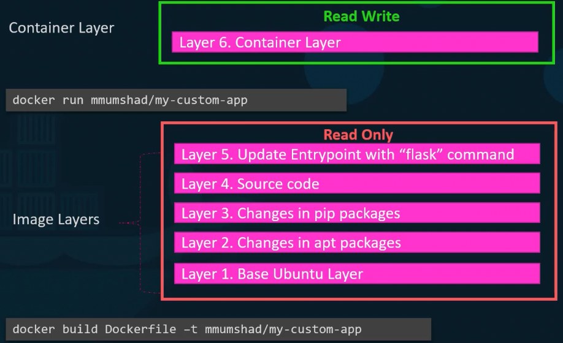
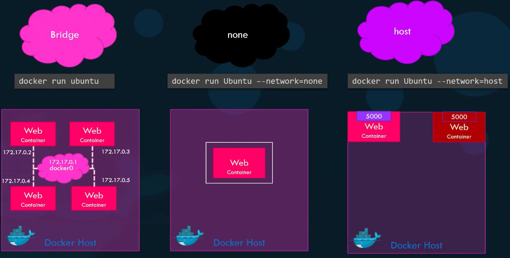
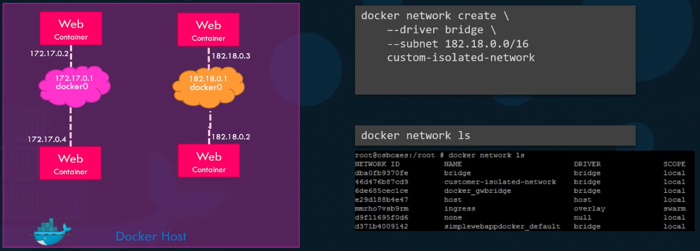

<h1 style="font-family: '仿宋', 'FangSong', 'Times New Roman', serif; color: orange; font-size: 2em; font-weight: bold; text-align: center; border-bottom: none; margin-bottom: 0;">Docker 进阶</h1>
<p style="font-family: 'Times New Roman', serif; font-size: 1em; text-align: right; margin-top: 0;">Livia Tassel</p>
<div style="font-family: 'Times New Roman', 'FangSong', '仿宋', serif;">

[TOC]

# Docker 安装
```bash
for pkg in docker.io docker-doc docker-compose docker-compose-v2 podman-docker containerd runc; do sudo apt-get remove $pkg; done
curl -fsSL https://get.docker.com -o get-docker.sh
sudo sh ./get-docker.sh --dry-run
``` 

自动化部署完 Docker 后，检查版本：
```bash
sudo docker version
```

# Docker 命令速查表
| 命令 | 描述 |
| :---: | :---: |
| docker ps | 查看本地正在运行的容器 |
| docker ps -a | 查看包括已停止的所有容器 |
| docker run image_name | 启动新的容器 |
| docker run -d image_name | 在后台运行容器 (分离模式) |
| docker attach container_name/id | 重连后台运行的容器 |
| docker run -it image_name /bin/bash | 启动容器并进入交互式 Shell |
| docker run --name container_name image_name | 为容器命名运行 |
| docker run -p 8080:80 image_name | 映射端口 (宿主机端口:容器端口) |
| docker run -v host_path:container_path image_name | 磁盘映射 (卷挂载) (宿主机路径:容器路径) |
| docker run -e VAR=value image_name | 设置环境变量 |
| docker start container_name/id | 启动已停止的容器 |
| docker stop container_name/id | 停止正在运行的容器 |
| docker restart container_name/id | 重启容器 |
| docker exec -it container_name/id /bin/bash | 进入正在运行的容器的交互模式 |
| docker logs container_name/id | 查看容器的日志输出 |
| docker logs -f container_name/id | 实时跟踪查看容器的日志 |
| docker top container_name/id | 查看容器内部运行的进程 |
| docker inspect container_name/id | 查看容器的底层详细信息 (JSON 格式) |
| docker rm container_name/id | 删除已停止的容器 |
| docker rm -f container_name/id | 强制删除正在运行的容器 |
| docker container prune | 删除所有已停止的容器 |
| docker images | 查看本地所有镜像 |
| docker pull image_name:tag | 从 Docker Hub 拉取镜像 |
| docker build -t image_name:tag . | 从当前目录的 Dockerfile 构建镜像 |
| docker rmi image_name/id | 删除镜像 |
| docker inspect image_name/id | 查看镜像的底层详细信息 (JSON 格式) |
| docker image prune | 删除所有悬空 (dangling) 镜像 |
| docker image prune -a | 删除所有未被任何容器使用的镜像 |
| docker info | 查看 Docker 系统信息 (配置、驱动、资源等) |
| docker version | 查看 Docker 客户端和服务器版本 |
| docker network ls | 查看 Docker 网络列表 |
| docker volume ls | 查看 Docker 卷 (volumes) 列表 |
| docker volume prune | 删除所有未被任何容器使用的卷 |
| docker system prune | 清理所有未使用的资源 (容器、网络、卷、镜像) |
| docker system prune -a --volumes | 清理一切 |

# 端口映射
将 Docker 内部端口映射到宿主机端口，以便可以从外部访问。注意，不能多次映射到主机的同一端口。


# 磁盘映射
将容器内部的磁盘映射到本地，此时删除容器，磁盘中的文件依旧会在本地保留。


# 自定义镜像
基于现有的 Ubuntu 镜像自定义镜像：
```Dockerfile
FROM Ubuntu
RUN apt-get update
RUN apt-get install python
RUN pip install flask
RUN pip install flask-mysql
COPY./opt/source-code
ENTRYPoINT FLASK_APP=/opt/source-code/app.py flask run
```

执行创建命令，并推送到 Docker Hub 仓库：
```bash
docker login
docker build Dockerfile -t livia/custom-ubuntu
docker push livia/custom-ubuntu
```


>**自上而下**
 Base Image（基础镜像）：以现有镜像为基础创建自定义镜像。
 Install Dependencies（依赖）：在基础镜像内部执行命令，以搭建基础环境。
 Copy Code（复制源码）：将 Dockerfile 所在目录下所有文件复制到镜像内部的新目录 /opt/source-code 中，通常是测试代码。
 Sepcify Entrypoint（指定入口）：指定容器从该镜像启动时，默认执行的命令。

## CMD
CMD 和 ENTRYPOINT 在 Dockerfile 中都是“容器启动时要执行的命令”，但它们的**核心区别**在于：「主命令」、「默认参数」，以及在 `docker run` 时能否覆盖。

### 🐳

| 特性 | CMD | ENTRYPOINT |
|:----:| :----: | :-----------: |
| 定义位置 | Dockerfile 中只能有一个 CMD（后写的覆盖前写的） | Dockerfile 中只能有一个 ENTRYPOINT |
| 作用 | 为容器提供**默认命令或参数** | 定义容器**固定要执行的主命令** |
| 能否被 `docker run` 覆盖 | ✅ 会 | ⚙️ 不会 |
| 常见用法 | 提供可变参数 | 定义不可变的主执行命令 |

1. 只有 CMD 的情况
```Dockerfile
FROM ubuntu
CMD ["sleep", "5"]
```

执行：
```bash
docker run myimage
```
👉 默认执行 `sleep 5`。

覆盖默认命令：
```bash
docker run myimage echo "hello"
```
👉 执行 `echo "hello"`（`sleep 5` 被覆盖）。

2. 只有 ENTRYPOINT 的情况
```Dockerfile
FROM ubuntu
ENTRYPOINT ["sleep"]
```

执行：
```bash
docker run myimage 5
```
👉 实际执行的是 `sleep 5`。

不加参数：
```bash
docker run myimage
```
👉 报错：`sleep: missing operand`，因为 ENTRYPOINT 不会自动附带参数。

3. ENTRYPOINT + CMD 组合
```Dockerfile
FROM ubuntu
ENTRYPOINT ["sleep"]
CMD ["5"]
```

执行：
```bash
docker run myimage
```
👉 默认执行 `sleep 5`

执行：
```bash
docker run myimage 10
```
👉 执行 `sleep 10`。

# 环境变量
通常在 Docker 中会有一些环境值占位符可以用 `-e` 指明，若不指明则为默认值。


# Docker Compose
当程序由多个服务组成时（如 Web、缓存等），如果只用 `docker run`：
- 每个服务都要单独运行命令
- 手动配置网络、端口、卷等
- 服务之间的依赖关系

Docker Compose 能让多容器应用 “一条命令启动，一条命令停止”，就像编译中的 cmake 一样，其核心在于 `docker-compose.yml` 文件，包含要运行的服务（service）、网络、卷等：
```yml
version: '3'
services:
  web:
    image: simple-webapp
    ports:
      - "8080:8080"
  mongo:
    image: mongo
  redis:
    image: redis:alpine
```
| 命令 | 描述 |
| :---: | :---: |
| docker compose up | 启动所有服务 |
| docker compose up -d | 后台启动 |
| docker compose down | 停止并删除容器 |
| docker compose ps | 查看 compose 启动的服务 |
| docker compose logs | 查看 compose 日志 |

[Demo for Docker Compose](https://learn.kodekloud.com/user/courses/docker-training-course-for-the-absolute-beginner/module/e4f7711c-d82a-4953-ab4c-bce10b901ed9/lesson/4af86780-4231-4629-ba0f-1c7be812b70b?autoplay=true)、[Install Docker Compose](https://docs.docker.com/compose/install)

# Docker Engine
## 概览
- **Docker Engine** 是 Docker 平台的核心组件，管理镜像、容器、网络和存储。
- 采用**客户端-服务器（Client-Server）架构**：
  - **Docker CLI（客户端）**：用户与 Docker 交互的命令行工具（`docker`）。
  - **Docker Daemon（守护进程）`dockerd`（服务器）**：实际执行镜像拉取、容器创建、网络管理等操作，并暴露出 REST API。
  - **REST API**：Docker Daemon 提供的 HTTP API，供 CLI、GUI 或其它自动化工具调用。
- 现代 Docker Engine 栈包含：`dockerd` → `containerd` → `runc`（或其他运行时），其中 `containerd` 负责容器生命，`runc` 执行容器进程（使用 Linux namespaces、cgroups）。

# Docker Storage
- Docker 存储（Storage）涵盖**镜像**、**容器可写**、**存储驱动（storage driver）**、**卷（volumes）**、**绑定挂载（bind mounts）** 与 **tmpfs** 等概念。
- 默认宿主机路径是 `/var/lib/docker`，里面包含镜像、容器、卷、overlay/aufs 等存储驱动相关目录。


## 写时复制
- 镜像由多个**只读片**组成；当基于镜像启动容器时，Docker 在其上创建一个**可写片**（container writable layer）。
- 写时复制（CoW）机制：只有当容器修改文件时，才会在可写片创建新副本，节省磁盘空间。
- 镜像片由存储驱动负责并可被多个容器共享。


## 存储驱动（Storage Drivers）
- 常见驱动：`overlay2`（推荐）、`aufs`（较旧）、`devicemapper`、`btrfs`、`zfs` 等。
- 驱动职责：镜像片与容器片的合并与存储实现。

## 卷 vs 绑定挂载 vs tmpfs
1. **Volumes（命名卷 / Docker 操作）**
   - 由 Docker 操作，存放在 Docker 的存储位置（如 `/var/lib/docker/volumes/...`）。
   - 可用 `docker volume create`、`docker volume ls`、`docker volume inspect`、`docker volume rm` 操作。
   - 常用于持久化、在容器间共享、以及 Compose 中声明持久化。

2. **Bind mounts（绑定挂载宿主机路径）**
   - 把宿主机上的目录或文件挂载到容器内（`-v /host/path:/container/path` 或 `--mount type=bind`）。

3. **tmpfs**
   - 临时内存文件系统，仅存在内存（未持久化），适合缓存。
   - 示例：`docker run -d --tmpfs /tmp:rw,size=64m myimage`

# 网络
Docker 安装后自动创建三个网络：


## bridge（默认网络）
* 容器默认加入 bridge 网络。
* Docker 会给容器分配私有 IP，并提供 NAT，让容器可以访问外部网络。
* 多个容器在同一个 bridge 下可以互相通信。
* 命令：
  ```bash
  docker run ubuntu
  docker run --network=bridge ubuntu
  ```
### 自定义网络
容器默认加入 bridge 网络，如果想隔离部分容器，可以自定义网络。另外，通过 `docker inspect` 可以找到 bridge 部分配置，检查当前容器的网络，IP 以及 MAC 地址：


## none
* 容器没有网络接口（除了 loopback）。
* 容器无法访问其他容器和外网，完全隔离。
* 命令：
  ```bash
  docker run --network=none ubuntu
  ```

## host
* 容器直接占用宿主机网络栈。
* 不再有独立 IP，端口冲突风险大。
* 网络性能最好。
* 命令：
  ```bash
  docker run --network=host ubuntu
  ```
