<h1 style="font-family: '仿宋', 'FangSong', 'Times New Roman', serif; color: orange; font-size: 2em; font-weight: bold; text-align: center; border-bottom: none; margin-bottom: 0;">KV Cache 压缩</h1>

Livia Tassel

[TOC]

# ExCP: Extreme LLM Checkpoint Compression via Weight-Momentum Joint Shrinking
论文：https://arxiv.org/abs/2406.11257
代码：https://github.com/Gaffey/ExCP
年份：2024.6.17
核心：checkpoint 的存储压缩

## 名词解释
- 检查点（Checkpoint）：LLM 训练途中定期保存参数、优化器状态等信息，避免意外情况导致模型从头训练。
- 优化器（Optimizer）：优化器本质上是一种算法，根据 LLM 的损失值与梯度得出参数优化的方向与步长。常见的优化器如 “Adam” 的检查点除上述信息外，还会保存 “动量状态”（几乎和 LLM 参数一样大），为此 ExCP 论文中尝试利用联合权重和动量剪枝来对 LLM checkpoint 进行压缩。
- 动量（Momentum）：动量是 Adam 等优化器的 “核心组件”，作用是记住之前的参数更新方向（一阶矩 ($v_{t}$)）与步长（二阶矩 ($m_{t}$)），让参数更新稳定、更快。
- 量化（Quantization）：论文中采用非均匀量化，即对于核心参数高精度存储（FP16/FP32），而非核心参数整型存储。
- 残差（Residual）：即相邻两个参数之间的差异，LLM 大部分参数残差具有稀疏性，也正因此非常适合压缩。
- 近无损恢复（Nearly Lossless Recovery）：从压缩后的 checkpoint 恢复训练时，得到的 LLM 几乎没有性能损失。

## 核心方法
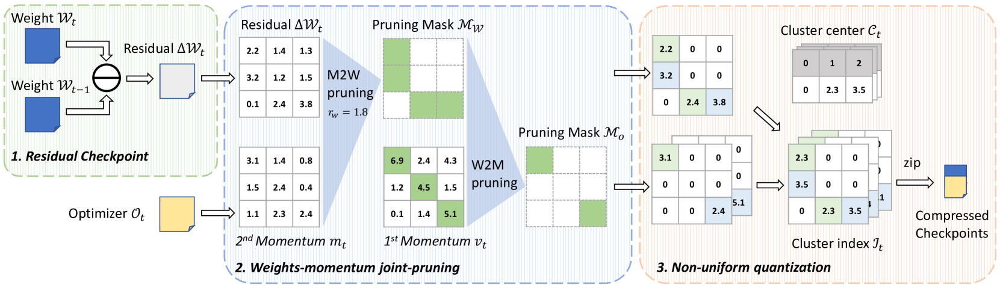
### 残差检查点（Residual Checkpoint）
- **输入**：当前训练轮次的模型权重 $W_t$、上一轮次的模型权重 $W_{t-1}$，以及优化器状态 $\mathcal{O}_t$。 
- **操作**：**权重残差** $\Delta W_t = W_t - W_{t-1}$。
- **原理**：LLM 训练中，相邻轮次的权重是 “渐进微调” 的，因此 $\Delta W_t$ 会包含大量接近0的稀疏值。

### 权重-动量联合剪枝（Weights-momentum Joint-pruning）
- **权重剪枝（M2W pruning）**：
  - 针对残差权重 $\Delta W_t$，以**二阶矩 $m_t$** 为指标，设置阈值 $\tau_w = 1.8$（示例值），将低于阈值的残差权重设为0，得到剪枝掩码 $\mathcal{M}_w$。
  - 原理：低于阈值的残差对模型性能影响极小，可安全剪枝。

下面以**实际矩阵示例**来拆解，$W$指的是**权重残差矩阵**（即$\Delta W_t = W_t - W_{t-1}$）。
\[
W = \begin{pmatrix}
2.2 & 1.4 & 1.3 \\
3.2 & 1.2 & 1.5 \\
0.1 & 2.4 & 3.8 \\
\end{pmatrix}
\]

取得残差矩阵的中位数 $\text{median}(W) = 1.5$，假设超参数 $\alpha = 5e-5$，二阶矩 $m_t = 0.0004$，代入公式计算剪枝阈值 $r_w$，：
\[
r_w = \frac{\alpha}{\sqrt{m_t}} \times \text{median}(W) = \frac{5e-5}{0.02} \times 1.5 = 0.00375
\]

剪枝掩码 $\mathcal{M}_w(i) = \mathcal{I}_{w(i) > r_w}$，即原残差矩阵 $W$ 中小于 0.00375 的将被剪枝。

- **动量剪枝（W2M pruning）**：
  - 针对优化器的一阶动量 $v_t$，以**一阶矩 $v_t$** 为指标，根据权重剪枝的掩码 $\mathcal{M}_w$，仅保留权重未被剪枝位置的动量，得到剪枝掩码 $\mathcal{M}_o$。
  - 原理：动量与权重强关联，权重被剪枝的位置，其动量对后续训练的作用也可忽略，因此同步剪枝可进一步减少冗余。

### 非均匀量化（Non-uniform quantization）
- **操作**：对剪枝后的残差权重和动量，用**K-means聚类**将数值分为若干“聚类中心”（如示例中的 $0, 2.3, 3.5$ 等），然后存储 “聚类中心 $C_t$” 和 “聚类下标 $\mathcal{I}_t$”。
- **原理**：多个相似的数值可以共享同一个聚类中心，只存储下标即可还原原始数值。

经过上述三步处理后，再用压缩算法（如7zip）打包，得到**体积极小的压缩检查点（Compressed Checkpoints）**，同时能保证模型训练的 “近无损恢复”。

# CacheGen: KV Cache Compression and Streaming for Fast Large Language Model Serving
论文：https://arxiv.org/abs/2310.07240
代码：https://github.com/UChi-JCL/CacheGen
年份：2024.7.19
核心：长上下文 KV 缓存网络传输延迟高
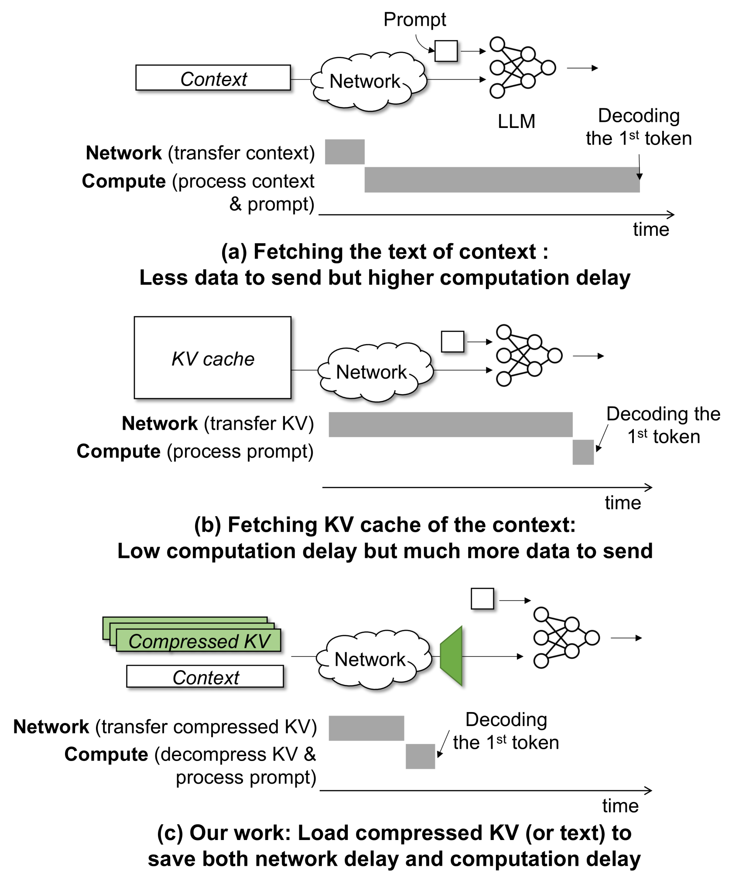

## 名词解释
- 张量（Tensor）：高维向量，CacheGen 核心在于通过编码技术，将大张量转化为小的 “比特流”，传输后再解码恢复为张量。
- Delta 编码（Delta Coding）：即残差编码，使得量化和算术编码压缩效率更高。
- 通道（Channel）：即不同 K/V 向量的同一位置，由于相邻 token 语义的相似性，相邻向量同一通道的值也具有相似性，[详细](https://www.zhihu.com/question/362131975/answer/3491521854)见解。

## 核心方法
### 差值张量计算（Delta Tensors）
- **操作**：将上下文按 10 个 token 分组，每组选首个 token 为 “锚定 token”，以高精度存储，其余 token 以低精度存储与锚定 token 的 KV 差值（即 delta 张量）。
- **原理**：**token 级局部性（Token-wise Locality）**，即同一层的同一通道内，相邻 token 的 KV 值差异远小于原始值，即**差值（delta）的方差比原始值的方差低**。
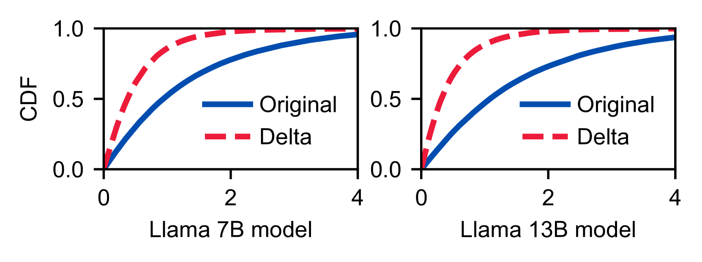

### 分层量化（Layer-wise Quantization）
- **操作**：将 Transformer 分为 3 组（前 1/3、中 1/3、后 1/3），对不同组采用不同精度的**向量量化**，从前到后精度依次下降。
- **原理**：**层间损失敏感性（Layer-wise Sensitivity to Loss）**,即浅表 KV 抽象的是原始信息，其值损失对 LLM 性能影响较大。
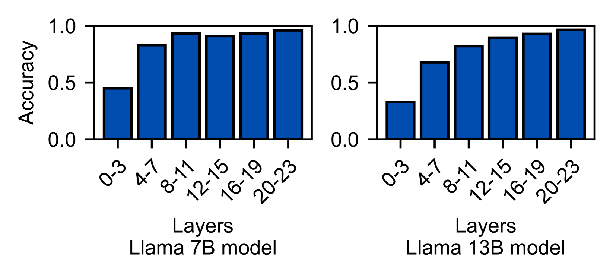

### 算术编码（Arithmetic Coding）
- **操作**：离线为所有 “Layer+Channel” 组合量化符号的概率分布，使用 GPU 加速的算术编码库，对量化后的 delta 张量和锚定张量进行**无损压缩**。
- **原理**：**维度分布差异（Distribution along Layers, Channels, and Tokens）**，即由于语义的相似性，同通道的 KV 值分布更集中，为此按 “Layer+Channel” 分组的 KV 值信息增益（熵降低）远高于按 token 位置分组。而熵越低，值的 “可预测性” 越强，压缩算法（如算术编码）能更高效地减少比特流大小。
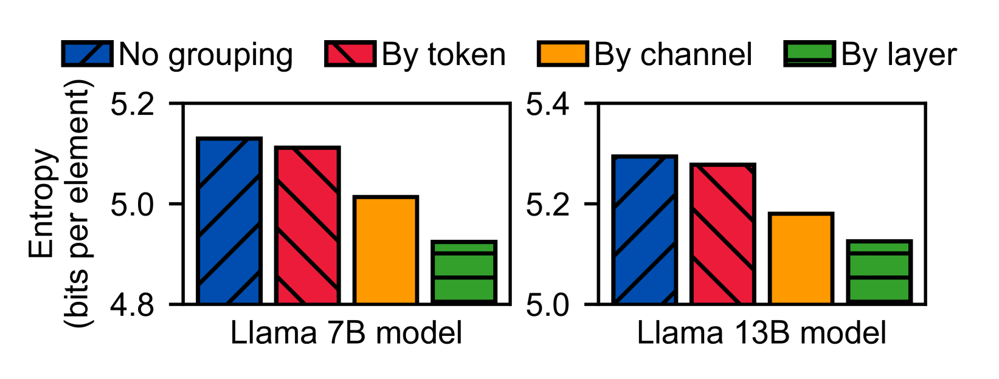

下面以 $2\ Layer、3\ Token、3\ Channel$ 来直观体验熵减与算术编码的魅力：
\[
\text{Layer 1 V} = \begin{pmatrix} 
0.6 & 0.3 & 0.1 \\
0.2 & 0.8 & 0.0 \\
0.5 & 0.2 & 0.3
\end{pmatrix}
\]

\[
\text{Layer 2 V} = \begin{pmatrix} 
0.8 & 0.2 & 0.1 \\
0.9 & 0.3 & 0.05 \\
0.7 & 0.1 & 0.15
\end{pmatrix}
\]

熵 $H = -\sum p_i \log_2 p_i$（$p_i$ 为某值的出现概率），将所有 V 值量化为 3 种符号（$A\in[0.0,0.3],\ B\in[0.4,0.6],\ C\in[0.7,0.9]$），统计概率后得到熵：

#### No grouping 组：
\[
[0.6(\text{B}), 0.3(\text{A}), 0.1(\text{A}),\ 0.2(\text{A}), 0.8(\text{C}), 0.0(\text{A}),\ 0.5(\text{B}), 0.2(\text{A}), 0.3(\text{A})\ ...]
\]
- 符号统计：A 出现 11 次，B 出现 2 次，C 出现 5 次；
- 概率：$p_A=11/18≈0.61$，$p_B=2/18≈0.11$，$p_C=5/18≈0.28$；
- 熵：$H = -0.61\log_20.61 -0.11\log_20.11 -0.28\log_20.28 ≈ 1.45$。

#### By token 组：
将相同位置（行）的 Token 的 V 值归为一组，共 3 组：
- Token1组：符号=[B, A, A, C, A, A] → A=4, B=1, C=1 → 熵≈1.46；
- Token2组：符号=[A, C, A, C, A, A] → A=4, C=2 → 熵≈1.0；
- Token3组：符号=[B, A, A, C, A, A] → A=4, B=1, C=1 → 熵≈1.46；
- 平均熵：$(1.46+1.0+1.46)/3 ≈ 1.31$。

#### By channel 组：
将相同通道（列）的 V 值归为一组，共 3 组：
- 通道 0 组：符号=[B, A, B, C, C, C] → B=2, C=3, A=1 → 熵≈1.46；
- 通道 1 组：符号=[A, C, A, A, A, A] → A=5, C=1 → 熵≈0.65；
- 通道 2 组：符号=[A, A, A, A, A, A] → A=6 → 熵=0；
- 平均熵：$(1.46+0.65+0)/3 ≈ 0.70$。

#### By layer 组：
将每层的所有通道、Token V值归为一组，共2组（第1层、第2层）：
- **第1层组**：符号=[B, A, A, A, C, A, B, A, A] → A=5, B=2, C=1 → 熵≈1.36；
- **第2层组**：符号=[C, A, A, C, A, A, C, A, A] → A=5, C=3 → 熵≈1.29；
- 平均熵：$(1.36+1.29)/2 ≈ 1.33$ 比特/元素（虽有降低，但不如按通道分组显著）。

分组后各通道的符号 “集中”，熵自然大幅降低，算术编码能为高频符号分配极短比特，最终实现高压缩比。

### 自适应流传输（Adaptive Streaming）
- **操作**：根据实时带宽动态适应传输内容，在 CacheGen 中将上下文拆分为多个上下文块（论文中以 1.5k token 作为默认块长），每个块都压缩不同精度的版本，传输时根据实时带宽选择最合适版本，如带宽极差时，则直接传输原始上下文予 CPU 重新计算。
- **原理**：压缩方法即张量量化 → 聚类（存储下标）→ 按 “Layer + Channel” 分组得到序列，如 [1, 2, 0, 1] → [转比特流](https://zhuanlan.zhihu.com/p/390684936)。

# GEAR: An Efficient KV Cache Compression Recipe for Near-Lossless Generative Inference of LLM
论文：https://arxiv.org/html/2403.05527
代码：https://github.com/HaoKang-Timmy/GEAR
年份：2024.9.30
核心：KV Cache 近无损存储压缩
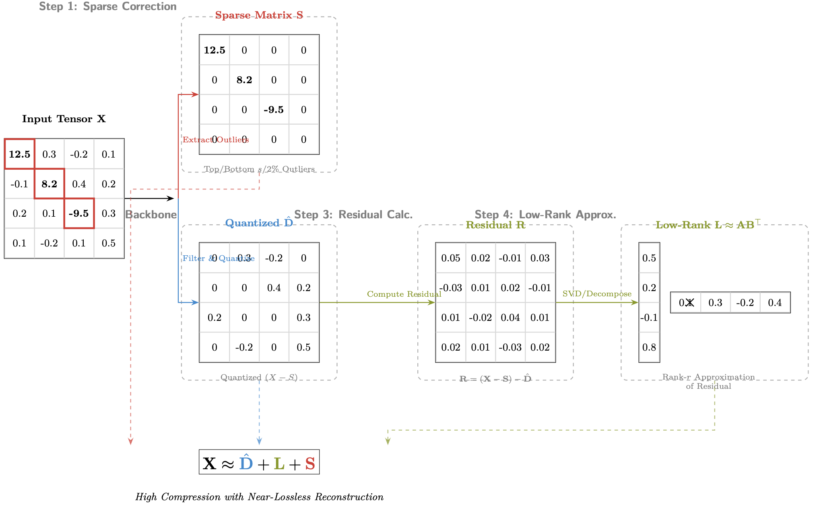

## 核心方法
GEAR 通过 “量化主干+低秩近似+稀疏修正” 的三级架构，实现 “高压缩比-近无损性能” 平衡，具体流程如下：
$$\min_{\hat{D}, L, S} \|X - \hat{D} - L - S\|_F$$

### 步骤 1：基于异常值过滤的量化主干（$\hat{D}$）
先提取 KV 张量中的极值异常值，再对剩余值进行超低精度量化，避免异常值导致的量化误差放大。

1. 异常值提取：对 Key 张量（按 channel 分组）和 Value 张量（按 token 分组），分别提取每个分组内 $\frac{s}{2}\%$ 的最大值与 $\frac{s}{2}\%$ 的最小值，构成稀疏矩阵 $S \in \mathbb{R}^{n \times d}$：  
    $$S_{ij} = \begin{cases} 
    X_{ij} & \text{if} \ X_{ij} \in \text{top/bottom } \frac{s}{2}\% \ \text{of group} \\
    0 & \text{else}
    \end{cases}$$

    （论文中 $s=2\%$，即仅保留 2% 的异常值，内存开销 \<3%）
2. 分组量化：对过滤后的 $X - S$ 采用 **per-channel Key + per-token Value** 量化（基于 KCVT/KIVI 变体），量化公式为：  
    $$\hat{D}_{\mathcal{G}_i} = \left\lfloor \frac{(X - S)_{\mathcal{G}_i} - \min_{\mathcal{G}_i} (X - S)}{\Delta_i} \right\rceil, \quad \Delta_i = \frac{\max_{\mathcal{G}_i} (X - S) - \min_{\mathcal{G}_i} (X - S)}{2^b - 1}$$  
    其中 $\mathcal{G}_i$ 为分组 $i$，$b$ 为量化位宽（2-bit/4-bit），$\Delta_i$ 为缩放因子。

### 步骤 2：头级别低秩近似（$L$）
量化残差 $R = X - \hat{D} - S$ 存在**相干结构**（即不同 token 共享部分上下文信息），通过低秩矩阵捕捉该结构，修正量化误差。

1. 头级别分解：将残差 $R$ 按注意力头拆分，得到 $H$ 个子矩阵 $R_h \in \mathbb{R}^{n \times d_H}$（$d_H = d/H$ 为单头维度）；
2. 低秩逼近：对每个 $R_h$，通过**幂迭代算法**（高效 SVD 近似）得到 top-$r$ 奇异值与向量，构建低秩矩阵 $L_h = A_h B_h^\top$（$A_h \in \mathbb{R}^{n \times r}$，$B_h \in \mathbb{R}^{d_H \times r}$），最终拼接为 $L = \text{Concat}(L_1, ..., L_H)$；
3. 秩选择：论文中 $r=4$（prefill 阶段）/$r=2$（解码阶段），此时 $L$ 的内存开销仅为原始 $X$ 的 $\frac{r}{d} \approx 3.125\%$（$d=128$ 时）。

### 步骤 3：误差融合与重建
- **最终压缩张量**：$\hat{X} = \hat{D} + L + S$，满足 $\|X - \hat{X}\|_F \ll \|X - \hat{D}\|_F$（量化误差降低 80% 以上）；
- **流缓冲优化**：引入大小为 $n_b=20$ 的缓冲区，每生成 $n_b$ 个 token 批量执行上述压缩，比逐令牌压缩延迟降低 40%。

以下是在不同量化技术的基础上加上 GEAR 获得的效果：
<table>
<tr align="center">
    <td>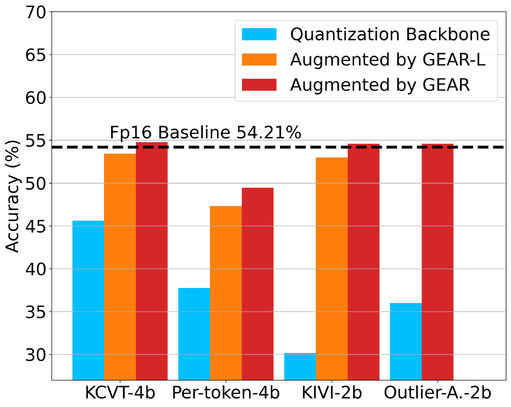</td>
    <td>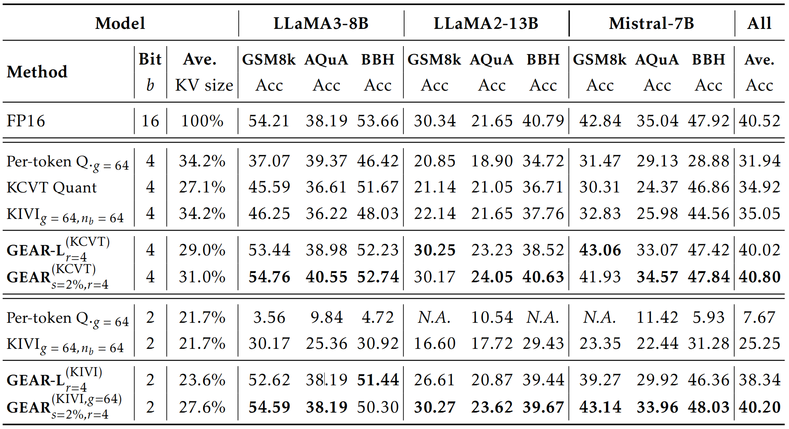</td>
</tr>
</table>

## IDEAL
流版 Bitwise Gear 完全保留原版 Gear “拆分易压/难压部分 → 分模块处理 → 协同重建” 的分治逻辑，但针对 MNN 端侧 **CPU 算力有限、内存/存储资源紧张、精度要求 100% 无损**的特性，将原版 “量化 + SVD 低秩” 的有损算子，改为**位操作 + 流式无损压缩**的硬件友好型算子，最终实现 “Bit-exact 无损压缩” 与 “端侧无感推理” 的双重目标。

### 步骤 1：Base 流提取 —— 高低位拆分
FP16 由 “1 位符号 + 5 位指数 + 10 位尾数” 构成：
- **高 8 位**：在同一 Channel/Attention Head 内，因上下文语义相关性强，分布稳定，熵值极低，属于 “易压部分”，对应原版 Gear 的 “基准部分”；
- **低 8 位**：长序列下存在局部统计规律，属于 “难压部分”，对应原版 Gear 的 “残差部分”。

将原始 KV 张量 $X \in \text{FP16}^{n \times d}$（$n$ 为序列长度，$d$ 为特征维度）拆分为 Base 流 $\hat{D}$：所有 FP16 的高 8 位，存储为`uint8_t`型，尺寸为 $n \times d$（字节数仅为原始的 1/2）；Residual 流 $R$：所有 FP16 的低 8 位，同样存储为`uint8_t`型，尺寸与 Base 流一致。

通过 NEON 的`vst2q_u8`指令，将拆分后的高低位 “交织” 写入内存，避免朴素循环中 “Base流/Residual流反复切换导致的 Cache Line 颠簸”，内存带宽打满。

### 步骤 2：Residual 流压缩
原版 Gear 用 SVD 低秩分解捕捉残差的“全局相干性”（有损），而 Bitwise Gear 利用 Zstd 压缩的 “字典记忆 + 滑动窗口” 特性，捕捉 Residual 流的“局部序列相关性”（无损）：

**双流并行压缩**：为 Base 流和 Residual 流分别创建独立的 Zstd 流上下文，Base 流压缩比可达 5× 以上；Residual 流压缩比可达 1.2×~1.5×，最后将两个流的压缩结果封装为 “双流压缩块”。

### 步骤3：流式缓冲与无损重建
#### ① 压缩阶段：4KB Page Buffer批量处理
#### ② 解压重建阶段：预取 + NEON 快速拼接

# LoMA: Lossless Compressed Memory Attention
论文：https://ar5iv.labs.arxiv.org/html/2401.09486
代码：无
年份：2024.1.16
核心：KV Cache （近）无损压缩记忆注意力

## 核心方法
LoMA 的核心是 “训练时学习压缩/验证，推理时执行压缩/生成”：
### 训练阶段
训练的核心是 “**阅读区（原始信息）→ 内存区（压缩信息）→ 重复区（验证压缩）**”的闭环。
#### 步骤 1：输入序列的结构化重组
LoMA 将原始训练序列拆分为多个**训练块（Training Chunk）**，每个块强制包含 3 个区域，且引入 2 个 token：  
- $m$（Memory Token）：存储压缩后的信息，放在 “内存区”；  
- $r$（Repetition Token）：验证压缩是否无损，放在 “重复区”。  

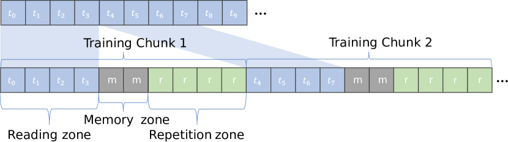

为此，训练块的结构公式为：  
$$Training\ Chunk = Reading\ Zones(t_c) + Memory\ Zones(t) + Repetition\ Zones(t_c)$$

其中：  
- $t_c = c × t$（$c$ 为**压缩比**）；  
- 阅读区：原始文本 token（如“今天天气晴朗，适合去公园散步”）；  
- 内存区：$t$ 个 $m$ token（如 $m\ m$）；  
- 重复区：$t_c$ 个 $r$ token（如 $r\ r\ r\ r\ r\ r\ r\ r$）。  

#### 步骤 2：特殊注意力掩码
普通 Transformer 用 “下三角掩码” 实现自回归，但 LoMA 通过**自定义掩码**强制规定三个区域的信息流向，避免模型 “作弊”，三种区域的掩码规则如下：

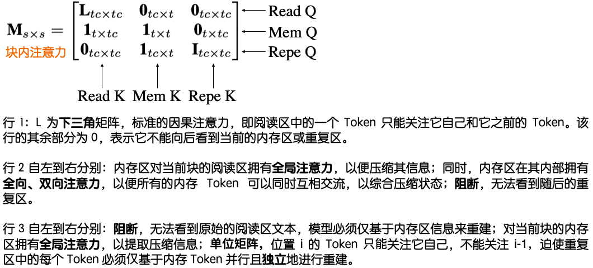
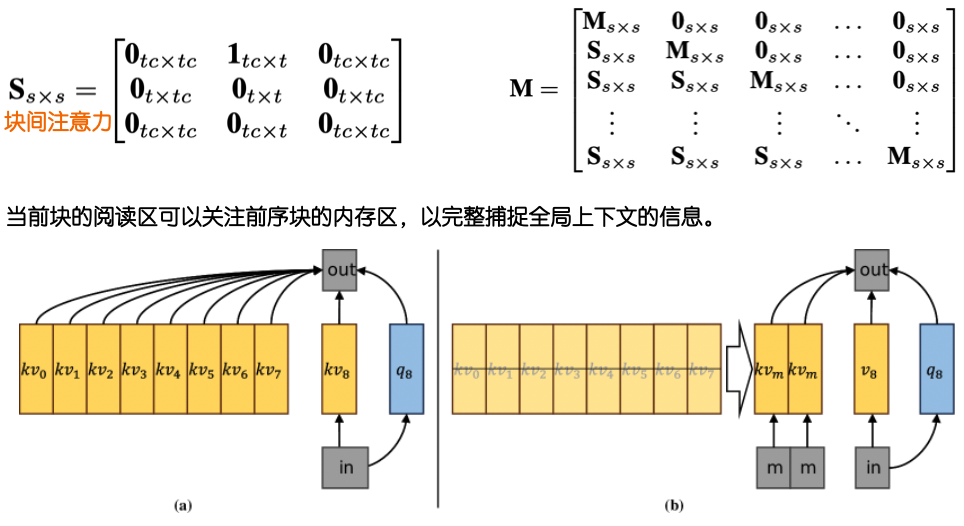

#### 步骤 3：间接监督损失
LoMA 不为 “内存区的 $m$” 设计标签，而是通过**重复区的损失间接监督<m>的压缩能力**，形成 “压缩质量 → 复现效果 → 损失反馈” 的闭环。  

$$L = L_{Read} + L_{Rep}$$  

其中
- $L_{Read}$：普通 LLM 的自回归损失（如交叉熵）；  
- $L_{Rep}$：核心监督项，要求 “重复区的 $r$ token 必须完全复现原始信息”，损失为<r>的预测结果与原文本的交叉熵。  

注：原论文中特殊位置 ID（保证压缩后上下文连贯性）忽略。

### 推理阶段
训练完成后，模型已具备 “将长 KV Cache 压缩为短 $m$ KV” 的能力，推理时无额外辅助模型，仅通过 3 步即可完成无损压缩，且融入 autoregressive 生成流程。

假设训练好的 Llama-2-7B 模型进行 “问如何煮咖啡” 的长对话推理，设置 $c=4$、$t=2$：  

1. **步骤 1：初始化**  
   模型按标准 autoregressive 方式生成 $t_c=8$ 个 token，如 “问如何煮咖啡，要详细步骤”，同时得到这 8 个 token 对应的 KV Cache（记为 $KV_{Read}$）。  

2. **步骤 2：输入 $m$ token**  
   向模型输入 $t=2$ 个 $m$ token，模型基于步骤 1 的 $KV_{Read}$ 执行一次推理：  
   - 此时模型会将 $KV_{Read}$ 中的所有信息（“问如何煮咖啡，要详细步骤” 的上下文）压缩到 2 个 $m$ 的 KV Cache 中（记为 $KV_{Compressed}$）；  
   - 训练时 $m$ 已学会存储所有必要信息，2 个 $m$ 的 KV 完全等价于 8 个原始 token 的KV。  

3. **步骤 3：驱逐原始 KV**  
   驱逐步骤 1 的 $KV_{Read}$，仅保存 $KV_{Compressed}$，模型基于 $KV_{Compressed}$ 完成回答，回答过程中又得到新的 token，重复步骤 2-3。  

# H2O: Heavy-Hitter Oracle for Efficient Generative Inference of Large Language Models
论文：https://arxiv.org/abs/2306.14048
代码：https://github.com/FMInference/H2O
年份：2023.12.18
核心：驱逐注意力得分最低的 KV

## 名词解释
- 重击者（Heavy Hitters）：在模型生成过程中，被注意力长期反复“关注”的 token。
- 注意力分数（Attention Score）：$i_{th}$ 个位置的 $Query$ 向量 $q_i$ 和 $j_{th}$ 个位置的 $Key$ 向量 $k_j$，未归一化的注意力分数 $s_{i,j} \;=\; \frac{q_i^\top k_j}{\sqrt{d_k}}$，本质两个 token 的相关性。

## 核心方法
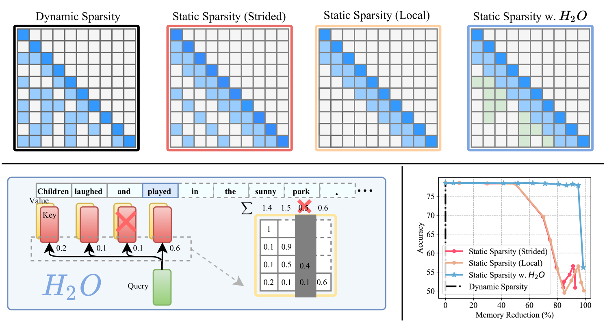
### 驱逐时机
- **Prefill 阶段**：对 prompt 一次性并行计算，得到所有 prompt token 的 KV cache。
- **Decode 阶段（逐 token 生成）**：每生成 1 个新 token 都新增一组 KV；当 KV cache 超过预算时，**就在该步结束后立刻驱逐**，为下一步生成腾出空间。

### Recent + Heavy Hitters
H2O 仅存储两类 token 的 KV：
- **Recent tokens**：最近的 $r$ 个 token；
- **Heavy hitters**：历史注意力分和最高的若干 token。

令 $i_{th}$ 步（即生成 $i$ 个 token）结束后，cache 中存储的 token 下标集合 $S_i\subseteq [i],\ [i]=\{1,2,3,...,i\}$，固定容量：$|S_i|=k$。将 $i_{th}$ 步把新生成 token $i$ 加入候选后得到：
  $$G_i = S_{i-1} \cup \{i\},\quad |G_i| = k+1.$$
记 $i_{th}$ 步注意力（softmax 后）的相关性分配向量 $o_i$。在 H2O 中，**仅在可见集合上归一化**，不在候选集中的 token 注意力置 0：
  $$o_i[j] = \frac{\exp(s_{i,j})}{\sum_{t\in S_{i-1}} \exp(s_{i,t})},\ j\in S_{i-1};\quad o_i[j]=0,\ j\notin S_{i-1}.$$

其中 $s_{i,j}=\frac{q_i^\top k_j}{\sqrt{d_k}}$。

下面通过计算来解释 H2O 驱逐向量的原理：令 $k=3$，Recent 窗口 $r=1$，Prefill prompt 有 3 个 token 下标：$1,2,3$。Prefill 结束后初始化：
$$S_3=\{1,2,3\}$$

token $t$ 的历史注意力分和等于 $H[t]$，初始：
$$H[1]=H[2]=H[3]=0$$

每个 decode step 生成新 token 时，可得到相关性分配向量 $o_i$（softmax 后），其反映了某个 token 和当前 token 的相关性，于是有如下公式：
$$H[t]\leftarrow H[t] + o_i[t],\ t\in S_{i-1}$$

然后由 $F_{\text{score}}(T)=\sum_{t\in T} H[t]$ 选出将驱逐的 KV，论文采取在可驱逐的候选中，踢掉 **$H[v]$ 最小** 的那个。

现在 Step i=4，$S_3=\{1,2,3\}$，因此 $o_4$ 仅在 {1,2,3} 上归一化。假如模型在 i=4 步，得到如下注意力：$o_4[1]=0.70$，$o_4[2]=0.20$，$o_4[3]=0.10$。

那么：$H[1]=0+0.70=0.70,\ H[2]=0+0.20=0.20,\ H[3]=0+0.10=0.10$。再**加入新 token 到候选集合**：$G_4=S_3\cup\{4\}=\{1,2,3,4\}$，并令 $H[4]=0$。

由于 $r=1$，token 4 最新 token，**不可驱逐**。选择当前 $H[i]$ 最低的 3 踢掉，得到：$S_4=G_4\setminus\{3\}=\{1,2,4\}$。如果出现注意力分相同的，可以配合 LRU 选择最佳驱逐对象。

# ChunkKV: Semantic-Preserving KV Cache Compression for Efficient Long-Context LLM Inference 
论文：https://arxiv.org/abs/2502.00299
代码：https://github.com/NVIDIA/kvpress
年份：2025.10.14
核心：以语义块为单位压缩、裁剪 KV

## 名词解释
- 语义块（Semantic Chunk）：将一段含有关联语义的 token 作为一个整体，例如 “主+动+宾” 的短片段，压缩时保留最有信息量的 chunk。
- 观察窗口（Observation Window）：在正式压缩前，先观察最近一段 query 对历史 KV 的注意力分布，用它估计历史内容的重要性。

## 核心方法
### 步骤 1：语义局部性切分 Chunk
假设历史 prompt 被分词后得到 12 个 token：
$$[t_1,t_2,t_3,t_4,\ t_5,t_6,t_7,t_8,\ t_9,t_{10},t_{11},t_{12}]$$

令块大小等于 4，则可切成 3 个 chunk：
$$C_1=[t_1,t_2,t_3,t_4],\quad C_2=[t_5,t_6,t_7,t_8],\quad C_3=[t_9,t_{10},t_{11},t_{12}]$$

分块后可能分别对应：
- \(C_1\)：`The cat sat on`
- \(C_2\)：`the red mat near`
- \(C_3\)：`the sunny window today`

### 步骤 2：观察窗口统计 token 注意力贡献
取最近一段 query token 作为观察窗口，统计它们对历史 token 的注意力分布。如果最近生成的内容频繁关注某段历史 token，那么那一段在后面的生成中可能也很重要。

令观察窗口里有 2 个 query：\(q_1,q_2\)，历史一共 8 个 token：
\[
[t_1,t_2,t_3,t_4,t_5,t_6,t_7,t_8]
\]

如果模型得到的注意力和（不区分 head）等于：
\[
A=[0.05,0.08,0.32,0.30,0.04,0.06,0.10,0.05]
\]

即最近 query 比较关注 \(t_3,t_4\)，其次 \(t_7\)。

### 步骤 3：将 token 聚合成 Chunk Score 并执行 Top-K
对 chunk 内部 token 的注意力贡献求和或求平均，得到 chunk 级注意力贡献。上述两块的 chunk score 可写为：
\[
S(C_1)=0.05+0.08+0.32+0.30=0.75 \\
S(C_2)=0.04+0.06+0.10+0.05=0.25
\]

如果驱逐一个块，那么将驱逐 \(C_2\) 块。

### 步骤 4：下标复用（Layer-wise Index Reuse）
在某一层选出 Top-K chunk 后，后面几层不再从头计算，而是复用这些 chunk 的下标，或只做少量修正。因为它们通常会共同关注相近的语义区域。

# ClusterKV: Manipulating LLM KV Cache in Semantic Space for Recallable Compression
论文：https://arxiv.org/abs/2412.03213
代码：https://github.com/sjtu-zhao-lab/ClusterKV
年份：2025.6.14
核心：在语义空间中聚类 KV，可回溯压缩

## 名词解释
- 可回溯压缩（Recallable Compression）：把大量 KV 放到 CPU 等低速存储中，解码时再 “召回” 一部分真正重要的 token 回到 GPU 参与注意力计算。
- 语义簇（Semantic Cluster）：在 key 向量空间中（方向）靠近的一组 token。语义相近的 token 往往有相近的注意力权重，因此可以以 “簇” 而不是以 “位置页” 来召回。
- 聚类中心（Centroid）：一个语义簇的代表向量，通常由簇内 key 向量求均值得到。解码时先用 query 和这些中心进行点积，优先召回分高的簇。
- 注意力汇（Attention Sink）：一般指最开头的一小段 token，它们通常在未来很长一段时间都受到关注，且在聚类中常表现为离群点，因此不参与普通聚类。

## 核心方法
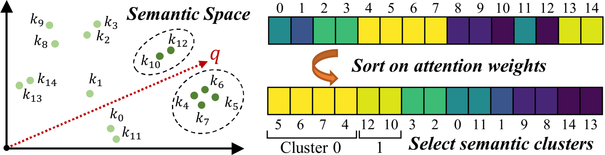
把 key 向量在语义空间里聚成若干簇；解码时不再在全部 token 上算注意力贡献，而以簇为单位得到哪些**簇中心**靠近当前 query，再把这些簇里的 token 全部召回。

### 步骤 1：Prefill 后在 key 空间做语义聚类
在 prefill 结束后，对 prompt token 的 key 向量做 K-means 聚类（余弦相似性衡量距离）；前 16 个 attention sink 默认保留，不参与普通聚类。

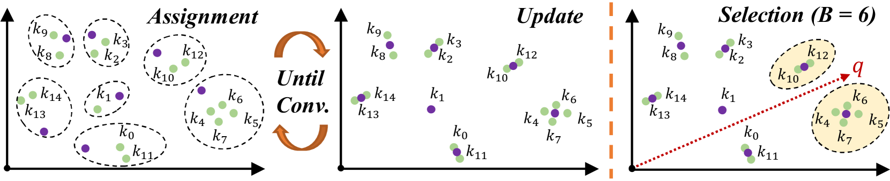
如果历史中有 8 个 token，它们对应的 key 向量在语义空间里自然分成 3 团：
- Cluster 0：`Paris`, `France`, `capital`
- Cluster 1：`Curie`, `Nobel`, `Physics`
- Cluster 2：`apple`, `banana`

那么 K-means 后可以得到 3 个簇：
\[
\mathcal{C}_0=\{t_1,t_2,t_3\},\quad
\mathcal{C}_1=\{t_4,t_5,t_6\},\quad
\mathcal{C}_2=\{t_7,t_8\}
\]

并得到 3 个簇中心：$\mu_0,\mu_1,\mu_2$。

### 步骤 2：对簇中心算注意力分
当前解码步得到 query \(q\) 后，与各个簇中心 \(\mu_i\) 进行点积，得到注意力分；然后按得分从大到小排序簇。

比如当前问题：`What is the capital of France?`。那么当前 query 和 3 个簇中心的点积可能是：
$$q^\top\mu_0 = 0.92,\quad q^\top\mu_1 = 0.21,\quad q^\top\mu_2 = 0.05$$

说明当前 query 明显关心 Cluster 0，对 Curie/Nobel 那一团就不太关心。

### 步骤 3：按簇顺序召回 token
把簇排序后，逐个把对应簇里的 token 取出来，直到 GPU 上的 KV 达到预算上限；如果最后一个簇超预算，就对最后一个簇做裁剪。

值得注意，同一个簇中 token 的下标可能离散，所以召回时要借助前缀和快速选中对应 token。

假如 5 个 token 的簇标签是：$[2,0,2,1,1]$。即 \(t_1,t_3\) 归 Cluster 2，\(t_2\) 归 Cluster 0，\(t_4,t_5\) 归 Cluster 1。

以簇标签排序后得到下标：$[2,4,5,1,3]$，簇大小是：$[1,2,2]$，前缀和是：$[1,3,5]$。如果当前选中 Cluster 0 和 Cluster 1，那根据前缀和就能立刻得到：
- Cluster 0 对应排序区间 `[1,1]`
- Cluster 1 对应排序区间 `[2,3]`

自然也能快速得到 token 下标：$[t_2,t_4,t_5]$。

### 步骤 4：解码中新生成 token 再聚类
对于解码阶段新生成的 token，并非每一步都和 prefill token 混在一起做全局聚类，而**隔若干 decoding steps**，对新生成的 token 做一次局部聚类，形成新簇与新中心。

# SentenceKV: Efficient LLM Inference via Sentence-Level Semantic KV Caching
论文：https://arxiv.org/abs/2504.00970
代码：https://github.com/zzbright1998/SentenceKV
年份：2025.9.29
核心：以句子为语义单位管理 KV

## 名词解释
- 句子桶（Sentence Bucket）：将历史上下文以句号、问号等自然语言边界切成若干句子，每个句子看作一个语义桶。
- 句子语义向量（Sentence Semantic Vector）：对某个句子中被选择的 token 的 key 向量求平均，得到该句子的语义中心。

## 核心方法
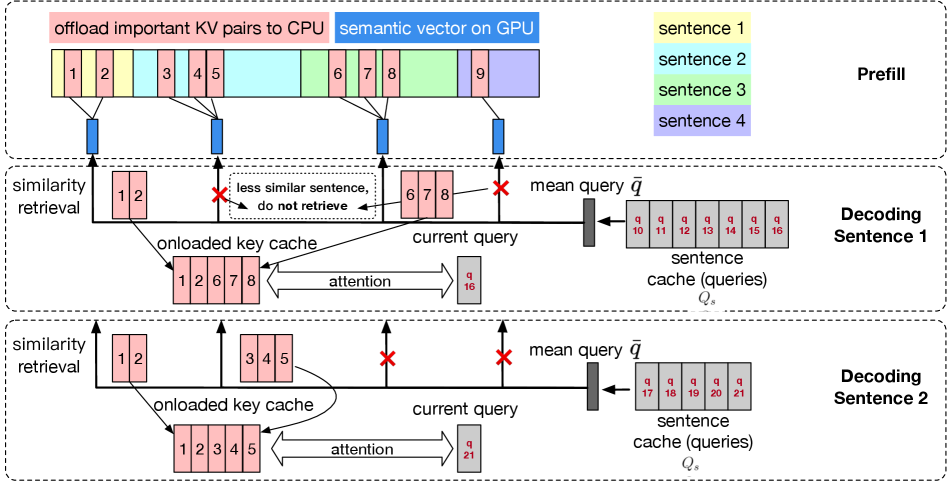

### 步骤 1：切分句子桶
假如历史 prompt 有下面三句话：
- $C_1$：`Paris is the capital of France.`
- $C_2$：`Marie Curie won the Nobel Prize in Physics.`
- $C_3$：`Bananas are rich in potassium.`

SentenceKV 先依标点切分成 3 个句子桶：
\[
C_1=[t_1,t_2,t_3,t_4,t_5,t_6],\quad
C_2=[t_7,t_8,t_9,t_{10},t_{11},t_{12},t_{13},t_{14}],\quad
C_3=[t_{15},t_{16},t_{17},t_{18},t_{19}]
\]

### 步骤 2：观察窗口中给历史 token 打注意力分

Prefill 阶段取 prompt 末尾的一小段 token 作为观察窗口，统计这些 token 对历史所有 token 的注意力贡献。假如观察窗口长 2，它们（$t_{18},t_{19}$）对其前面的历史 token 的注意力分聚合如下：

\[
score(t_j)=\sum_{q\in \text{Obs}} \text{Attn}(q,t_j)
\]

- $\text{Obs}$ 表示 observation window 中的 query token 集合；
- $\text{Attn}(q,t_j)$ 表示 query $q$ 对历史 token $t_j$ 的注意力。

### 步骤 3：句子内部选择 token
SentenceKV 并非 “句子一旦入选就选择全部 token”，而仅将句子作为召回单位，句子内部仍然仅选择注意力分高的 token。假设最终 GPU 预算 $B=4$，令 $\alpha=2$，则 Prefill 阶段先选择：$B' = \alpha B = 2 \times 4 = 8$ 个 token。

比如选择：
- $C_1$：`Paris`, `capital`, `France`
- $C_2$：`Curie`, `Nobel`, `Physics`
- $C_3$：`Bananas`, `potassium`

### 步骤 4：构建句子语义向量
对每个句子桶中被选择 token 的 key 向量求平均，得到该句子的语义中心。设句子 $C_i$ 中被选择 token 的下标集合为 $I_i$，$h_{th}$ 个注意力头上 $t_{th}$ 个 token 的 key 向量为 $k_t^{(h)}$，则 $h_{th}$ 个头上的句子语义向量：
\[
\mu_i^{(h)} = \frac{1}{|I_i|}\sum_{t\in I_i} k_t^{(h)}
\]

比如对句子 $C_1=$ `Paris is the capital of France.`，选择了 3 个 token：
\[
I_1=\{\text{Paris},\ \text{capital},\ \text{France}\}
\]

令某个 head 上它们的 key 向量如下：
\[
k_1=[1,0],\quad k_2=[0,2],\quad k_3=[2,2]
\]

那么该头上该句子的平均 key 向量：$\mu_1 = \frac{1}{3}([1,0]+[0,2]+[2,2]) = [1,\tfrac{4}{3}]$。$\mu_i$ 非常小，可以常驻 GPU；而真正占显存的 token 级 KV 则存放到 CPU。

### 步骤 5：解码时 query 句子语义向量
到了 Decode 阶段，SentenceKV 不把当前这个 token 的 query 查询历史句子，而把**当前正在生成的这一句话**中所有已经得到的 query 暂存，取均值 $\bar{q}$ 来查询并召回历史句子。比如当前模型正在生成：`The capital of France is ...`。

当前生成的 3 个 token 对应的 query 向量如下：
\[
q_1=[1,1],\quad q_2=[2,1],\quad q_3=[1,2]
\]

那么 平均 query $\bar{q}$：
\[
\bar{q} = \frac{q_1+q_2+q_3}{3}
= \frac{[1,1]+[2,1]+[1,2]}{3}
= [\tfrac{4}{3},\tfrac{4}{3}]
\]

将 $\bar q$ 与历史句子的语义向量 $\mu_i$ 进行点积 $score(C_i)=\bar q^\top \mu_i$：
\[
\bar q=[\tfrac{4}{3},\tfrac{4}{3}],\quad
\mu_1=[1,\tfrac{4}{3}],\quad
\mu_2=[0.2,0.4],\quad
\mu_3=[0.1,0.0]
\]

则：
\[
score(C_1)=\bar q^\top \mu_1
=\tfrac{4}{3}\cdot1+\tfrac{4}{3}\cdot\tfrac{4}{3}
=\tfrac{4}{3}+\tfrac{16}{9}
=\tfrac{28}{9}\approx 3.11
\]

\[
score(C_2)=\bar q^\top \mu_2
=\tfrac{4}{3}\cdot0.2+\tfrac{4}{3}\cdot0.4
=0.8
\]

\[
score(C_3)=\bar q^\top \mu_3
=\tfrac{4}{3}\cdot0.1+\tfrac{4}{3}\cdot0
\approx 0.13
\]

因此有：
\[
score(C_1) > score(C_2) > score(C_3)
\]

然后，SentenceKV 依句子分从高到低（$C_1 > C_2 > C_3$），依次把对应句子中的选择 token 的 KV 从 CPU 召回，直到达到 GPU token 预算 $B$。

- $C_1$：`Paris`, `capital`, `France`（3 个）
- $C_2$：`Curie`, `Nobel`, `Physics`（3 个）
- $C_3$：`Bananas`, `potassium`（2 个）

所以先召回 $C_1$ 的 3 个 token；预算还剩 1 个，再从 $C_2$ 中取 1 个最相关 token。最终 GPU 中参与注意力的历史 token 可能：$\{\text{Paris},\ \text{capital},\ \text{France},\ \text{Physics}\}$。
