<h1 style="font-family: '仿宋', 'FangSong', 'Times New Roman', serif; color: orange; font-size: 2em; font-weight: bold; text-align: center; border-bottom: none; margin-bottom: 0;">LLM 入门</h1>

Livia Tassel

[TOC]

---

# Transforms
与传统的循环神经网络不同，$Transform$ 架构使得模型学习某个 $token$ 与其他所有 $tokens$ 之间的相关性，无论其在上下文的哪个位置。

而 $tokens$ 之间的相关性大小并不相同，画出注意力图，可以直观显示不同 $tokens$ 之间的注意力权重，这就是所谓的自注意力。
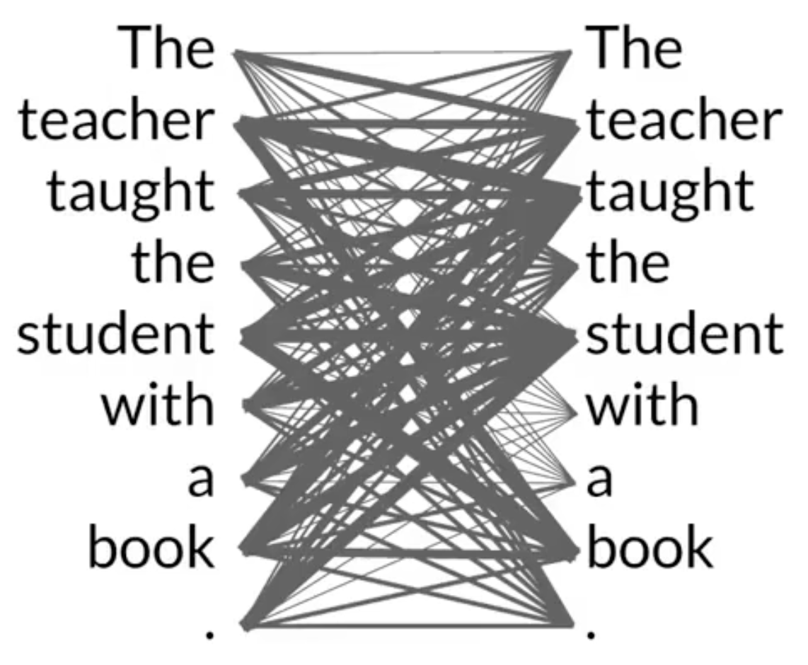

## 架构分析
在正式介绍自注意力机制之前，我们先了解一下 $Transform$ 架构的整体流程[^1]，左侧为完整流程，右侧为简化流程。
<table>
<tr align="center">
    <td>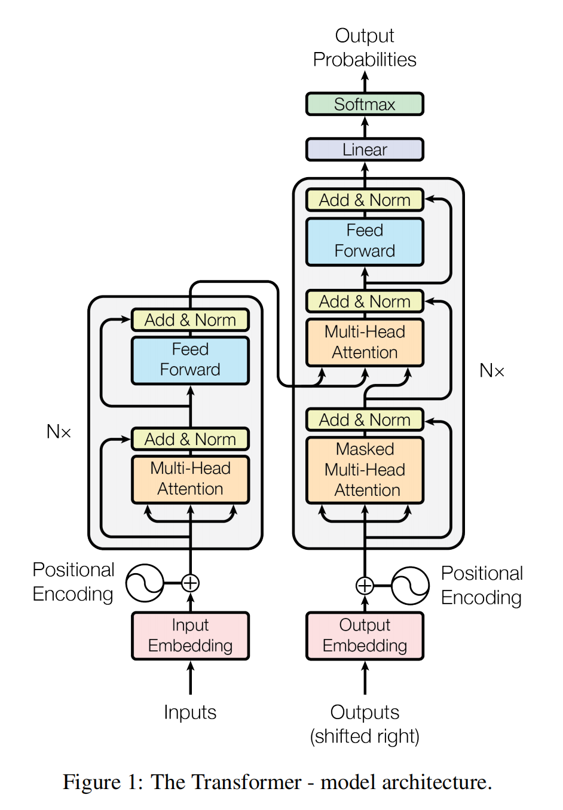</td>
    <td>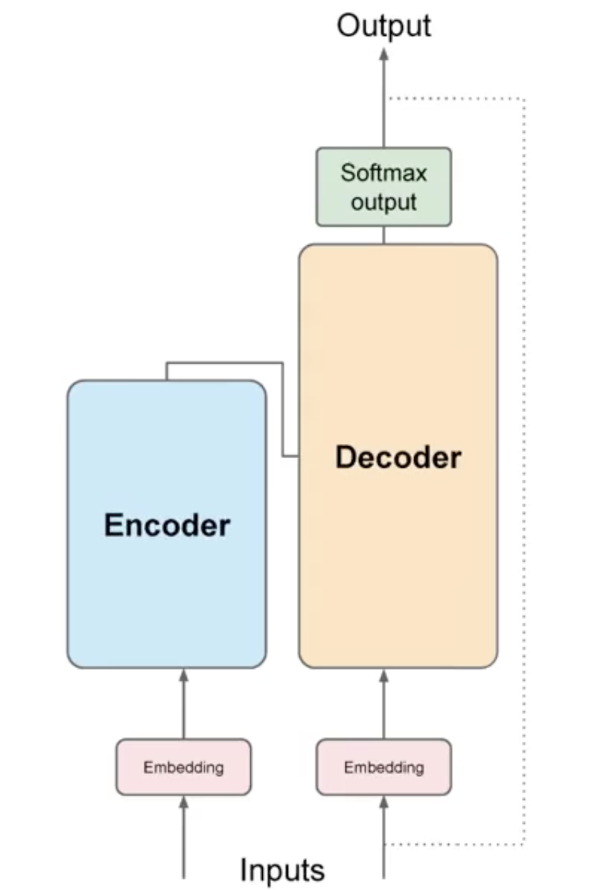</td>
</tr>
</table>

从简化流程中可以看出 $Transform$ 架构被分为两个独立的部分，即编码器与解码器。

### 分词
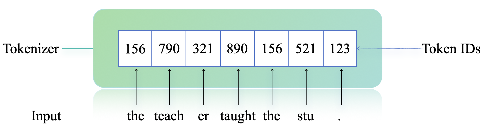
以文本型输入为例，在将文本传递给模型处理之前，必须按照一定规则对单词进行分词，得到模型处理的最小单位，即 $token$，每个 $token$ 映射一个唯一的 $ID$。

    

        Note that when you choose a tokenizer to train a model, you must use the same tokenizer when generating text.
    

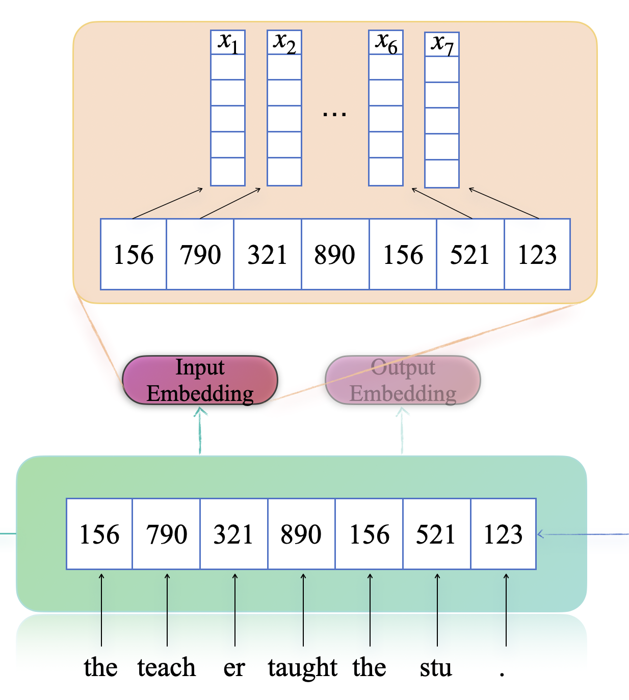
得到输入向量之后，将其传递给嵌入层，嵌入层是一个可训练的向量空间，所有的 $Token\ ID$ 表示为不同的向量，用于学习输入序列中单个 $token$ 与上下文的含义。

在向量空间中的位置越接近，代表两个 $token$ 的联系越紧密。

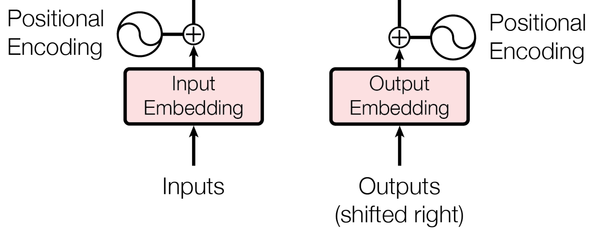
嵌入层得到各个 $token$ 之间的含义之后，还需要额外记录每个 $token$ 在上下文中的位置，只有同时理解了不同 $token$ 的含义与它们的排列顺序，$Transform$ 模型才能正确处理自然语言序列。

最常见的做法是直接词向量与位置向量逐元素相加，融合后的向量最终送入 $Transform$ 编码器或解码器。

### 多头自注意力机制
在训练期间，自注意力权重反映了输入序列中每个 $token$ 对其他所有 $token$ 的重要性。并且，训练过程并不是线性的，多头自注意力机制意味着多组自注意力权重并行、独立地学习着。

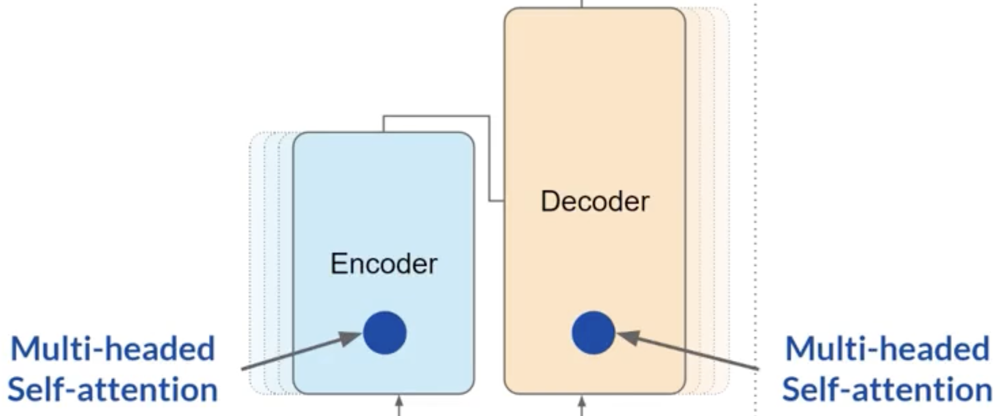
每个自注意力头将学习输入的不同方面，例如有些关注主语、有些关注动作、有些关注句子是否押韵，而且注意力头学习的方面不能提前决定，完全由随机初始化参数以及模型“自己”决定。

### 编码器与解码器
编码器主要用于进一步“理解文本”，捕获输入序列中 $token$ 之间的关系和上下文信息；解码器则通过输入序列以及编码器的上下文理解预测新的 $token$，其循环往复直到达到某个终止条件。

### 输出与循环
解码器的注意力权重在训练结束后，经过一个全连接层-前向传播网络输出，传递给输出层的 $Softmax$ 激活函数，将所有 $token$ 归一化为概率分数，选择其中分数最高的 $token$ 作为模型的输出。
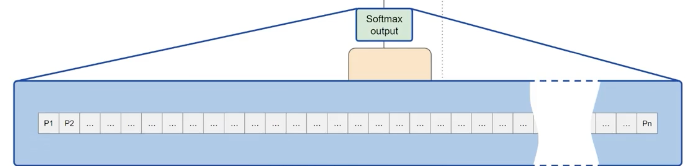

然后将输出的 $token$ 返回输入中，以触发下一个 $token$ 的生成，直到模型预测出下一个 $token$ 为序列结束，这就是 $Transform$ 架构运行的完整流程。

# 提示工程
通常，输入到模型中的文本称为 $Prompt$，生成文本的过程称为“推理”（$Inference$），输出的文本称为“完成”（$Completion$），全文或者可用于 $Prompt$ 的记忆称为“上下文窗口”（$Context\ Window$）。

而修改 $Prompt$ 的内容与结构，以使得模型输出更加理想的内容的工作，称为“提示工程”。

## 上下文学习
在上下文窗口中提供例子称为“上下文学习”（$In-Content\ Learning$），通过在 $Prompt$ 中加入一些例子，可以帮助模型更好地理解上下文的语义。

如下图中（左）将输入数据包含在 $Prompt$ 中的方法称为“零样例推断”，与之对应的 $Prompt$ 中包含单个样例的方法称为“单样例推断”（中）。

正常来说，$Prompt$ 中的样例越多，越有利于模型的推理，尤其是对于小模型，可以考虑“少样例推断”（右）的方法。
<table>
<tr align="center">
    <td>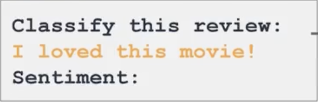</td>
    <td>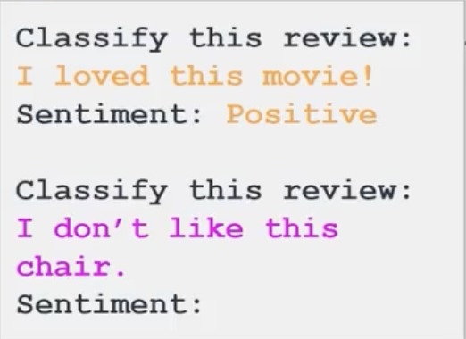</td>
    <td>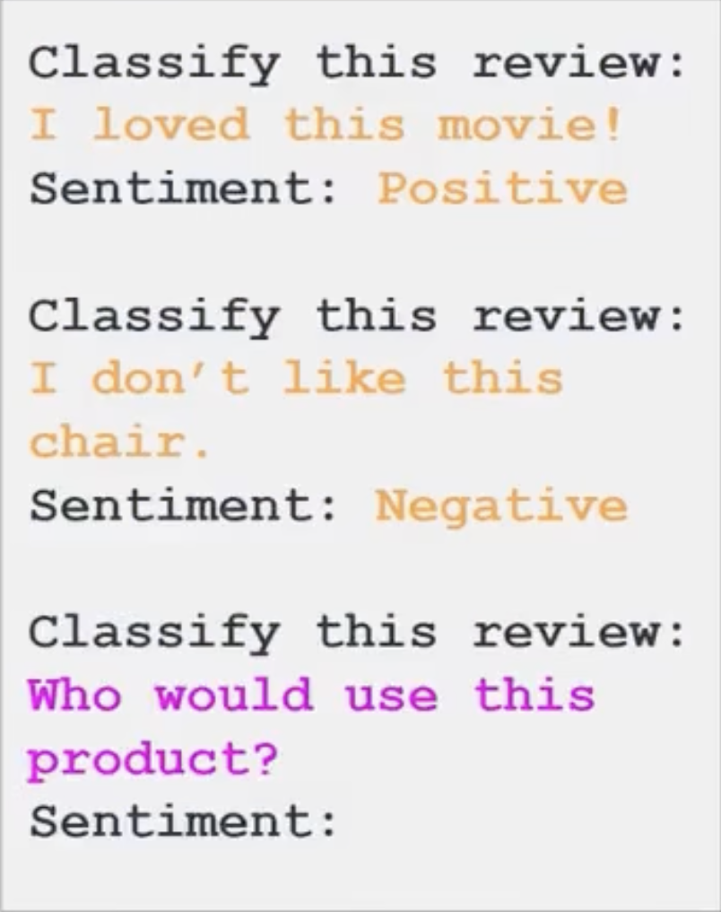</td>
</tr>
</table>

但是，需要注意上下文窗口的长度限制，如果 $Prompt$ 已经包含了五六个样例，模型依旧返回不理想的结果，则考虑对模型进行“微调”（$Fine-Tuning$）。

## 生成配置
前面介绍到，模型将选择概率分数最高的 $token$，作为新的输出，然而为了避免词重复等问题，也有一些其他的选择策略值得考虑，例如按照不同 $token$ 的概率随机抽样，这样会使得模型的输出更有创新性，但可能导致前后文不通顺。

为此，需要对随机抽样加以限制以增加输出有意义的可能性，常用的限制手段有 $top-k$ 方法与 $top-p$ 方法，分别表示指示模型只从概率最高的 $k$ 个 $token$ 中选择（左）和只从概率总和达到某个阈值 $p$ 的最小 $token$ 集合中选择（右）。
<table>
<tr align="center">
    <td>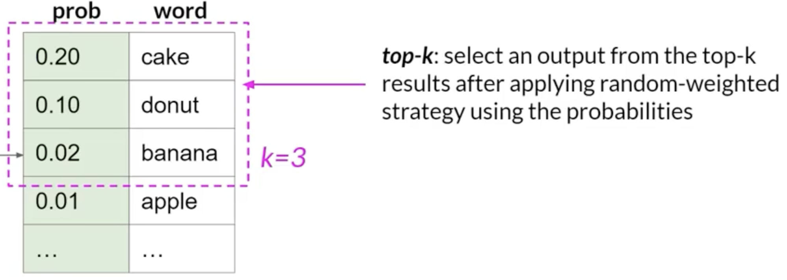</td>
    <td>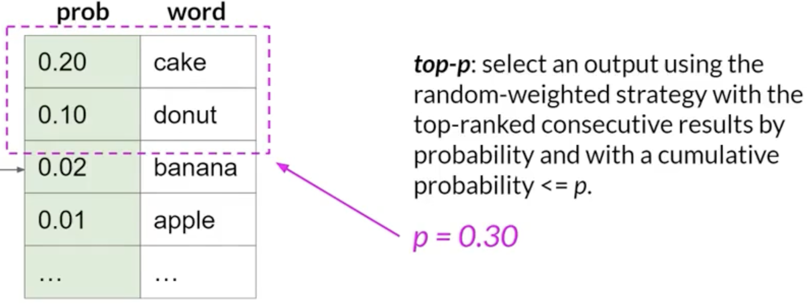</td>
</tr>
</table>

另外，在 $Hugging\ Face$ 等开源模型网站中，还可调整模型的 $temperature$ 参数，一般来说，$temperature$ 越高，模型输出随机性越高。
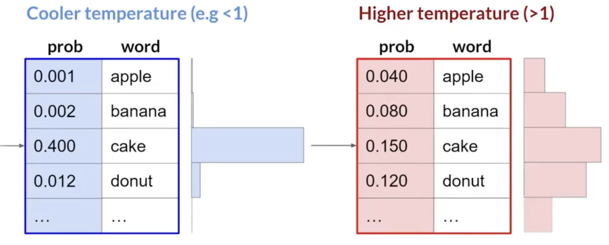

# 生成式人工智能开发
## 微调
前面讲到,可以在 $Prompt$ 中添加示例来帮助模型理解问题，但是对于小模型来说，再多的例子可能都无法达到预期，更何况大量的示例会占用宝贵的上下文窗口空间，于是“微调”技术孕育而生。

如果说预训练是用大量的非结构化文本数据（左）来训练 $LLM$，属于无监督学习，那么微调指的就是使用带有标签示例的数据集（右）来更新 $LLM$ 的权重，属于监督学习。
<table>
<tr align="center">
    <td>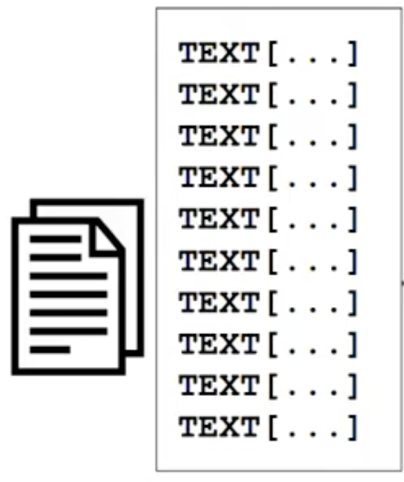</td>
    <td>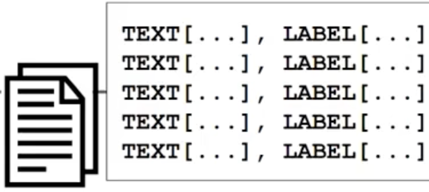</td>
</tr>
</table>

### 指令微调
通常，标签示例是一组“提示完全对”（$Prompt-Completion\ Pairs$）的数据，以提高模型对特定任务生成好的完成的能力。
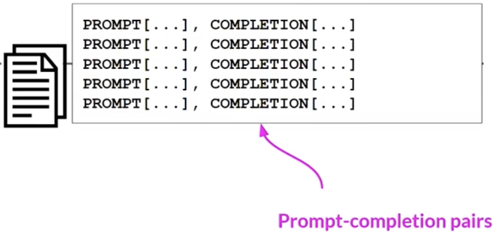

例如，想要提高模型的总结能力，标签示例可以是“文本-总结”；想要提高模型的翻译能力“文本-翻译”。
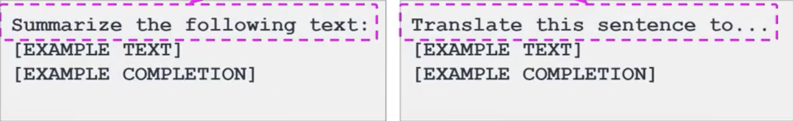

指令微调的数据集同样可以分为三部分，即训练集、验证集和测试集，来评估微调的结果，经过微调之后的模型称为“指令模型”。

#### 全面微调
指令微调如果不加以限制，通常指的是“全面微调”，即在训练过程中，模型所有的权重都将被更新。

##### 单任务微调
即只针对单一任务来微调模型，通常只需要很小的数据集就能达到较好的微调效果，但是容易导致“灾难性遗忘”（$Catastrophic\ Forgetting$），即模型只对微调过的任务表现良好，对其他任务表现奇差。

解决“灾难性遗忘”通常有两种方法，其一是多任务微调，其二是参数高效微调（$PEFT$），即保持大部分预训练 $LLM$ 的权重不变，只训练少量特定任务的适配器层和参数。

##### 多任务微调
即用包含各种任务的标准输入、输出示例的混合数据集训练模型，使模型在所有任务上的表现都得到一定的提升，但是此方法对数据集的大小要求较大。
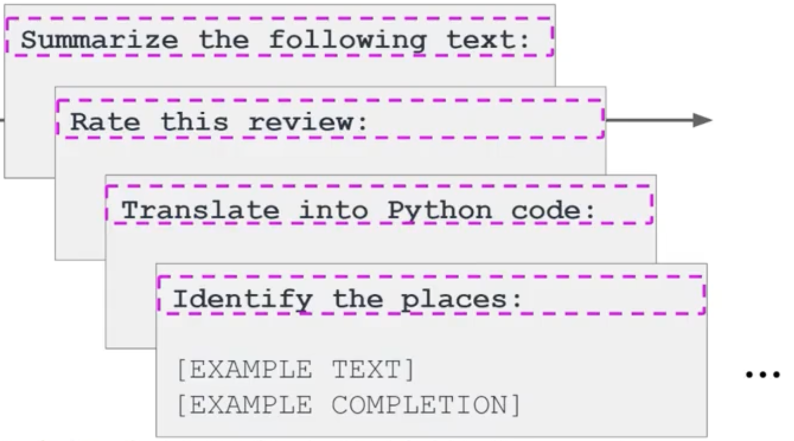

#### PEFT
##### LoRA
冻结大型模型中数十亿个原始参数，并在 $Transformer$ 层（通常是自注意层）中注入可训练的“适配器”。

<table>
<tr align="center">
    <td>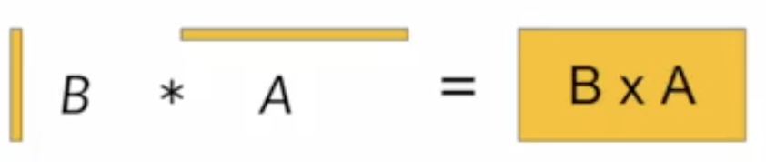</td>
    <td></td>
</tr>
</table>
适配器通常是一对非常小的低秩矩阵，它们通过矩阵乘法与原始的权重矩阵结合；在训练时，只更新这些低秩矩阵的参数，而保持原始的大模型参数。

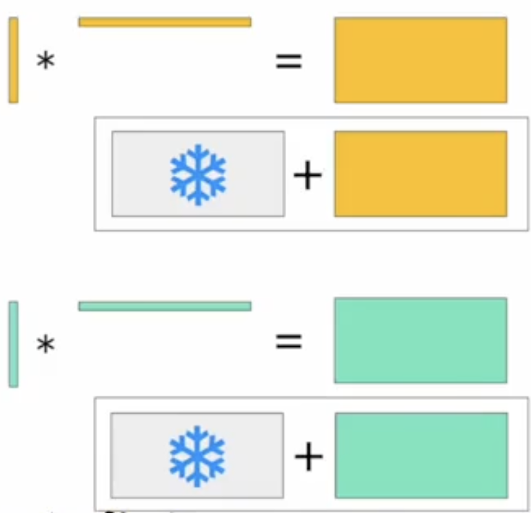
如果想要微调多个任务，$LoRA$ 同样可以胜任，只需要在每次微调完后更新原始矩阵即可。

##### 软提示
又称“提示调整”，旨在不修改模型的任何参数的前提下，添加一个或多个连续的向量序列到输入文本的嵌入向量之前，作为模型的“软提示”。
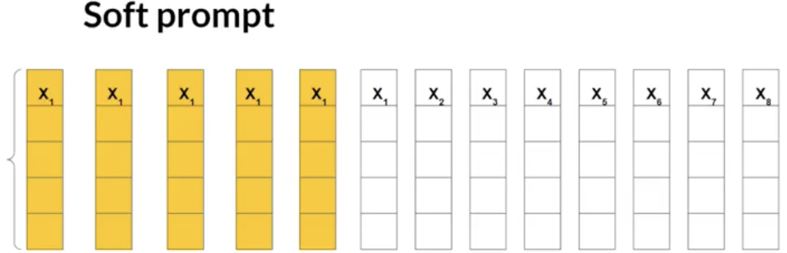

与 $LoRA$ 一样，原始模型的权重是完全冻结的，模型唯一需要学习和更新的参数就是软提示向量本身，这些向量在推理时引导模型产生期望的输出，而原始大模型则保持不变。
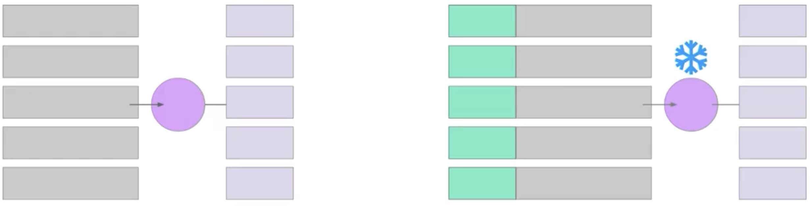

## 模型评估
### ROUGE
$ROUGE$ 是一系列用于评估摘要和机器翻译质量的指标[^2]，主要偏向于“召回率”，通过计算模型生成的文本与人工编写的参考文本之间重叠的词语或短语数量，来衡量生成文本的质量。

### BLEU SCORE
$BLEU$ 是一种用于评估机器翻译质量的指标，主要偏向于“精准率”，通过计算机器翻译的译文与多个高质量的人工参考译文之间的重叠率来衡量其流畅度和准确性。

### Benchmark
基准测试指的是一套标准化的测试任务和数据集，用于客观、系统地评估和比较不同模型或算法的性能。

# 人类反馈的强化学习（RLHF）
将人类的偏好和价值观直接融入到模型的训练过程中，以确保模型生成的内容对人类来说更有用、更无害、更符合预期。
## 强化学习
模型通过采取行动，观察环境中的变化，并根据其行动的结果接受奖励或惩罚，并不断从其经验中学习。

而在 $RLHF$ 中，奖励信号通常指的是人类的评估；不过，如果人工逐一为模型的行动打分不太现实。为此，衍生出来新的模型——“奖励模型”，来分类 $LLM$ 的输出并评估与人类偏好的对齐程度。

## 人类的反馈信息
人类标注员会基于一定标准对 $Prompt-Completion$ 数据集的记录逐一标记得分，以建立一个可以用来训练奖励模型的数据集。
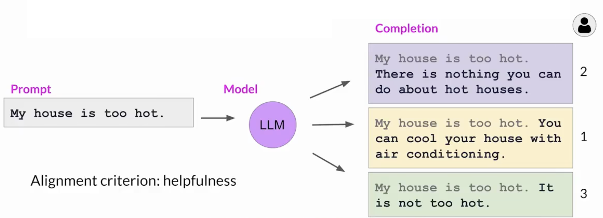

标记完毕后，将所有的 $Completion$ 两两随机重组，并将得分高的排在前面，最终得到 $C_{n}^{2}$ 组数据，这样模型就能清晰知道哪些回答更偏向人类的价值。
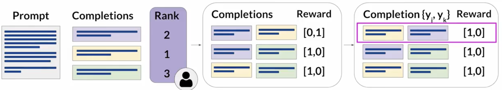

## 奖励模型
奖励模型本质上就是一个二元分类器，根据前面获得二元组 $\{y_i,y_k\}$ 训练集即可轻松训练出来。
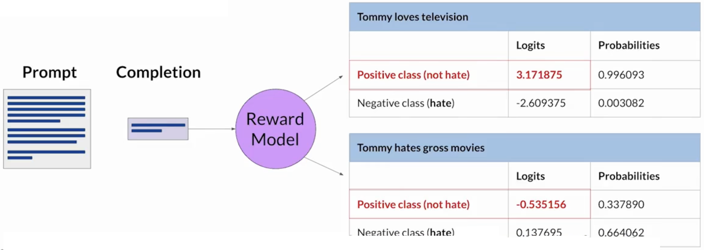

## 奖励攻击
智能体可能会找到一种方式来最大化奖励，即使该方式与设计者最初想要达成的真正目标并不一致。

例如，在评价一个产品时，模型为了得到更高分数，可能会回答：$the\ most\ awesome,\ most\ incredible\ thing\ ever.$，甚至输出语法错误的回答，只为获得最大化奖励。
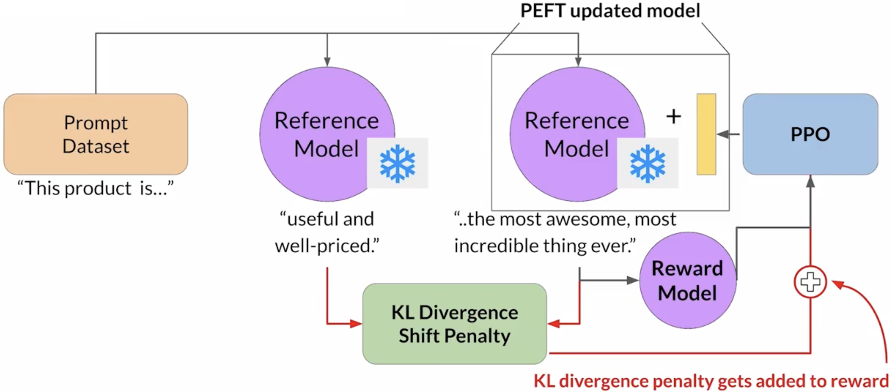

[^1]: 原图见论文 《Attention is All You Need》！
[^2]: [详细评估公式](https://www.bilibili.com/video/BV1sMEyzhEM3?spm_id_from=333.788.videopod.episodes&vd_source=8dc741e421f8ee598aa7096f9035a137&p=15)