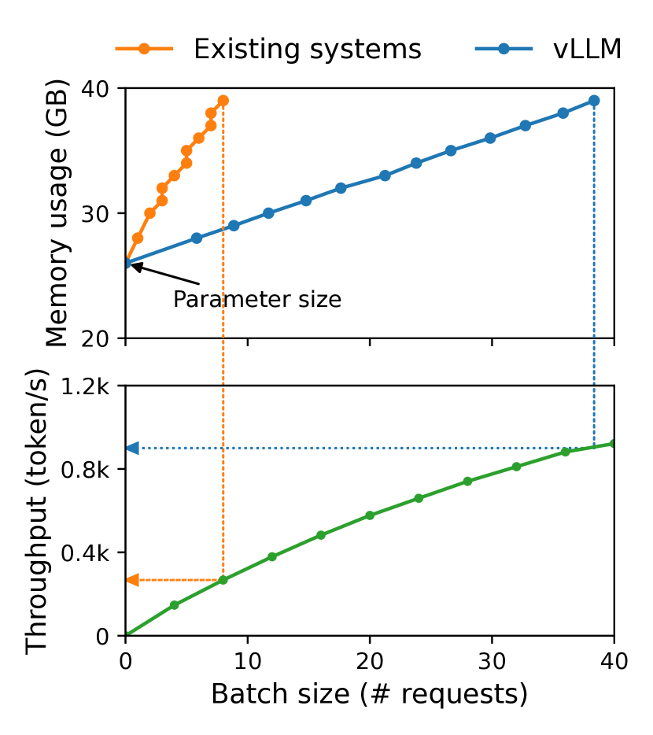
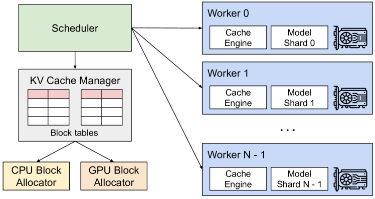
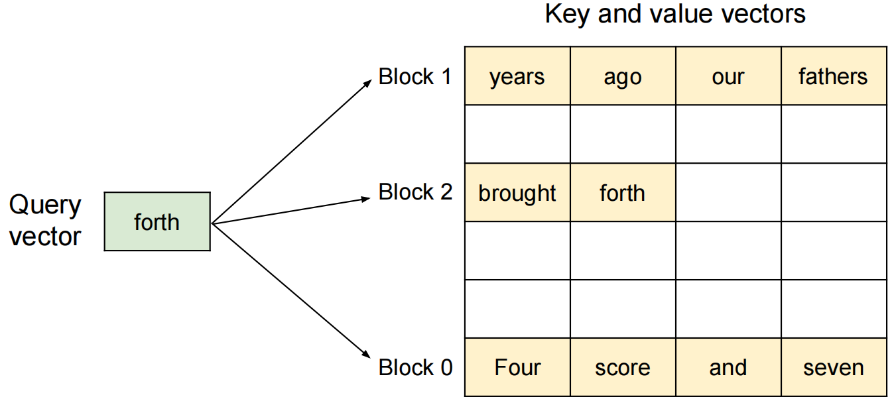
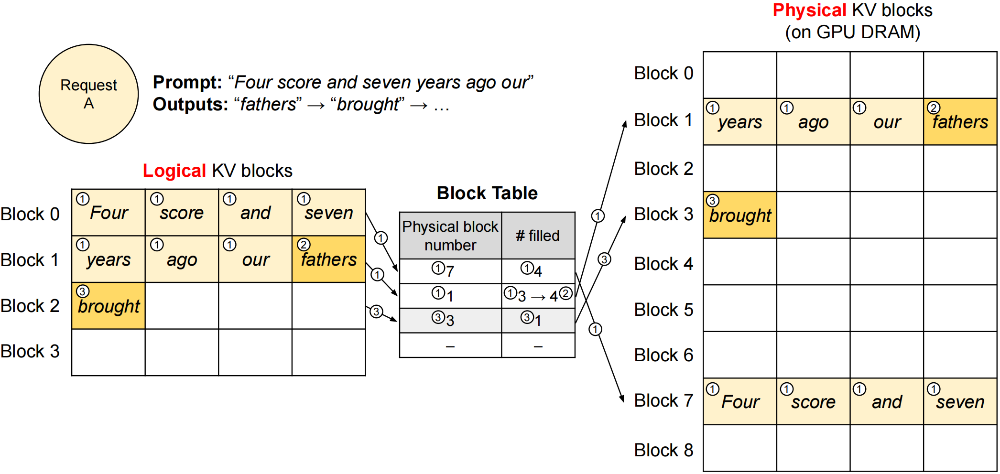
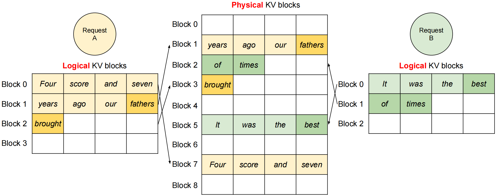
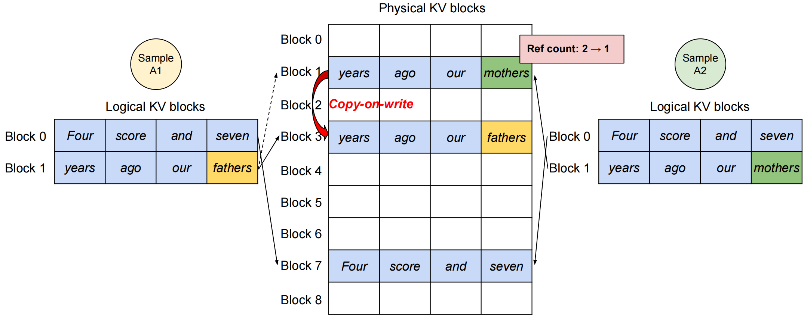
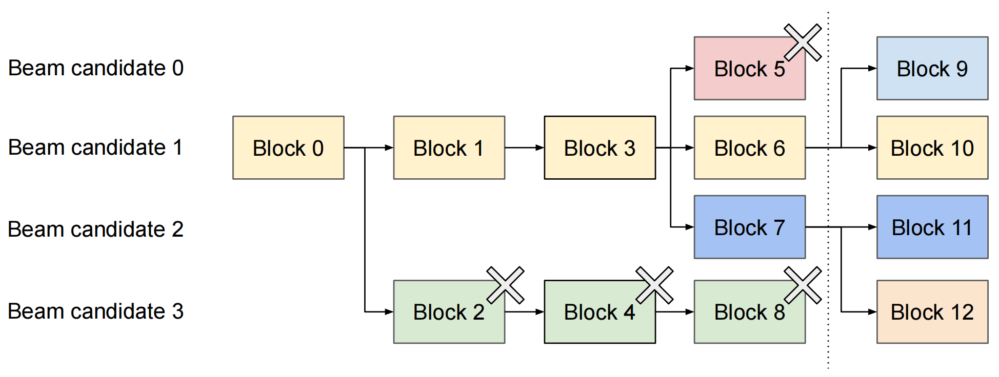
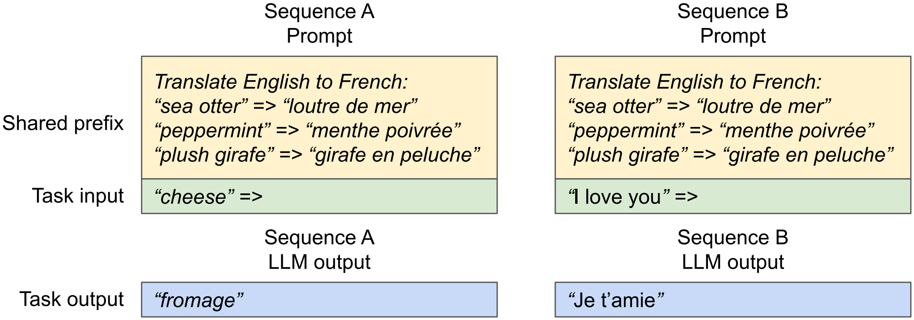

<h1 style="font-family: '仿宋', 'FangSong', 'Times New Roman', serif; color: orange; font-size: 2em; font-weight: bold; text-align: center; border-bottom: none; margin-bottom: 0;">PageAttention 入门</h1>

Livia Tassel

[TOC]

---

# Batch
$Batch$ 指的是 GPU 在单次计算中同时处理的多个独立用户请求的集合。简单来说，更大的 $batch\ size$ 意味着 GPU 可以一次性为更多的用户生成回复，从而最大化利用其强大的平行计算能力，提高整体服务的效率（吞吐量）。

# KV 缓存
现有的 LLM 服务系统，将 KV 缓存存储在连续的内存空间中，因为大多数深度学习框架要求张量存储在连续空间中，但是 KV 缓存有其特性：

1. 随模型生成新的 $token$，其大小随时间推移增长与缩小。
2. 其生命周期与长度是先验未知的。

在 $vLLM$ 出现之前，现有系统普遍采用静态批处理（$Static\ Batching$）。系统为了处理一个 $batch$，会预先分配一块连续的、巨大的内存空间给这个 $batch$ 中的每一个请求。并且，这个空间的大小是按照可能的最长回复来计算的，然而大部分请求根本不会生成如此长的回复，导致预留的内存空间大量被闲置浪费（内存内部碎片化）。

另外，原文[^1]中提到，现有 LLM 服务通常采取并行采样和波束搜索[^2]，为每个请求生成多个输出，此时部分序列本可以共享 KV 缓存，但是受到前文提到的 KV 缓存单独连续存储的限制，现有系统无法实现该功能。

# vLLM
## 模型架构
<figure id="fig-vllm-kv-cache">
    
    <figcaption style="text-align: center;"><em>fig1：vLLM KV Cache Structure</em></figcaption>
</figure>
总得来说，KV 缓存管理器通过集中式调度器发送的指令来管理 GPU worker 上的物理 KV 缓存。

## PagedAttention
分页注意力算法灵感来自于操作系统的分页功能与虚拟内存技术，其将请求的 KV 缓存划分为多个块，每个块包含固定数量的 $token$ 的注意力键、值，并且各块的存储空间不一定连续。

为此，可以像在操作系统中管理虚拟内存一样管理 KV 缓存，将每个块视为页面，将各 $token$ 视为字节，将请求视为进程。由于每个块的大小相同，所以消除了外部碎片，且支持以块的粒度，与同一请求关联的不同序列甚至不同请求之间实现内存共享。

将 KV 缓存分块后，原本的注意力计算可以转化为以下按块计算：
$$
A_{ij} = \frac{\exp(q_i^{\top} K_j / \sqrt{d})}{\sum_{t=1}^{\lceil i/B \rceil} \exp(q_i^{\top} K_t 1 / \sqrt{d})}, \quad o_i = \sum_{j=1}^{\lceil i/B \rceil} V_j A_{ij}^{\top}
$$

其中，$A_{ij}$ 表示第 $j$ 个 KV 块上注意力得分的行向量。每次注意力计算的过程中，$PagedAttention$ 内核会根据查询标记（“$forth$”）分别识别和获取不同的 KV 块，因此算法允许将 KV 块存储在非连续的物理内存中。

## KV 缓存管理器
在操作系统中，程序所需的内存会被划分到连续的逻辑页，而连续的逻辑页可以对应非连续的物理内存页，并且物理内存空间无需提前预留，使操作系统可以根据需要动态分配物理页面。

下面通过示例，演示 vLLM 在单个输入序列的解码过程中如何执行 $PagedAttention$ 并管理内存：

上图中，左侧虚拟内存可以存储所有 $token$ 的 KV 缓存，而在右侧实际的物理内存中只保留必要的 KV 块来容纳提示词计算期间生成的 KV 缓存。

随着更多 $token$ 及其 KV 缓存的生成，vLLM 会动态地将新的物理块分配给逻辑块。由于所有块都是从左到右填充的，并且只有在之前的所有块都已满时才会分配一个新的物理块，因此 vLLM 将请求的所有内存浪费限制在一个块内，请求生成完毕后，可以释放其 KV 块来存储其他请求的 KV 缓存。

并且请求可以进行批处理，从而提高吞吐量。

## 内存共享
### 并行采样
现在的 LLM 可以为单个输入提示词生成多个采样输出，用户可以从中选择最喜欢的输出。下面将展示，通过其 $PagedAttention$ 和分页内存管理，vLLM 如何实现并行采样过程中的 KV 缓存共享并节省内存。

如上图中，起初 A1 与 A2 的提示词完全一致，所以在分配物理块时，两者可以共享一份内存，但为了避免不同的请求覆写同一块内存，需要为每个物理块引入引用计数（“$reference\ count$”）。

当请求 A1 将新的 KV 缓存（图中 “fathers”）写入逻辑块时，vLLM 识别出对应物理块（Block 1）的引用计数大于 1，此时系统将分配一个新的物理块（Block 3），并从 Block 1 复制信息，并将引用计数减少到 1。接下来，当请求 A2 写入 Block 1 时，引用计数已减少到 1，因此 A2 直接将其新生成的 KV 缓存写入 Block 1。

### 波束搜索
与并行解码不同，波束搜索不仅共享初始提示块，还共享不同候选者之间的其他块，并且共享模式随着解码过程的推进而动态变化，类似于复合分叉创建的操作系统中的进程树（或者说前缀树（bushi））。

上图中体现 vLLM 如何管理 $k=4$ 波束搜索示例的 KV 块。初始时，所有候选波束共享一个块，即 Block 0，后续的共享与更新机制与并行采样类似，即为所有物理块打上引用计数。

### 共享前缀
通常，部分系统提示或提示词工程会作为共享前缀以提高下游任务的准确性，因此 LLM 服务提供商可以提前存储前缀的 KV 缓存，以减少前缀上的冗余计算。

## 调度与抢占
当请求流量超过系统容量时，vLLM 必须确定请求子集的优先级。在 vLLM 中，所有请求都采用先到先得 （FCFS） 调度政策，确保公平并防止饥饿。

而随着请求数量及其输出的增长，vLLM 可能会耗尽 GPU 的物理块来存储新生成的 KV 缓存。此时来到两个经典问题：（1）应该驱逐哪些区块？（2）如果再次需要，如何恢复被驱逐的块？

通常，驱逐策略使用启发式方法来预测未来将访问最远的块并驱逐该块；而恢复被逐出的块将采用“交换”技术，即当 vLLM 耗尽物理块时，它会选择一组序列来逐出其 KV 缓存并将其传输到 CPU 内存。

## 分布式执行
许多 LLM 的参数大小超过了单个 GPU 的容量，因此，有必要将它们分区到分布式 GPU 上，并以模型并行方式执行它们。

然而，即使模型并行执行，每个模型分片仍然处理同一组输入 $token$，因此需要相同位置的 KV 缓存。vLLM 在集中式调度程序中具有单个 KV 缓存管理器，如<a href="#fig-vllm-kv-cache"> fig1 </a>所示，不同的 GPU 工作器共享管理器，以及从逻辑块到物理块的映射。

[^1]: [《Efficient Memory Management for Large Language Model Serving with PagedAttention》](https://ar5iv.labs.arxiv.org/html/2309.06180)
[^2]: [贪心搜索、集束搜索、随机采样](https://blog.csdn.net/jiangchao98/article/details/124934656)
