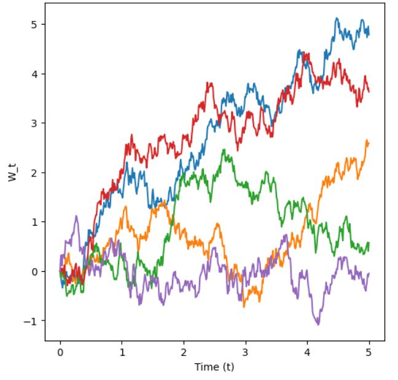
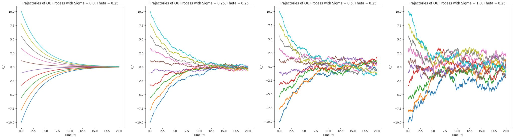

<h1 style="font-family: '仿宋', 'FangSong', 'Times New Roman', serif; color: orange; font-size: 2em; font-weight: bold; text-align: center; border-bottom: none; margin-bottom: 0;">流匹配和扩散模型导论</h1>

Livia Tassel

[TOC]

# 概率
图片、视频、蛋白质分子等，都可以用向量来表示：

假设我们可以访问一些轻松采样的初始分布 $p_{\text{init}}$，比如高斯分布 $p_{\text{init}}=\mathcal{N}(0, I_d)$。生成模型的目标就是将 $x \sim p_{\text{init}}$ 样本转换为 $p_{\text{data}}$ 样本。

# 流动与扩散模型
本节中，我们将构造适当的微分方程来模拟获得 $x$ 从 $p_{\text{init}}$ 样本转换为 $p_{\text{data}}$ 样本的过程。流动匹配和扩散模型分别模拟常微分方程（ODE）和随机微分方程（SDE）。
## 流模型
常微分方程的解由轨迹定义，即形式为：
$$
X : [0,1] \to \mathbb{R}^d,\quad t \mapsto X_t.
$$

它从时间 $t$ 映射到空间 $\mathbb{R}^d$ 中的某个位置。每个常微分方程由向量场 $u$ 定义，即形式为：
$$
u : \mathbb{R}^d \times [0,1] \to \mathbb{R}^d,\quad (x,t) \mapsto u_t(x),
$$

即对每个时间 $t$ 和位置 $x$，得到 $u_t(x)\in\mathbb{R}^d$，即一个指定空间速度的向量。轨迹 $X$ 沿向量场 $u_t$ 的直线前进，从点 $x_0$ 开始，将这样的轨迹形式化为方程的解：
$$
\frac{d}{dt} X_t = u_t(X_t)\\
X_0 = x_0
$$

现在，我们定义二元算子 $\psi_t(\cdot)$，即把起点 $x_0$ 映射成时间 $t$ 时到达的位置，令 $X_t = \psi_t(x_0)$，代入以上微分方程得流 $\psi_t$：
$$
\psi:\mathbb{R}^d\times[0,1]\mapsto\mathbb{R}^d,\quad (x_0,t)\mapsto \psi_t(x_0)\\
\frac{d}{dt}\psi_t(x_0)=u_t(\psi_t(x_0))\\
\psi_0(x_0)=x_0
$$

如所见，流是一个将空间进行“扭曲”的微分同胚（可逆 + 双方都光滑的映射）：
<table>
<tr align="center">
    <td></td>
    <td></td>
    <td></td>
</tr>
</table>

现在，我们可以写出流量模型由常微分方程的描述：
$$
X_0 \sim p_{\text{init}}\\
\frac{d}{dt}X_t = u_t^{\theta}(X_t)
$$

其中向量场 $u_t^{\theta}$ 是一个参数为 $\theta$ 的神经网络 $u_t^{\theta}$，即 $u_t^{\theta}:\mathbb{R}^d \times [0,1] \to \mathbb{R}^d$。稍后，我们将讨论神经网络架构的具体选择。我们的目标是让轨迹 $X_1$ 的端点分布为 $p_{\text{data}}$，即：
$$
X_1 \sim p_{\text{data}}
\iff
\psi_1^{\theta}(X_0)\sim p_{\text{data}}.
$$

其中 $\psi_t^{\theta}$ 描述由 $u_t^{\theta}$ 诱导的流动。但请注意，虽然称为流模型，但神经网络参数化的是向量场，而非流本身。
<table>
<tr align="center">
    <td></td>
    <td></td>
</tr>
</table>

## 扩散模型
随机微分方程将常微分方程的确定性轨迹拓展为随机轨迹。随机轨迹常称为随机过程 $(X_t)_{0\le t\le 1}$，并由以下方式给出：
$$
X_t\ \text{is a random variable for every}\ 0\le t\le 1 \\
X:[0,1]\to\mathbb{R}^d,\quad t\mapsto X_t\ \text{is a random trajectory for every draw of}\ X.
$$

特别地，当我们模拟同一个随机过程两次时，可能得到不同的结果，因为其动力学设计为随机的。

### 布朗运动
随机微分方程是通过布朗运动构造的，你可以把布朗运动看作随机游走。布朗运动 $W=(W_t)_{0\le t\le 1}$ 是一个随机过程，$W_0=0$，轨迹 $t\mapsto W_t$，且符合以下两个条件：
1. **正态增量：** $W_t-W_s \sim \mathcal{N}(0,(t-s)I_d)$ 对于所有 $0\le s<t$，即增量具有方差随时间线性递增的高斯分布（$I_d$ 为单位矩阵）。

2. **独立增量：** 对于任意 $0\le t_0<t_1<\cdots<t_n=1$，增量 $W_{t_1}-W_{t_0},\ldots,W_{t_n}-W_{t_{n-1}}$ 是独立的随机的。

### 随机微分方程
由于布朗运动的随机性，$W_t$ 无法求导，为此，将常微分方程的等价形式表述如下：
$$
\frac{d}{dt}X_t = u_t(X_t)\\
\Longleftrightarrow\quad
\frac{1}{h}\bigl(X_{t+h}-X_t\bigr)=u_t(X_t)+R_t(h)\\
\Longleftrightarrow\quad
X_{t+h}=X_t+h\,u_t(X_t)+h\,R_t(h).
$$

其中 $R_t(h)$ 描述了 $h$ 的误差项，即 $\lim_{h\to 0} R_t(h)=0$，这样一个 SDE 的轨迹 $(X_t)_{0\le t\le 1}$ 在每个时间步都带有一小步向 $u_t(X_t)$ 的方向，并加上布朗运动的部分贡献：
$$
X_{t+h}=X_t+ h\,u_t(X_t)+ \sigma_t\bigl(W_{t+h}-W_t\bigr)+ h\,R_t(h)
$$

其中 $\sigma_t\ge 0$ 为扩散参数，$R_t(h)$ 为随机误差项，于是标准差 $\mathbb{E}\!\left[\|R_t(h)\|^2\right]^{1/2}\to 0 \text{，当 } h\to 0$ 时。上述过程描述了一个随机微分方程：
$$
dX_t = u_t(X_t)\,dt + \sigma_t\,dW_t\\
X_0 = x_0
$$

然而，始终记住，上面的 $dX_t$ 是非正式符号。且 SDE 现在已经没有流映射 $\phi_t$ 了，因为值 $X_t$ 不再完全由 $X_0\sim p_{\text{init}}$ 决定，演化本身即随机的。

### 欧拉-马鲁亚马方法
欧拉-马鲁亚马对于随机微分方程的作用，就像欧拉方法对于常微分方程的作用一样。我们初始化 $X_0=x_0$ 并进行如下迭代即可求解以上随机微分方程：
$$
X_{t+h}=X_t + h\,u_t(X_t) + \sqrt{h}\,\sigma_t\,\epsilon_t, \quad \epsilon_t \sim \mathcal{N}(0, I_d)
$$

其中 $h=n^{-1}>0$ 为 $n\in\mathbb{N}$ 的迭代步长。

### 扩散模型
现在，我们终于可以通过 SDE 得到扩散生成模型，向量场 $u_t$ 仍代表一个神经网络：

**Algorithm** Sampling from a Diffusion Model (Euler-Maruyama method).
**Require:** Neural network $u_t^{\theta}$, number of steps $n$, diffusion coefficient $\sigma_t$.
1. Set $t=0$
2. Set step size $h=\frac{1}{n}$
3. Draw a sample $X_0 \sim p_{\text{init}}$
4. **for** $i=1,\ldots,n$ **do**
5. &nbsp;&nbsp;&nbsp;&nbsp;Draw a sample $\epsilon \sim \mathcal{N}(0, I_d)$
6. &nbsp;&nbsp;&nbsp;&nbsp;$X_{t+h} = X_t + h\,u_t^{\theta}(X_t) + \sigma_t\sqrt{h}\,\epsilon$
7. &nbsp;&nbsp;&nbsp;&nbsp;Update $t \leftarrow t+h$
8. **end for**
9. **return** $X_1$

因此，得到扩散模型如下：
$$
X_0 \sim p_{\text{init}}\\
dX_t = u_t^{\theta}(X_t)\,dt + \sigma_t\,dW_t
$$

