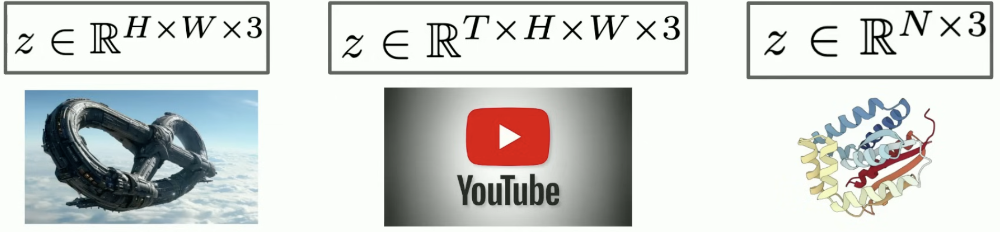
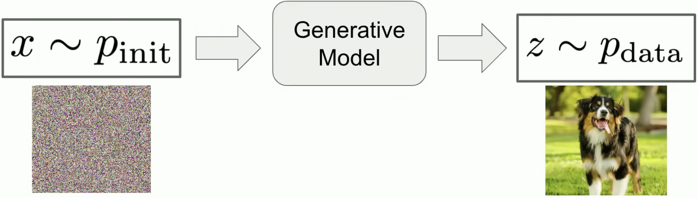
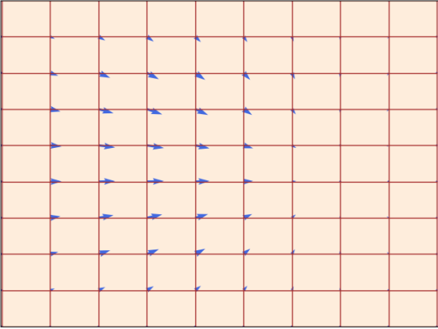
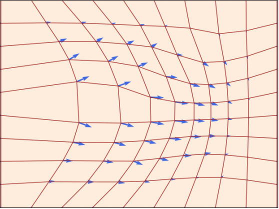
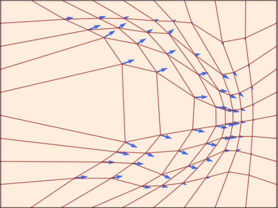
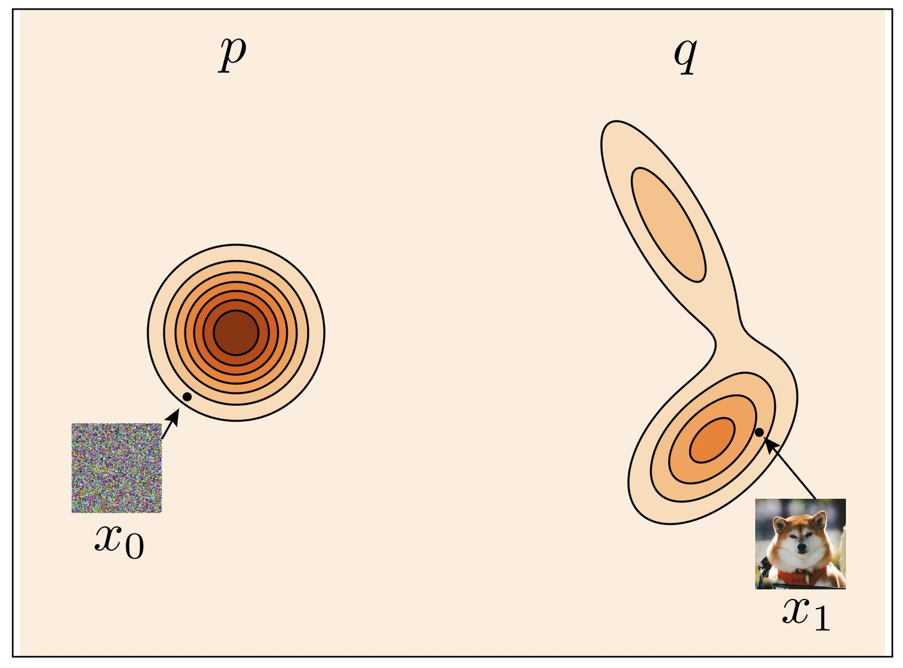
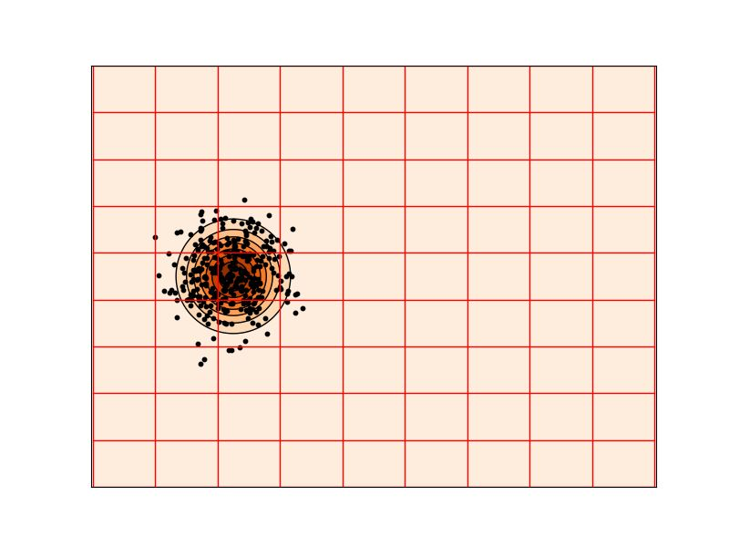

<h1 style="font-family: '仿宋', 'FangSong', 'Times New Roman', serif; color: orange; font-size: 2em; font-weight: bold; text-align: center; border-bottom: none; margin-bottom: 0;">流匹配和扩散模型导论</h1>

Livia Tassel

[TOC]

# 概率
图片、视频、蛋白质分子等，都可以用向量来表示：

假设我们可以访问一些轻松采样的初始分布 $p_{\text{init}}$，比如高斯分布 $p_{\text{init}}=\mathcal{N}(0, I_d)$。生成模型的目标就是将 $x \sim p_{\text{init}}$ 样本转换为 $p_{\text{data}}$ 样本。

# 流动与扩散模型
本节中，我们将构造适当的微分方程来模拟获得 $x$ 从 $p_{\text{init}}$ 样本转换为 $p_{\text{data}}$ 样本的过程。流动匹配和扩散模型分别模拟常微分方程（ODE）和随机微分方程（SDE）。
## 流模型
常微分方程的解由轨迹定义，即形式为：
$$
X : [0,1] \to \mathbb{R}^d,\quad t \mapsto X_t.
$$

它从时间 $t$ 映射到空间 $\mathbb{R}^d$ 中的某个位置。每个常微分方程由向量场 $u$ 定义，即形式为：
$$
u : \mathbb{R}^d \times [0,1] \to \mathbb{R}^d,\quad (x,t) \mapsto u_t(x),
$$

即对每个时间 $t$ 和位置 $x$，得到 $u_t(x)\in\mathbb{R}^d$，即一个指定空间速度的向量。轨迹 $X$ 沿向量场 $u_t$ 的直线前进，从点 $x_0$ 开始，将这样的轨迹形式化为方程的解：
$$
\frac{d}{dt} X_t = u_t(X_t)\\
X_0 = x_0
$$

现在，我们定义二元算子 $\psi_t(\cdot)$，即把起点 $x_0$ 映射成时间 $t$ 时到达的位置，令 $X_t = \psi_t(x_0)$，代入以上微分方程得流 $\psi_t$：
$$
\psi:\mathbb{R}^d\times[0,1]\mapsto\mathbb{R}^d,\quad (x_0,t)\mapsto \psi_t(x_0)\\
\frac{d}{dt}\psi_t(x_0)=u_t(\psi_t(x_0))\\
\psi_0(x_0)=x_0
$$

如所见，流是一个将空间进行“扭曲”的微分同胚（可逆 + 双方都光滑的映射）：
<table>
<tr align="center">
    <td></td>
    <td></td>
    <td></td>
</tr>
</table>

现在，我们可以写出流量模型由常微分方程的描述：
$$
X_0 \sim p_{\text{init}}\\
\frac{d}{dt}X_t = u_t^{\theta}(X_t)
$$

其中向量场 $u_t^{\theta}$ 是一个参数为 $\theta$ 的神经网络 $u_t^{\theta}$，即 $u_t^{\theta}:\mathbb{R}^d \times [0,1] \to \mathbb{R}^d$。稍后，我们将讨论神经网络架构的具体选择。我们的目标是让轨迹 $X_1$ 的端点分布为 $p_{\text{data}}$，即：
$$
X_1 \sim p_{\text{data}}
\iff
\psi_1^{\theta}(X_0)\sim p_{\text{data}}.
$$

其中 $\psi_t^{\theta}$ 描述由 $u_t^{\theta}$ 诱导的流动。但请注意，虽然称为流模型，但神经网络参数化的是向量场，而非流本身。
<table>
<tr align="center">
    <td></td>
    <td></td>
</tr>
</table>

## 扩散模型
随机微分方程将常微分方程的确定性轨迹拓展为随机轨迹。随机轨迹常称为随机过程 $(X_t)_{0\le t\le 1}$，并由以下方式给出：
$$
X_t\ \text{is a random variable for every}\ 0\le t\le 1 \\
X:[0,1]\to\mathbb{R}^d,\quad t\mapsto X_t\ \text{is a random trajectory for every draw of}\ X.
$$

特别地，当我们模拟同一个随机过程两次时，可能得到不同的结果，因为其动力学设计为随机的。

