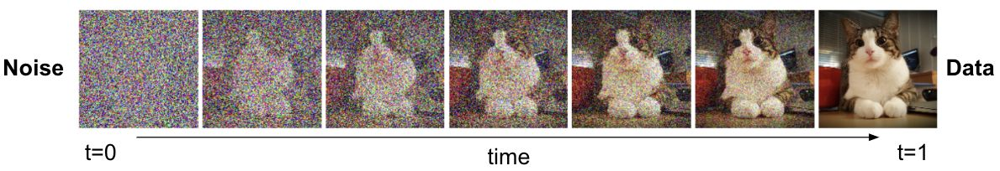
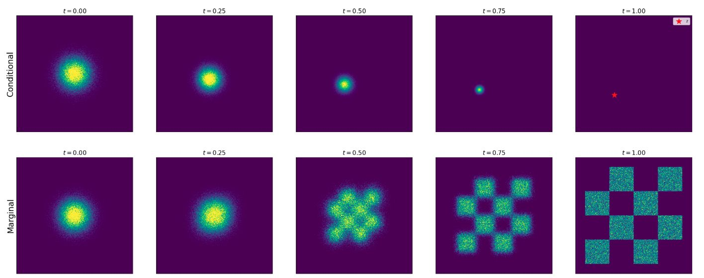
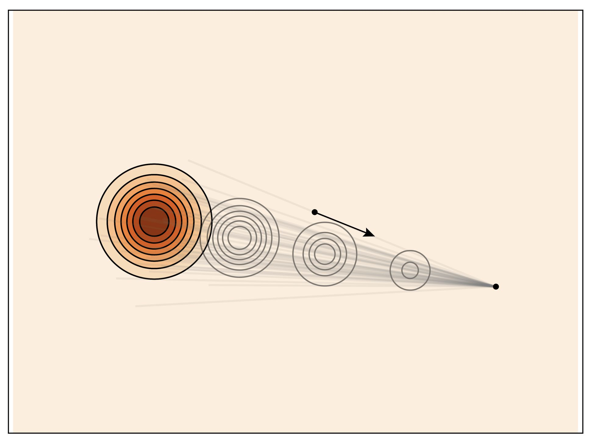
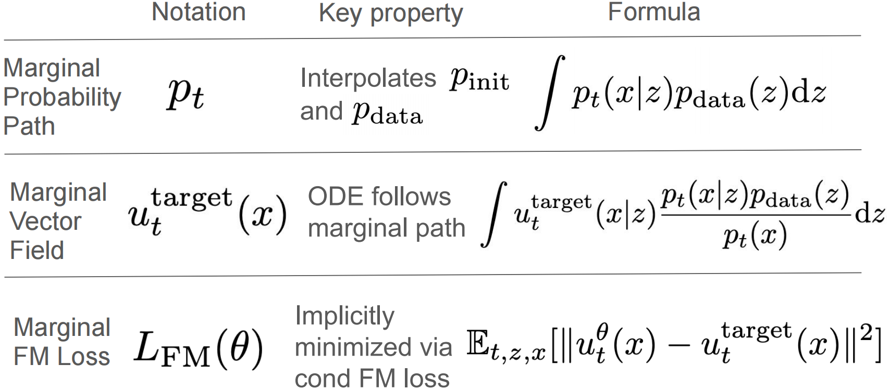

<h1 style="font-family: '仿宋', 'FangSong', 'Times New Roman', serif; color: orange; font-size: 2em; font-weight: bold; text-align: center; border-bottom: none; margin-bottom: 0;">流匹配和扩散模型导论</h1>

Livia Tassel

[TOC]

# 概率
图片、视频、蛋白质分子等，都可以用向量来表示：

假设我们可以访问一些轻松采样的初始分布 $p_{\text{init}}$，比如高斯分布 $p_{\text{init}}=\mathcal{N}(0, I_d)$。生成模型的目标就是将 $x \sim p_{\text{init}}$ 样本转换为 $p_{\text{data}}$ 样本。

# 流动与扩散模型
本节中，我们将构造适当的微分方程来模拟获得 $x$ 从 $p_{\text{init}}$ 样本转换为 $p_{\text{data}}$ 样本的过程。流动匹配和扩散模型分别模拟常微分方程（ODE）和随机微分方程（SDE）。
## 流模型
常微分方程的解由轨迹定义，即形式为：
$$
X : [0,1] \to \mathbb{R}^d,\quad t \mapsto X_t.
$$

它从时间 $t$ 映射到空间 $\mathbb{R}^d$ 中的某个位置。每个常微分方程由向量场 $u$ 定义，即形式为：
$$
u : \mathbb{R}^d \times [0,1] \to \mathbb{R}^d,\quad (x,t) \mapsto u_t(x),
$$

即对每个时间 $t$ 和位置 $x$，得到 $u_t(x)\in\mathbb{R}^d$，即一个指定空间速度的向量。轨迹 $X$ 沿向量场 $u_t$ 的直线前进，从点 $x_0$ 开始，将这样的轨迹形式化为方程的解：
$$
\frac{d}{dt} X_t = u_t(X_t)\\
X_0 = x_0
$$

现在，我们定义二元算子 $\psi_t(\cdot)$，即把起点 $x_0$ 映射成时间 $t$ 时到达的位置，令 $X_t = \psi_t(x_0)$，代入以上微分方程得流 $\psi_t$：
$$
\psi:\mathbb{R}^d\times[0,1]\mapsto\mathbb{R}^d,\quad (x_0,t)\mapsto \psi_t(x_0)\\
\frac{d}{dt}\psi_t(x_0)=u_t(\psi_t(x_0))\\
\psi_0(x_0)=x_0
$$

如所见，流是一个将空间进行“扭曲”的微分同胚（可逆 + 双方都光滑的映射）：
<table>
<tr align="center">
    <td></td>
    <td></td>
    <td></td>
</tr>
</table>

现在，我们可以写出流量模型由常微分方程的描述：
$$
X_0 \sim p_{\text{init}}\\
\frac{d}{dt}X_t = u_t^{\theta}(X_t)
$$

其中向量场 $u_t^{\theta}$ 是一个参数为 $\theta$ 的神经网络 $u_t^{\theta}$，即 $u_t^{\theta}:\mathbb{R}^d \times [0,1] \to \mathbb{R}^d$。稍后，我们将讨论神经网络架构的具体选择。我们的目标是让轨迹 $X_1$ 的端点分布为 $p_{\text{data}}$，即：
$$
X_1 \sim p_{\text{data}}
\iff
\psi_1^{\theta}(X_0)\sim p_{\text{data}}.
$$

其中 $\psi_t^{\theta}$ 描述由 $u_t^{\theta}$ 诱导的流动。但请注意，虽然称为流模型，但神经网络参数化的是向量场，而非流本身。
<table>
<tr align="center">
    <td></td>
    <td></td>
</tr>
</table>

## 扩散模型
随机微分方程将常微分方程的确定性轨迹拓展为随机轨迹。随机轨迹常称为随机过程 $(X_t)_{0\le t\le 1}$，并由以下方式给出：
$$
X_t\ \text{is a random variable for every}\ 0\le t\le 1 \\
X:[0,1]\to\mathbb{R}^d,\quad t\mapsto X_t\ \text{is a random trajectory for every draw of}\ X.
$$

特别地，当我们模拟同一个随机过程两次时，可能得到不同的结果，因为其动力学设计为随机的。

### 布朗运动
随机微分方程是通过布朗运动构造的，你可以把布朗运动看作随机游走。布朗运动 $W=(W_t)_{0\le t\le 1}$ 是一个随机过程，$W_0=0$，轨迹 $t\mapsto W_t$，且符合以下两个条件：
1. **正态增量：** $W_t-W_s \sim \mathcal{N}(0,(t-s)I_d)$ 对于所有 $0\le s<t$，即增量具有方差随时间线性递增的高斯分布（$I_d$ 为单位矩阵）。

2. **独立增量：** 对于任意 $0\le t_0<t_1<\cdots<t_n=1$，增量 $W_{t_1}-W_{t_0},\ldots,W_{t_n}-W_{t_{n-1}}$ 是独立的随机的。

### 随机微分方程
由于布朗运动的随机性，$W_t$ 无法求导，为此，将常微分方程的等价形式表述如下：
$$
\frac{d}{dt}X_t = u_t(X_t)\\
\Longleftrightarrow\quad
\frac{1}{h}\bigl(X_{t+h}-X_t\bigr)=u_t(X_t)+R_t(h)\\
\Longleftrightarrow\quad
X_{t+h}=X_t+h\,u_t(X_t)+h\,R_t(h).
$$

其中 $R_t(h)$ 描述了 $h$ 的误差项，即 $\lim_{h\to 0} R_t(h)=0$，这样一个 SDE 的轨迹 $(X_t)_{0\le t\le 1}$ 在每个时间步都带有一小步向 $u_t(X_t)$ 的方向，并加上布朗运动的部分贡献：
$$
X_{t+h}=X_t+ h\,u_t(X_t)+ \sigma_t\bigl(W_{t+h}-W_t\bigr)+ h\,R_t(h)
$$

其中 $\sigma_t\ge 0$ 为扩散参数，$R_t(h)$ 为随机误差项，于是标准差 $\mathbb{E}\!\left[\|R_t(h)\|^2\right]^{1/2}\to 0 \text{，当 } h\to 0$ 时。上述过程描述了一个随机微分方程：
$$
dX_t = u_t(X_t)\,dt + \sigma_t\,dW_t\\
X_0 = x_0
$$

然而，始终记住，上面的 $dX_t$ 是非正式符号。且 SDE 现在已经没有流映射 $\phi_t$ 了，因为值 $X_t$ 不再完全由 $X_0\sim p_{\text{init}}$ 决定，演化本身即随机的。

### 欧拉-马鲁亚马方法
欧拉-马鲁亚马对于随机微分方程的作用，就像欧拉方法对于常微分方程的作用一样。我们初始化 $X_0=x_0$ 并进行如下迭代即可求解以上随机微分方程：
$$
X_{t+h}=X_t + h\,u_t(X_t) + \sqrt{h}\,\sigma_t\,\epsilon_t, \quad \epsilon_t \sim \mathcal{N}(0, I_d)
$$

其中 $h=n^{-1}>0$ 为 $n\in\mathbb{N}$ 的迭代步长。

### 扩散模型
现在，我们终于可以通过 SDE 得到扩散生成模型，向量场 $u_t$ 仍代表一个神经网络：

**Algorithm** Sampling from a Diffusion Model (Euler-Maruyama method).
**Require:** Neural network $u_t^{\theta}$, number of steps $n$, diffusion coefficient $\sigma_t$.
1. Set $t=0$
2. Set step size $h=\frac{1}{n}$
3. Draw a sample $X_0 \sim p_{\text{init}}$
4. **for** $i=1,\ldots,n$ **do**
5. &nbsp;&nbsp;&nbsp;&nbsp;Draw a sample $\epsilon \sim \mathcal{N}(0, I_d)$
6. &nbsp;&nbsp;&nbsp;&nbsp;$X_{t+h} = X_t + h\,u_t^{\theta}(X_t) + \sigma_t\sqrt{h}\,\epsilon$
7. &nbsp;&nbsp;&nbsp;&nbsp;Update $t \leftarrow t+h$
8. **end for**
9. **return** $X_1$

因此，得到扩散模型如下：
$$
X_0 \sim p_{\text{init}}\\
dX_t = u_t^{\theta}(X_t)\,dt + \sigma_t\,dW_t
$$

# 模型训练
## 训练目标
**训练**神经网络 $u_t^{\theta}$，可以通过最小化损失 $C(\theta)$ 来实现：
\[
C(\theta)=\left\lVert u_t^{\theta}(x)-u_t^{\text{target}}(x)\right\rVert_2^{2},
\qquad
\underbrace{u_t^{\text{target}}(x)}_{\text{training target}}
\]

其中，$u_t^{\text{target}}(x)$ 是希望逼近的**训练目标**。本章的目标是为训练目标 $u_t^{\text{target}}$ 找到一个可表述的方程；下一章将描述一种逼近 $u_t^{\text{target}}$ 的训练算法。自然地，像神经网络 $u_t^{\theta}$ 一样，训练目标本身也应当是一个向量场：
\[
u_t^{\text{target}}:\mathbb{R}^d\times[0,1]\to\mathbb{R}^d.
\]

### 条件概率路径与边际概率路径
流匹配首先指定一条**概率路径**。直观地，概率路径刻画了 $p_{\text{init}}$ 与 $p_{\text{data}}$ 之间的渐变插值。也就是说，$t=0$ 时分布是 $p_{\text{init}}$，$t=1$ 时分布是 $p_{\text{data}}$。那么在起点与终点之间的中间时刻 $0<t<1$，“应该” 处于什么分布？

事实上，存在一定的自由性：端点条件符合，$0<t<1$ 的中间分布并不唯一。而**概率路径**正是对这种自由性进行刻画的一种方式：它规定了从 $p_{\text{init}}$ 到 $p_{\text{data}}$ 的过程应如何随时间演化。

为此，构造训练目标 $u_t^{\text{target}}$ 首先得**指定一条概率路径**。直观地，概率路径描述了 $p_{\text{init}}$ 与 $p_{\text{data}}$ 之间的逐步插值。

下文中，对于一个样本点 $z\in\mathbb{R}^d$，$\delta_z$ 表示 **Dirac delta “分布”**，即从 $\delta_z$ 抽样必返回 $z$。那么，一个**条件（插值）概率路径**就表示定义在 $\mathbb{R}^d$ 上的一族条件分布 $p_t(x\mid z)$（$t\in[0,1]$），符合：
\[
p_0(\,\cdot \mid z)=p_{\text{init}},\qquad
p_1(\,\cdot \mid z)=\delta_z,\qquad
\text{for all } z\in\mathbb{R}^d.
\]

即条件概率路径将初始分布 $p_{\text{init}}$ 逐步转化为**单个样本点**，也可以把概率路径理解为分布空间中的一条轨迹。每一条条件概率路径 $p_t(x\mid z)$ 都将诱导出一条**边际概率路径** $p_t(x)$：先从样本分布中抽样一个样本点 $z\sim p_{\text{data}}$，再从 $p_t(\,\cdot\mid z)$ 中采样所得到的分布：
\[
z\sim p_{\text{data}},\quad x\sim p_t(\,\cdot\mid z)
\ \Rightarrow\ x\sim p_t.\\
p_t(x)=\int p_t(x\mid z)\,p_{\text{data}}(z)\,dz.
\]

注意：我们**知道如何从** $p_t$ **进行采样**，但由于式中的积分往往不可解，于是**并不知道** $p_t(x)$ 的显式值。由端点条件可得，边际概率路径 $p_t(x\mid z)$ 在 $p_{\text{init}}$ 与 $p_{\text{data}}$ 之间插值：
\[
p_0=p_{\text{init}},\qquad p_1=p_{\text{data}}.
\]

> **常见的高斯条件路径：**  
> \[
> p_t(x\mid z)=\mathcal{N}\!\left(\alpha_t z,\;\beta_t^2 I_d\right).
> \]
> - 当 $t\to 1$ 时，$\alpha_t\to 1$ 且 $\beta_t\to 0$，则
>   \[
>   \mathcal{N}\!\left(\alpha_t z,\;\beta_t^2 I_d\right)\Rightarrow \delta_z,
>   \]
> - 当 $t\to 0$ 时，令 $\alpha_0=0,\ \beta_0=1$，则该分布不再依赖 $z$，退化为初始分布 $p_{\text{init}}=\mathcal{N}(0,I_d)$。
>
> 由上述**条件路径**可以立刻写出对应的**边际概率路径**：
> \[
> p_t(x)=\int p_t(x\mid z)\,p_{\text{data}}(z)\,dz
> =\int \mathcal{N}\!\left(x;\alpha_t z,\;\beta_t^2 I_d\right)\,p_{\text{data}}(z)\,dz.
> \]
> 直观地，这是把 $p_{\text{data}}$ 经过**线性缩放**（乘以 $\alpha_t$）后，再做一次各向同性高斯**平滑/加噪**（方差 $\beta_t^2$）得到的分布。
>
> 若 $p_{\text{data}}$ 是由有限样本集 $\{z_i\}_{i=1}^N$ 给出的经验分布，则上式可写成显式的混合形式：
> \[
> p_t(x)=\frac{1}{N}\sum_{i=1}^N \mathcal{N}\!\left(x;\alpha_t z_i,\;\beta_t^2 I_d\right).
> \]
> 此时，$p_t(x)$ 是一个**高斯混合分布**，比如 $p_{\text{data}}=\tfrac12\,\delta_{-1}+\tfrac12\,\delta_{+1}$，并取一条简单的高斯条件路径：
> \[
> p_t(x\mid z)=\mathcal{N}(t z,\,(1-t^2)),\quad z\in\{-1,+1\},
> \]
> 那么边际概率路径如下：
> \[
> p_t(x)=\tfrac12\,\mathcal{N}(t,\,1-t^2)+\tfrac12\,\mathcal{N}(-t,\,1-t^2).
> \]
> - $t=0$：两个高斯均值都等于 $0$，混合后 $\mathcal{N}(0,1)$；
> - $t$ 增大：两个高斯的均值向 $\pm 1$ 分开，同时方差 $1-t^2$ 逐渐减小；
> - $t\to 1$：方差趋于 $0$，混合分布收缩为两个尖点 $-1$ 与 $+1$。

### 条件向量场与边际向量场
一个概率路径 $\bigl(p_t\bigr)_{0\le t\le 1}$ 指示轨迹上 $X_t$ 在每个时刻 $t$ 应该服从的分布。那么**如何找到一个向量场**，使得由该向量场生成的轨迹 $(X_t)$ 的边际分布符合 $X_t\sim p_t$？

对于每个样本点 $z\in\mathbb{R}^d$，令 $u_t^{\text{target}}(\cdot\mid z)$ 表示一个**条件向量场**。我们希望它驱动的常微分方程在 $z$ 的条件下产生相应的条件概率路径 $p_t(\cdot\mid z)$，即：
\[
X_0 \sim p_{\text{init}},\quad 
\frac{d}{dt}X_t = u_t^{\text{target}}(X_t\mid z)
\Longrightarrow
X_t \sim p_t(\cdot\mid z),\ \ (0\le t\le 1).
\]

乍一看，条件向量场似个废物：因为在 $z$ 的条件下，ODE 的所有轨迹终点都将坍缩到 $X_1 = z$，就像在重新生成一个已知的样本点而已。

然而，条件向量场并非最终目的，我们在对 $z\sim p_{\text{data}}$ 进行边际化（或等价的混合）后，将这些条件动力学汇合成能产生边际概率路径 $p_t$ 的向量场，从而真正实现从 $p_{\text{init}}$ 到 $p_{\text{data}}$ 的生成。

令 $u_t^{\text{target}}(x\mid z)$ 是一个条件向量场。据此，我们定义如下的**边际向量场**：
\[
u_t^{\text{target}}(x)
=\int u_t^{\text{target}}(x\mid z)\,
\frac{p_t(x\mid z)\,p_{\text{data}}(z)}{p_t(x)}\,dz .
\]

其中分母 $p_t(x)=\int p_t(x\mid z)\,p_{\text{data}}(z)\,dz$，权重 $\frac{p_t(x\mid z)\,p_{\text{data}}(z)}{p_t(x)}$ 正是后验分布 $p_t(z\mid x)$，因此也可以写成条件期望的形式：
\[
u_t^{\text{target}}(x)=\mathbb{E}_{z\sim p_t(z\mid x)}\!\left[u_t^{\text{target}}(x\mid z)\right].
\]

这样定义的 $u_t^{\text{target}}(x)$ 将**遵循边际概率路径** $p_t$，即：
\[
X_0 \sim p_{\text{init}},\quad 
\frac{d}{dt}X_t = u_t^{\text{target}}(X_t)
\Longrightarrow
X_t \sim p_t,\ \ (0\le t\le 1).
\]

> 如前所述，令条件概率路径：
> $$
> p_t(\cdot\mid z)=\mathcal{N}\!\left(\alpha_t z,\;\beta_t^2 I_d\right),
> $$
>
> 记 $\dot{\alpha}_t=\partial_t\alpha_t,\ \dot{\beta}_t=\partial_t\beta_t$，分别表示 $\alpha_t$ 与 $\beta_t$ 对时间求导。那么对应的高斯条件向量场如下：
> \[
> u_t^{\text{target}}(x\mid z)
> =\left(\dot{\alpha}_t-\frac{\dot{\beta}_t}{\beta_t}\alpha_t\right)z+\frac{\dot{\beta}_t}{\beta_t}\,x.
> \]

### 条件得分与边际得分
目前已经成功构造了一个**流模型**的训练目标，现在将这一推导扩展到 **SDE**。为此，把边际分布 $p_t$ 的**边际得分**定义：
\[
\nabla \log p_t(x).
\]

由条件向量场与边际向量场 $u_t^{\text{target}}(x\mid z)$ 和 $u_t^{\text{target}}(x)$，对于任意 $\sigma_t\ge 0$，可以构造一个**遵循同一条概率路径** $p_t$ 的随机微分方程：
\[
X_0\sim p_{\text{init}},\quad
dX_t=\Bigl[u_t^{\text{target}}(X_t)+\frac{\sigma_t^2}{2}\,\nabla\log p_t(X_t)\Bigr]dt+\sigma_t\,dW_t.
\]

从而其边际分布符合 $X_t\sim p_t,\ (0\le t\le 1)$。特别地，这个 SDE 的终点分布符合 $X_1\sim p_{\text{data}}$。此外，如果将边际概率路径 $p_t(x)$ 与边际向量场 $u_t^{\text{target}}(x)$ 分别换成条件概率路径 $p_t(x\mid z)$ 与条件向量场 $u_t^{\text{target}}(x\mid z)$，上述结论同样成立。

类似地，可以由**条件得分** $\nabla\log p_t(x\mid z)$ 来表示**边际得分** $\nabla\log p_t(x)$：
\[
\nabla\log p_t(x)
=\frac{\nabla p_t(x)}{p_t(x)}
=\frac{\nabla\int p_t(x\mid z)\,p_{\text{data}}(z)\,dz}{p_t(x)}
=\frac{\int \nabla p_t(x\mid z)\,p_{\text{data}}(z)\,dz}{p_t(x)}
=\int \nabla\log p_t(x\mid z)\,
\frac{p_t(x\mid z)\,p_{\text{data}}(z)}{p_t(x)}\,dz.
\]

其中 $p_t(x)=\int p_t(x\mid z)p_{\text{data}}(z)\,dz$。

> 对于高斯条件概率路径 $p_t(x\mid z)=\mathcal{N}\!\left(x;\alpha_t z,\;\beta_t^2 I_d\right)$，其**条件得分**如下：
> \[
> \nabla_x \log p_t(x\mid z)
> =\nabla_x \log \mathcal{N}\!\left(x;\alpha_t z,\;\beta_t^2 I_d\right)
> = -\,\frac{x-\alpha_t z}{\beta_t^2}.
> \]

