<h1 style="font-family: '仿宋', 'FangSong', 'Times New Roman', serif; color: orange; font-size: 2em; font-weight: bold; text-align: center; border-bottom: none; margin-bottom: 0;">体系结构入门</h1>

Livia Tassel

[TOC]

---

# 系统漫游
## 程序的存储与执行
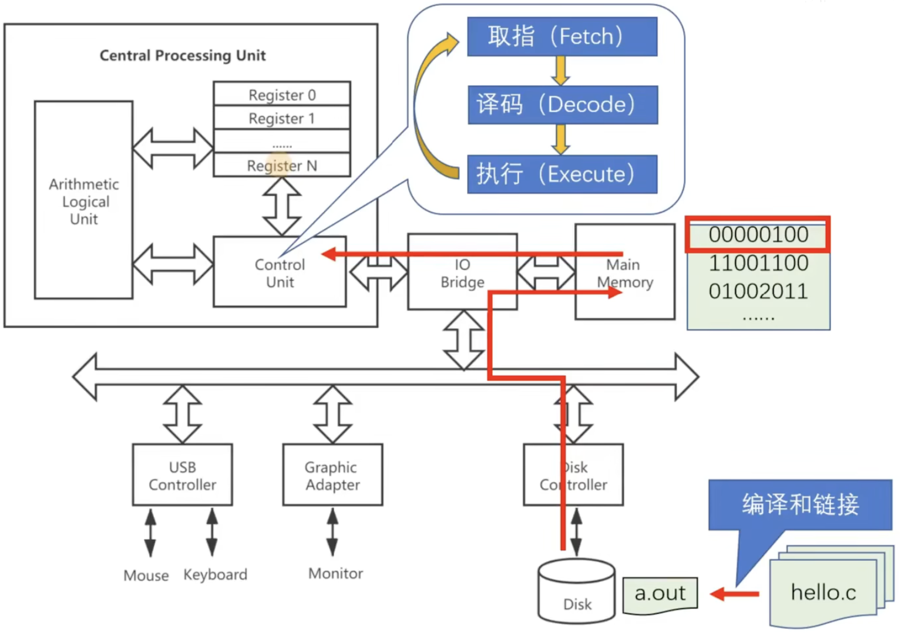
当一个 C 程序写好之后，进行编译与链接，生成`.out`的可执行文件，即二进制指令，并存储在磁盘中，然后经过总线到达主存，最后由 CPU 进行取指、译码并执行。

下面通过一个简单的加法程序来演示二进制指令在 CPU 中是如何执行的：
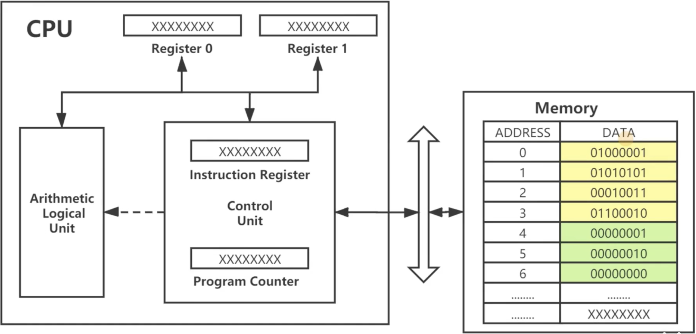
1. 注意，在冯若依曼架构中，指令（图中黄色区域）与数据（图中绿色区域）存储在同一片内存中，通过同一条总线与 CPU 通讯。
2. CPU 上电后，PC 复位，其指向当前程序的第一条指令，并将该指令加载到 IR（指令寄存器）中，再经过译码、执行，以此循环往复直到程序执行完毕。
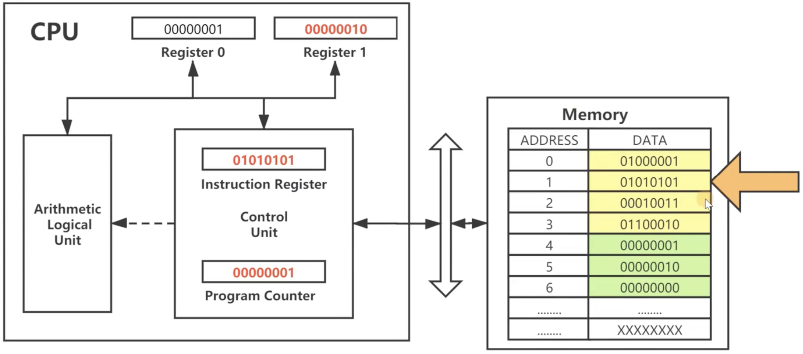

## 操作系统
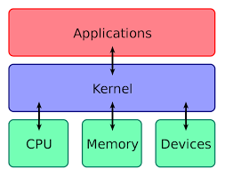
1. 应用程序与操作系统之间通过系统调用（$System\ Call$）进行交互。
2. 操作系统与硬件之间通过指令集架构 ISA 进行交互。

# RISC-V
## ISA
ISA 并不等同于汇编，其定义了软硬件交互的标准化接口，其中包括但不限于：
1. 指令集
2. 寄存器
3. 数据类型
4. 寻址模式
5. 内存模型
6. 中断与异常

32/64 位处理器指的是 CPU 中通用寄存器的宽度，与指令的编码长度无关，例如 RISC-V 中无论是 32/64 位机器，指令编码都是 32 位。

## 命名规范
RISC-V 的 CPU 命令通常由三部分组成：RV + 位宽 + 模块名，如 “RV32IMA”。

其中 RV 指的是 RISC-V 的简称；位宽指的是处理器的位宽；模块化指的是该处理器所支持的指令集模块。
### 模块化
在 RISC-V 中，只有基本整数指令集（I/E）必须实现，其余扩展指令集模块均可选。特别地， G（"General"） 不单指具体的指令集，而是特定组合 “IMAFD” 的简称。
<table>
<tr align="center">
    <td>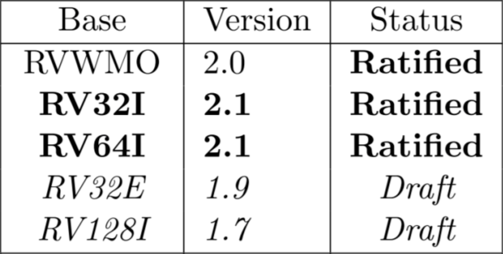</td>
    <td>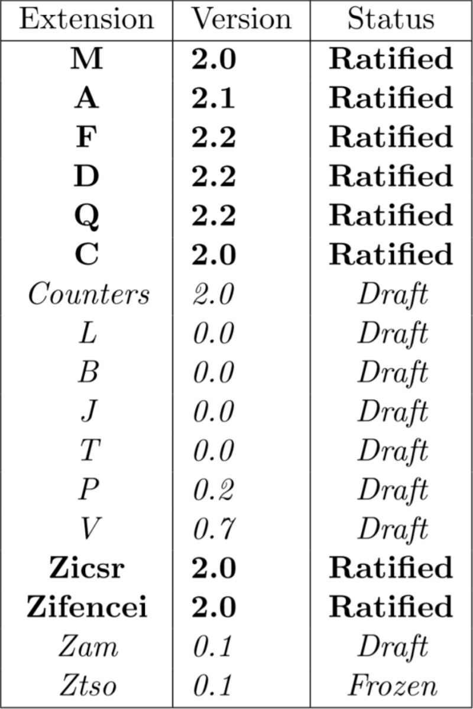</td>
</tr>
</table>

## 特权级
RISC-V 定义了三个特权级别，不同的特权级有各自的一套寄存器，以获取对应特权级下的工作状态，而高级别的特权级可以访问低级别的寄存器，反之不然。
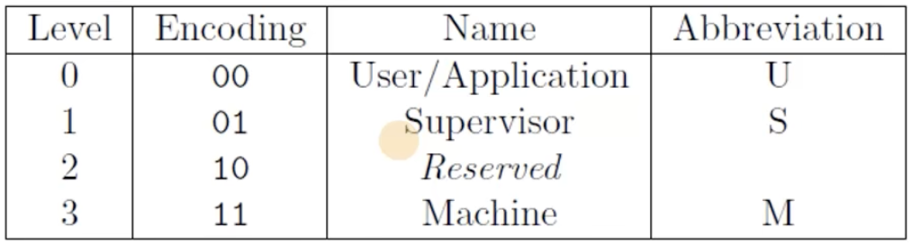

## 内存保护
### 虚拟内存保护
虚拟内存保护需要操作系统支持 “Supervisor Level”，即将虚拟内存映射到物理内存中，有了虚拟内存才有进程的概念。
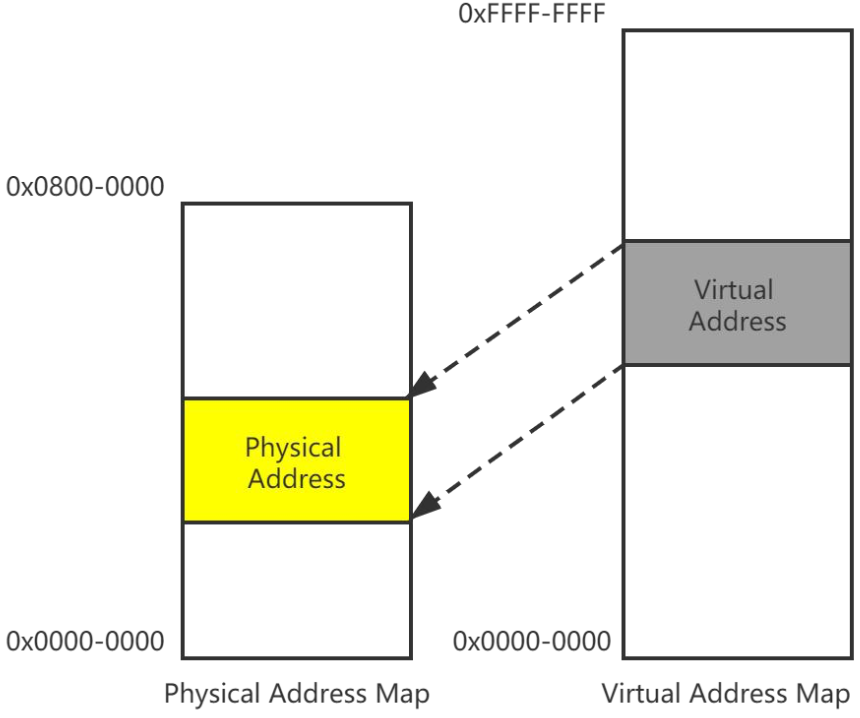
### 物理内存保护
物理内存保护就比较粗暴，直接将内存 “分块”，不同区域的访问权限不同，如可执行、可读、可写等等。
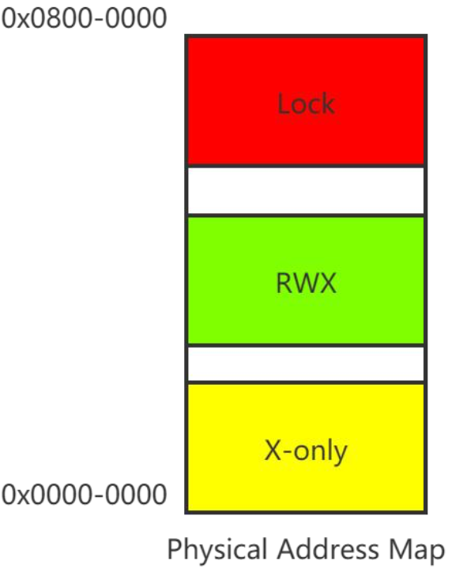

## 异常与中断
异常通常是由于程序本身存在 bug，导致运行中断，此时 CPU 将跳转到异常处理程序，异常处理结束后，CPU 将回到原先的异常指令再次执行。

而中断指的是由于外部因素导致的程序运行中断，CPU 执行完中断处理函数后，将回到被中断指令的下一指令开始执行。
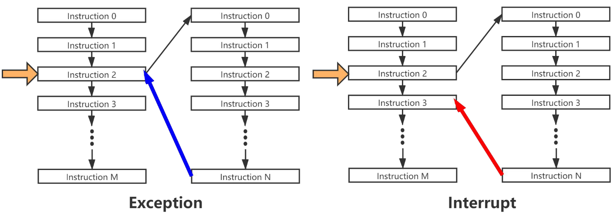

# 编译与链接
## GCC
GCC 是一个编译套件，具体命令格式如下：
`gcc [options] [filename]`
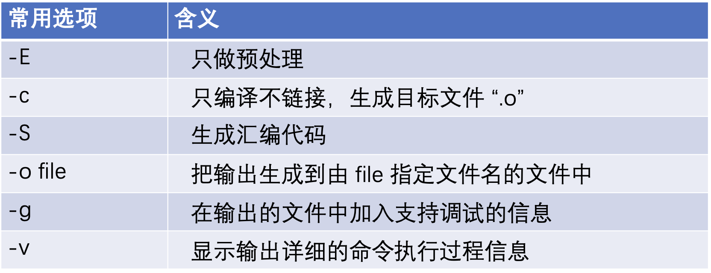

执行步骤：
1. 编译（cc1）：编译器完成 “预处理” 和 “编译”，其中 “预处理” 指处理源文件中以 “#” 开头的预处理指令，如`#include、#define`等；“编译” 则针对预处理的结果进行一系列的词法分析、语法分析、语义分析，优化后生成汇编指令，存放在`.s`文件中。
2. 汇编（as）：汇编器将汇编指令转化为 CPU 可以执行的指令，存放在`.o`文件中。
3. 链接（ld）：链接器将汇编器生成的`.o`文件和一些标准库（如`libc`）文件组合，形成最终可执行的应用程序，即`.out`文件。
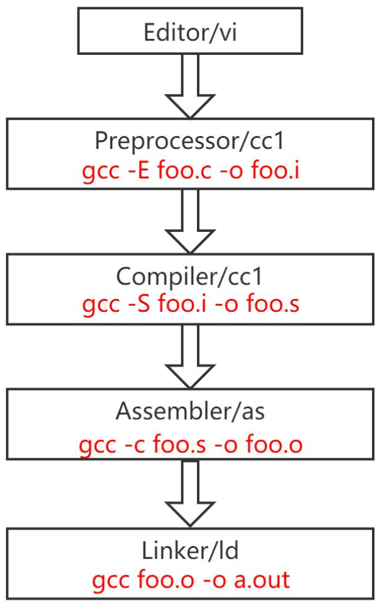

### 多源文件汇编
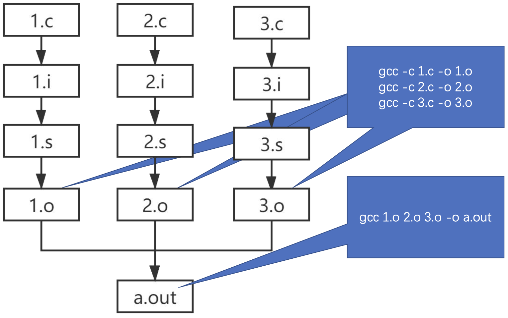

## ELF
ELF 指的是类 Unix 系统上的二进制文件格式标准，其定义了不同文件格式的作用。
| ELF 文件类型 | 说明 | 实例 |
| :---: | :---: | :---: |
| 可重定位文件 (Relocatable File) | 包含了代码和数据，可被链接成可执行文件或共享目标文件。 | `.o`文件 |
| 可执行文件 (Executable File) | 可直接执行的程序。 | `a.out` |
| 共享目标文件 (Shared Object File) | 包含了代码和数据，可作为链接器的输入；或者在运行阶段，作为动态链接器的输入。 | `.so`文件 |
| 核心转储文件 (Core Dump File) | 进程意外终止时，系统可以将该进程的部分内容和终止时的其他状态信息保存到该文件中以供调试分析。 | `core`文件 |

ELF 具体的文件格式如下：
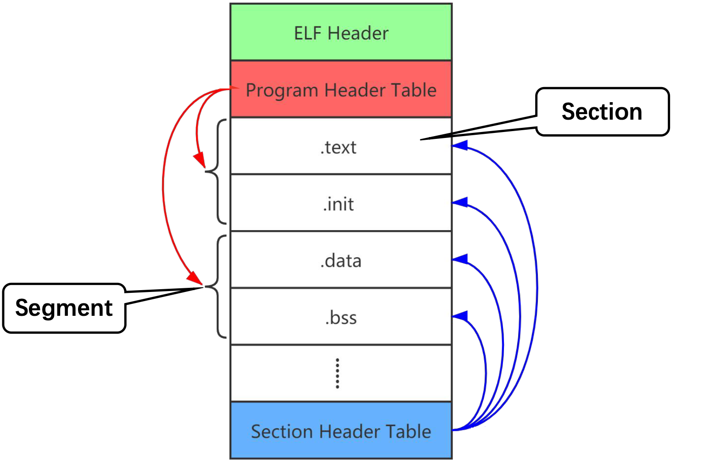

### ELF 文件处理
> ar：归档文件
  objcopy：执行文件格式转换
  objdump：显示 ELF 文件信息
  readelf：显示 ELF 详细文件信息
  >> -h：查看 ELF Header
     -s：查看 Section Header Table（链接视图）

#### 反汇编
在二进制文件反汇编出汇编指令，在编译时要使用`-g`参数，即`gcc -g -c hello.c`，得到`hello.o`文件后即可使用 objdump 工具反汇编，即`objdump -S hello.o`。
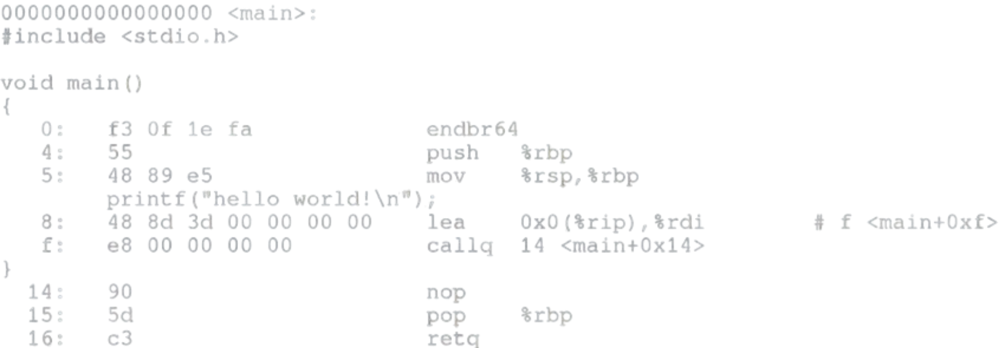

# 嵌入式开发
## 交叉编译
根据参与编译和运行的系统的角色可以将机器分为三类：
> 构建（build）系统：执行编译构建的机器，生成一个编译器。
  主机（host）系统：利用构建系统生成的编译工具编译本地源码，得到新的可执行程序。
  目标（target）系统：运行主机系统生成的可执行程序的机器。

根据编译方式分类可分为：
- 本地编译：`build == host == target`
- 交叉编译：`build == host != target`
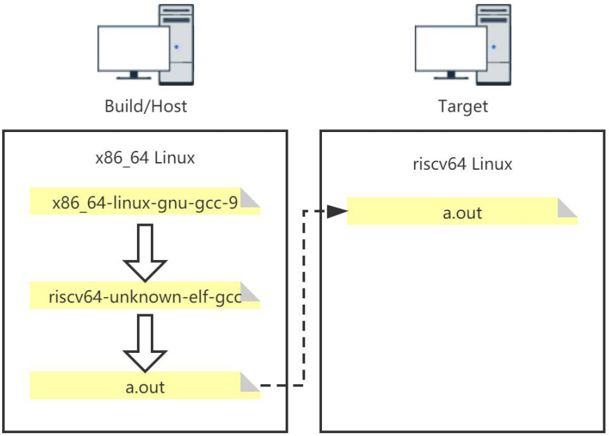

## 调试器 GDB
GDB 是 GNU 项目调试器，用于调试崩溃程序。

基本步骤：
1. 编译程序（加入`-g`参数）：`gcc -g hello.c`
2. 运行 gdb 与程序：`gdb a.out`
3. 设置断点：`(gdb) b 6`
4. 运行程序：`(gdb) r`
5. 程序在断点处停止，执行查看：`(gdb) p xxx`
6. 继续/单步/恢复程序运行：`(gdb) s/n/c`

## Make
Make 是一个自动化工程管理工具，Makefile 用于描述构建工程过程中所管理的对象以及如何构造工程的过程。
