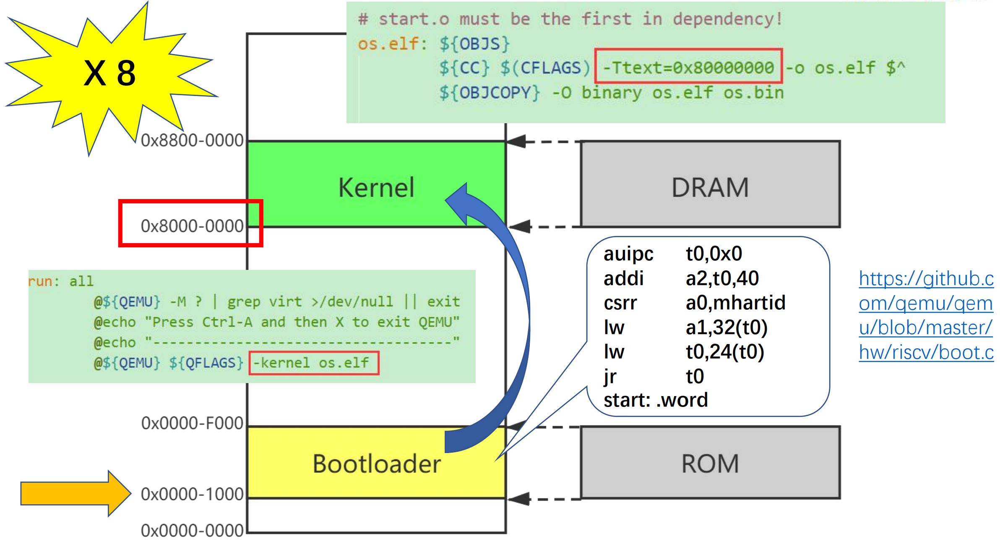
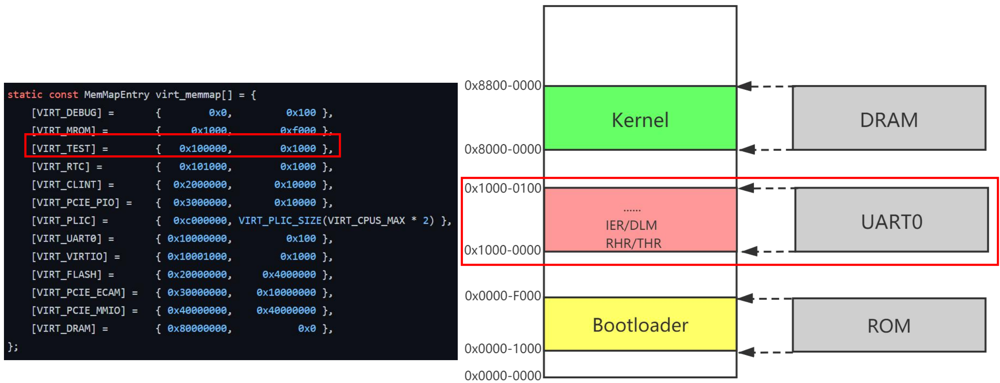
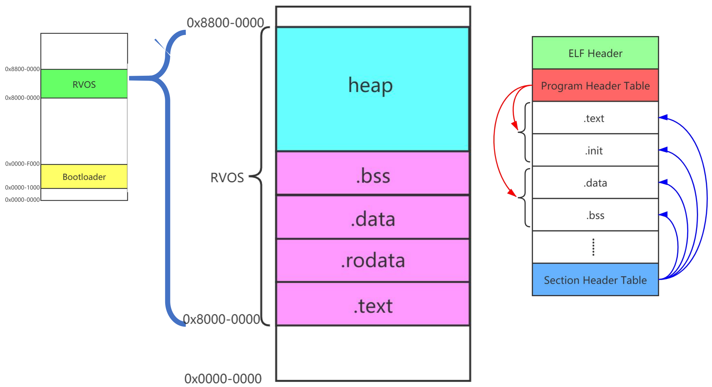
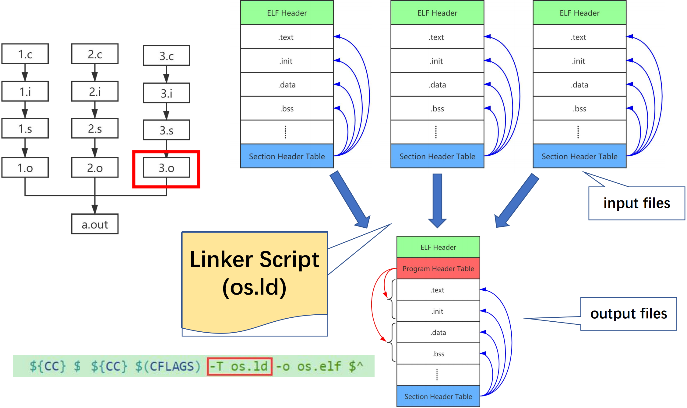
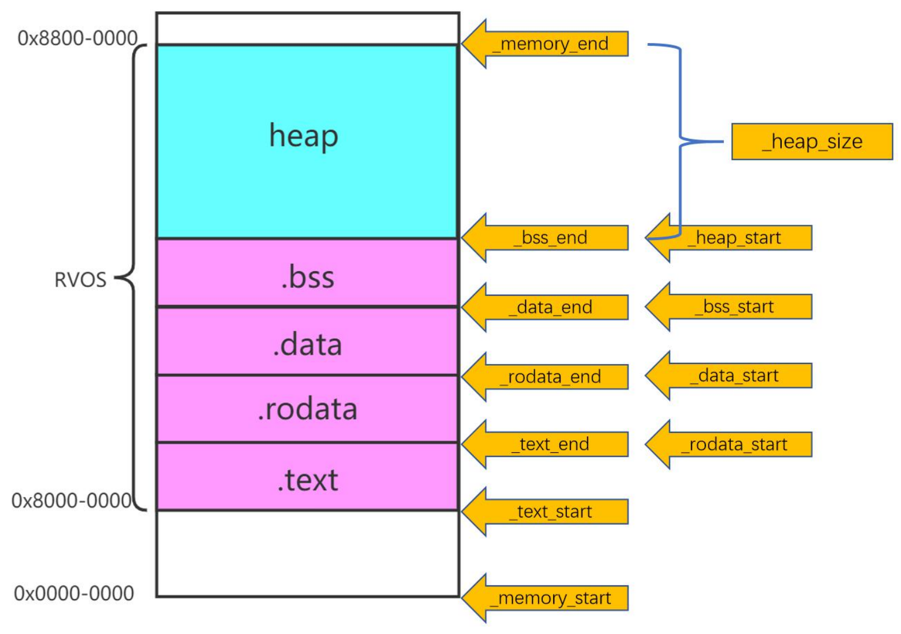
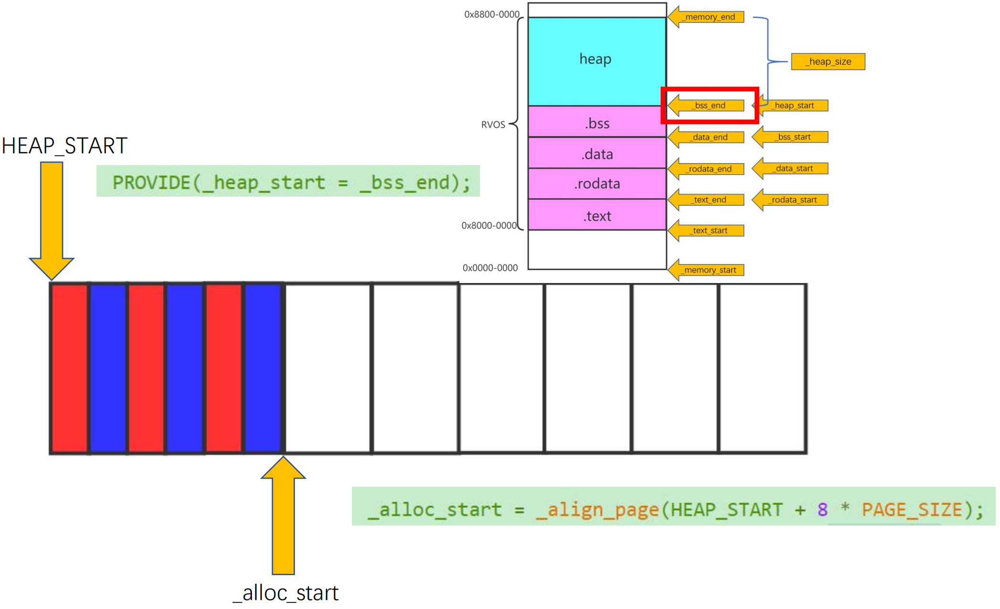
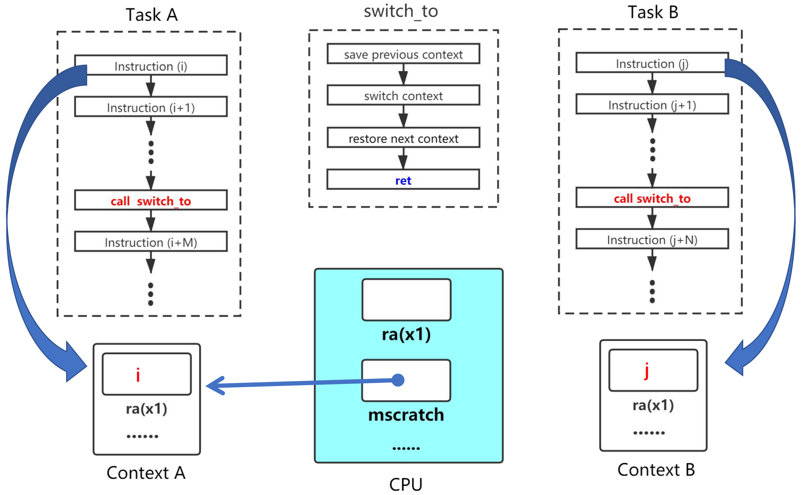
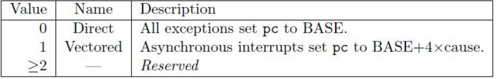

<h1 style="font-family: '仿宋', 'FangSong', 'Times New Roman', serif; color: orange; font-size: 2em; font-weight: bold; text-align: center; border-bottom: none; margin-bottom: 0;">操作系统入门</h1>

Livia Tassel

[TOC]

---

# 系统引导
## QEMU 模拟
 

## 内存映射

# 内存管理
## 链接脚本（Linker Script）
链接脚本是用于指导链接器（Linker）如何将程序的不同代码段和数据段组织、布局和放置在最终可执行文件或内存中的配置文件。

而内存管理是利用链接脚本提供的地址信息来划分、分配和保护内存。

## 内存分配和释放（页级别）
### 数组实现
物理内存划分为大小固定的页帧（Page Frames），大小通常是4KB。数组实现的核心在于建立页帧与数组中元素（位图）的一一对应关系。

# 协作式多任务
## 上下文
“上下文”指的是一个进程/线程在任何时间点的完整运行状态，当操作系统停止运行某个程序并切换到另一程序时，它必须保存当前程序的上下文，以便将来能够从它中断的地方恢复执行。

上下文信息通常包括：
1. CPU 寄存器
2. 进程状态信息（进程 ID、进程状态等）
3. 内存管理信息（页表基址寄存器）

## 协作式多任务
操作系统不具备强制抢占正在运行的程序的能力。 只有当当前程序主动放弃控制权后，操作系统才能进行上下文切换，调度下一个任务运行。

# 中断和异常
## 控制流
控制流指的是 CPU 执行程序指令的顺序，在没有特殊指令或事件干扰的情况下，程序按顺序执行；异常控制流（ECF）则是系统对突发事件的响应机制。

## 寄存器
### mtvec
存储发生异常时 CPU 跳转到的地址，必须保证4字节对齐。

### mepc
当 $trap$ 发生时，$hart$ 会将发生 $trap$ 所对应的指令的地址保存在 $mepc$ 中。