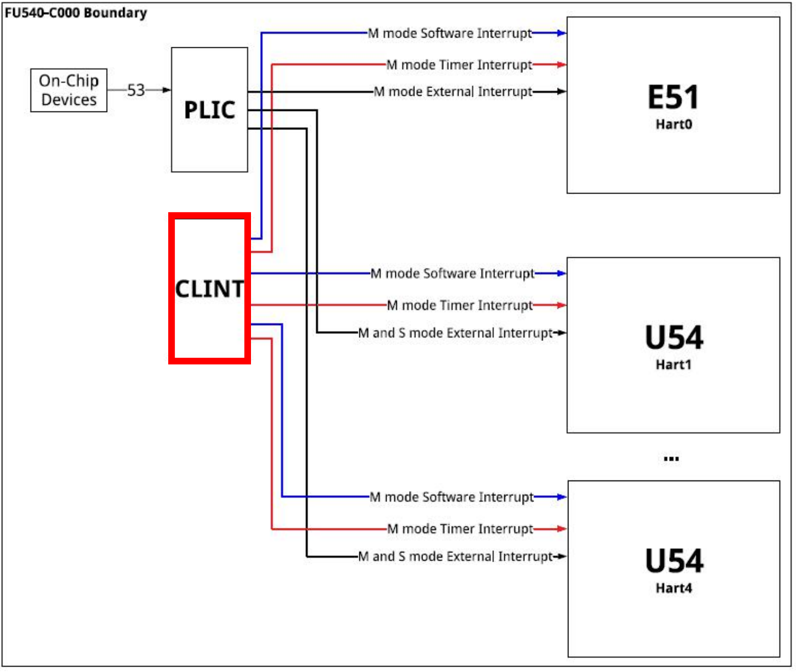
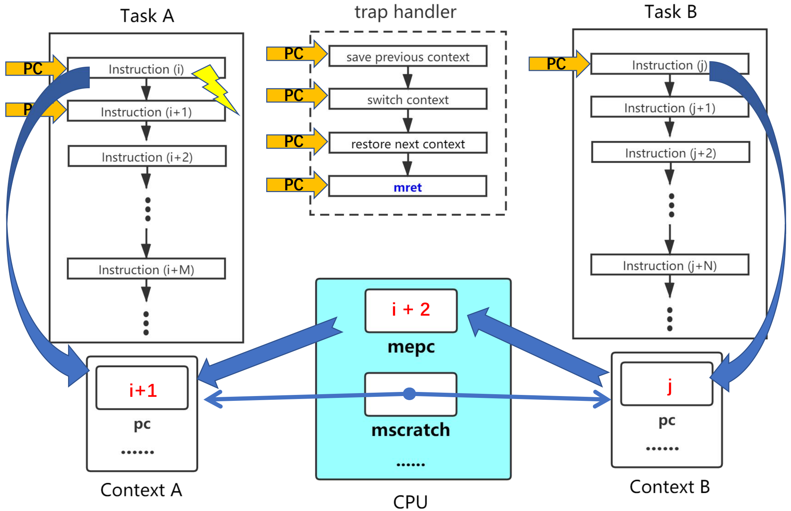
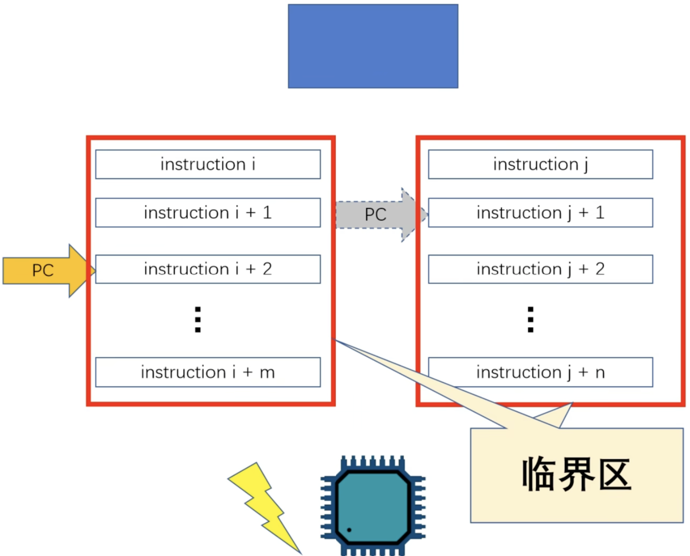
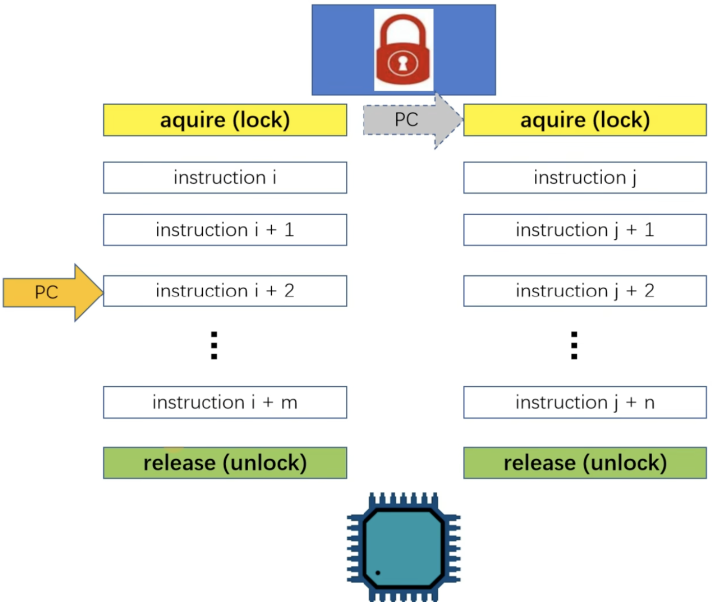
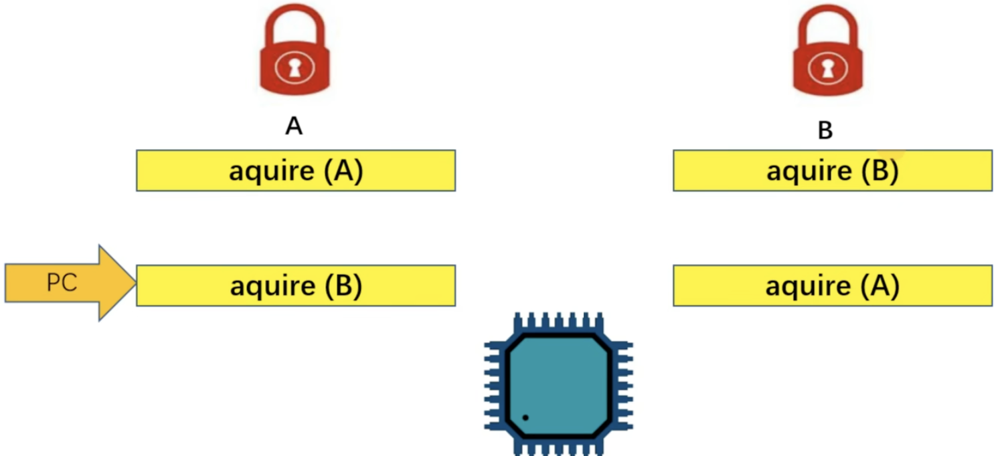
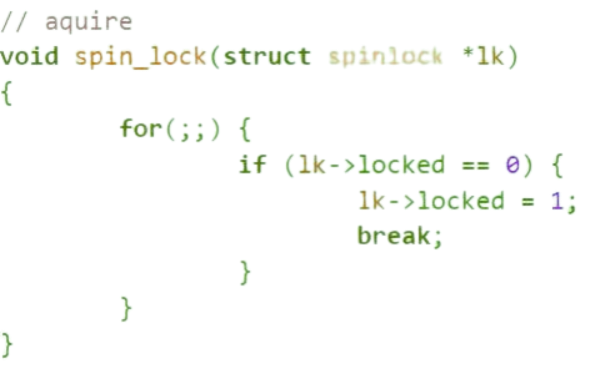
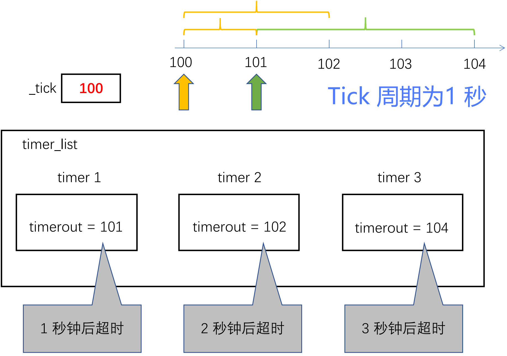
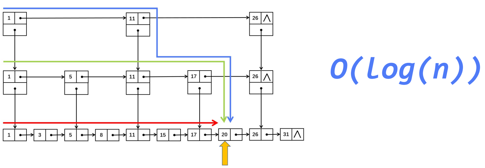
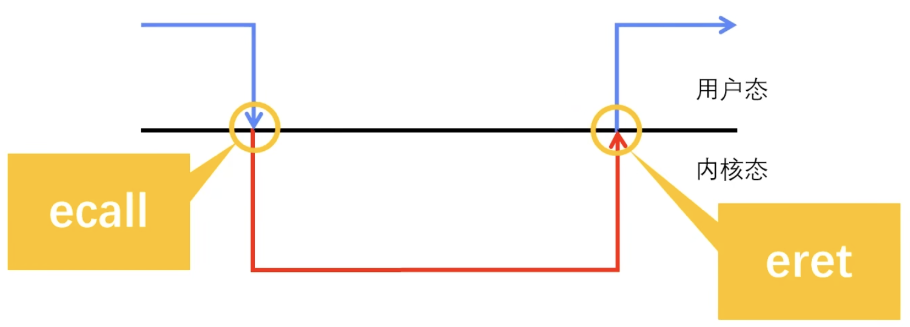
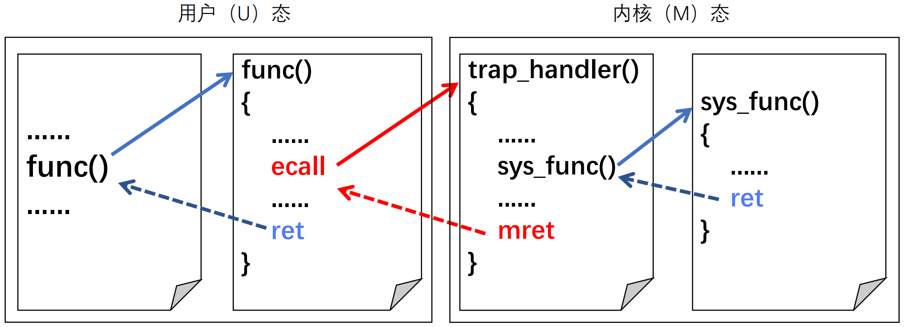

<h1 style="font-family: '仿宋', 'FangSong', 'Times New Roman', serif; color: orange; font-size: 2em; font-weight: bold; text-align: center; border-bottom: none; margin-bottom: 0;">操作系统入门</h1>
<p style="font-family: 'Times New Roman', serif; font-size: 1em; text-align: right; margin-top: 0;">Livia Tassel</p>
<div style="font-family: 'Times New Roman', 'FangSong', '仿宋', serif;">

[TOC]

---

# 系统引导
## QEMU 模拟
 

## 内存映射


# 内存管理
## 链接脚本（Linker Script）
链接脚本是用于指导链接器（Linker）如何将程序的不同代码段和数据段组织、布局和放置在最终可执行文件或内存中的配置文件。


而内存管理是利用链接脚本提供的地址信息来划分、分配和保护内存。


## 内存分配和释放（页级别）
### 数组实现
物理内存划分为大小固定的页帧（Page Frames），大小通常是4KB。数组实现的核心在于建立页帧与数组中元素（位图）的一一对应关系。


# 协作式多任务
## 上下文
“上下文”指的是一个进程/线程在任何时间点的完整运行状态，当操作系统停止运行某个程序并切换到另一程序时，它必须保存当前程序的上下文，以便将来能够从它中断的地方恢复执行。

上下文信息通常包括：
1. CPU 寄存器
2. 进程状态信息（进程 ID、进程状态等）
3. 内存管理信息（页表基址寄存器）

## 协作式多任务
操作系统不具备强制抢占正在运行的程序的能力。 只有当当前程序主动放弃控制权后，操作系统才能进行上下文切换，调度下一个任务运行。


# 异常
## 控制流
控制流指的是 CPU 执行程序指令的顺序，在没有特殊指令或事件干扰的情况下，程序按顺序执行；异常控制流（ECF）则是系统对突发事件的响应机制。

## 寄存器
### mtvec
存储发生异常时 CPU 跳转到的地址，必须保证 4 字节对齐。


### mepc
当 $trap$[^1] 发生时，$hart$ 将 $mepc$ 设置为当前指令或下一指令的地址，以便退出 $trap$ 时，将 $mepc$ 中的值恢复到 PC 中。


### mcause
指示 $trap$ 发生的具体原因，最高位 $Interrupt$ 为 1，标识为中断，否则为异常，剩余的 $Exception\ Code$ 标识具体的中断/异常种类。


### mtval
辅助 $mcause$ 指示 $trap$ 更加详细的信息。


### mstatus
- XIE（X=M/S/U，红色部分），分别用于打开（1）或关闭（0）M/S/U 模式下的全局中断，当 $trap$ 发生时，$hart$ 将其自动设置为 0，防止被其他 $trap$ 打断。
- XPIE（X=M/S/U，绿色部分），用于保存 $trap$ 发生前 XIE 的值。 
- XPP（X=M/S，黄色部分），用于保存 $trap$ 发生前的权限级别值。 
- 其余标志位涉及内存访问权限、虚拟内存控制等。


## 异常处理
### 初始化
1.  设置 $mtvec$：内核将异常处理程序的入口地址写入 $mtvec$ 寄存器。
2.  设置 $mstatus$ 和 $mie$：控制全局中断使能和特权级切换。
3.  配置特权级：内核配置 CSRs 以允许从 U-Mode 切换到 S-Mode/M-Mode。

### 上半部（Top Half）
* 将 PC 保存到 $mepc$ 中，同时将 PC 设置为 $mtvec$。
* 将引发 $trap$ 的原因代码写入 $mcause$，并根据实际为 $mtval$ 设置附加信息。
* 将 $trap$ 发生前的全局中断使能状态保存到 $mstatus$ 的 MPIE 中，清除 MIE 标志位，从而使中断禁止。
* 将 $trap$ 发生前的权限模式保存到 $mstatus$ 的 MPP 中，并将 $hart$ 权限模式改为 M。


### 下半部（Bottom Half）
* 利用 $mscratch$ 保存当前控制流的上下文信息。
* 调用 C 程序的 $trap\ handle$ 函数（从 $trap\ handle$ 返回，$mepc$ 的值可能有所修改）。
* 恢复上下文信息，并执行 $mret$ 指令返回到 $trap$ 之前的状态。

### 返回（Return）
#### mret 指令
用于退出 $trap$，不同权限级别退出 $trap$ 有各自的返回指令 XRET(X=M/S/U)。


以 M 模式为例，执行 $mret$ 后，执行以下操作：
```c
hart = mstatus.MPP;
mstatus.MPP = U;
mstatus.MIE = mstatus.MPIE;
mstatus.MPIE = 1;
PC = mepc;
```

# 中断
## 中断分类
中断分为本地中断和全局中断，其中本地中断又分为软中断和定时器中断。


## 寄存器
### mie、mip
- $mie$ 二级控制中断信号，打开（1）或关闭（0）M/S/U 模式下的外部/定时器/软件中断，前面提到的 MIE 是控制全局中断的使能信号，若关闭则所有类型中断均禁止。

- $mip$ 标识当前 M/S/U 模式下外部/定时器/软件中断是否打开。


## PLIC
由于 CPU 的外部中断信号只有一个，而外设种类众多，为此引入中断控制器（PLIC），统一控制外部中断信号。当多个中断同时发生时，根据优先级筛选出一个进行处理。


### 寄存器
- $priority$：每个中断源对应一个寄存器，用于配置该中断源的优先级。
- $pending$：每个 PLIC 包含 2 个 32 位的 $pending$ 寄存器，每一个 $bit$ 对应一个中断源，为 1 即该中断源上发生了中断，有待 $hart$ 处理，否则无中断发生。
- $enable$：每个 $hart$ 有 2 个 $enable$ 寄存器，用于控制该 $hart$ 启动或关闭某路中断源。
- $threshld$：每个 $hart$ 有 1 个 $threshold$ 寄存器用于设置中断优先级的阈值，小于阈值的中断即使发生也不予处理。
- $claim/complete$：每个 $hart$ 有 1 个 $claim/complete$，两者本质上是一个寄存器，$claim$ 获取当前优先级最高的中断源 ID，$claim$ 成功后清除其 $pending$ 位；$complete$ 通知 PLIC 对该路中断的处理已经结束。

### PLIC 流程


## 定时器中断
定时器中断属于本地中断，由本地芯片 CLINT 发出，软件中断也由该芯片发出。

### 寄存器
- $mtime$：系统全局唯一的计数器，64bit 位宽，上电复位时恢复为 0，后按照一定频率自增。
- $mtimecmp$：每个 $hart$ 有 1 个 $mtimecmp$ 寄存器，64bit 位宽，由程序设置初值。
    - 当 $mtime >= mtimecmp$ 时，CLINT 将产生一次计时器中断，若要使能该中断得确保全局中断打开并 $mie.$MTIE 标志位为 1。
    - 当计时器中断发生时，$hart$ 将设置 $mip.$MTIP，程序可在 $mtimecmp$ 中写入新的值清除 $mip.$MTIP。

# 抢占式多任务
操作系统内核可在任何时候，强制中断正在运行的程序（进程或线程），并切换到另一个程序。
## 抢占式流程


## 软件中断
某些时候，程序可能不用等到定时器中断到达时才释放 CPU，因此依旧可以兼容协作式多任务，加入软件中断的设计。
### 寄存器
- $msip$：每个 $hart$ 有 1 个 $msip$ 寄存器，32bit 位宽，然高 31 位不可用，最低位映射到 $mip.$MSIP。
    - 对 $msip$ 写入 1 时触发软件中断，反之对该中断进行应答。

# 任务同步和锁
## 并发和同步
并发指多个控制流同时执行，具体还可分为以下类：
1. 多处理器多任务
2. 单处理器多任务
3. 单处理器单任务+中断

同步指在并发执行环境中，使各控制流可以有效执行的编程技术。

## 临界区
临界区：在并发的执行环境中，临界区（Critical Section）指一个访问共享资源（设备或内存）的指令片段，且这种共享访问可能引发问题。


## 同步
为了在并发环境下有效控制临界区的执行（同步），当有一个控制流进入临界区时，其他相关控制流必须**等待**。
### 锁


当控制流执行路径中涉及多个锁，且这些控制流执行路径获取（aquire）锁的顺序不同时就可能出现死锁问题。


### 自旋锁
若简单采用 $for$ 循环来实现自旋锁可能有问题，因为在汇编级别，读取锁和加锁是两步操作。所以，当进程 A 读取锁发现锁处于打开状态，刚要上锁时，被中断，程序 B 也读取锁发现也是打开状态，此时两个进程将反复上锁。


故，读取锁状态和上锁必须是原子性的（本质是先加锁再判断）。


# 软件定时器
前面介绍的定时器属于“硬件定时器”，由外部晶振提供，精度高，但个数受芯片设计限制。

软件定时器基于硬件定时器，采用软件方式实现，个数不受限，但精度低，必须是 $tick$ 的整数倍。

## 分类
- 按设定方式分：
    - 单次触发定时器：创建后触发一次后自动销毁。
    - 周期触发定时器：创建后可按设定周期无限触发，直到手动停止。
- 按上下文环境分：
    - 中断上下文环境中：执行函数执行时间尽可能短，反应迅速。
    - 任务上下文环境中：创建任务来执行函数，函数可等待或挂起，实时性较差。

## 设计与实现


## 跳表优化


# 系统调用
系统调用是一种特殊的同步异常，$ecall$ 指令用于主动触发异常，此时 $epc$ 寄存器存放 $ecall$ 指令本身的地址，在异常处理中要手动修改为下一正常指令的地址。


## 执行流程

1. 用户态：程序将系统调用号以及所有必要参数放入指定的寄存器中。
2. 用户态：执行 $ecall$ 指令。
3. 内核：$ecall$ 指令触发同步异常，硬件自动执行：保存上下文、模式切换、跳转到 $trap$ 入口。
4. 内核态：根据 $a7$ 中的**调用号**，在系统调用表中查找并跳转到对应的内核函数。
5. 内核态：内核执行 $sys\_open$ 等特权代码，访问文件系统、硬件等完成任务。
6. 内核态：内核将执行结果写入寄存器。
7. 内核：内核执行 $sret$ 指令，硬件自动恢复用户上下文、模式切换，并将 PC 设置为 $ecall$ 指令的下一指令。
8. 用户态：程序从 $ecall$ 的下一指令继续执行，从 $a0$ 中获取系统调用的**返回值**。

[^1]: 异常和中断统称为 $trap$。