<h1 style="font-family: '仿宋', 'FangSong', 'Times New Roman', serif; color: orange; font-size: 2em; font-weight: bold; text-align: center; border-bottom: none; margin-bottom: 0;">操作系统进阶</h1>
<p style="font-family: 'Times New Roman', serif; font-size: 1em; text-align: right; margin-top: 0;">Livia Tassel</p>
<div style="font-family: 'Times New Roman', 'FangSong', '仿宋', serif;">

[TOC]

---

# 操作系统简介

> 1. 操作系统的定义？
  操作系统的边界是相对的，除去**应用、硬件**之外的都可以称为操作系统。例如 Java 虚拟机跑在安卓上就属于操作系统的一部分，而跑在 Linux 上就属于应用。
> 2. 操作系统的功能？
>   - **服务**应用、**管理**应用
>   - **管理**硬件、**抽象**硬件

# 用户态 ISA

> 1. ARM AArch64 里通常有 **31 个 64 位通用寄存器 X0\~X30**，W0\~W30 是它们的低 32 位视图，不是另外独立的 31 个寄存器。
> 2. 在 ARM 中，**简单算式**可以作为某些汇编指令的**源操作数**，如 `add x2, x2, x2, lsl #1` 等价于 `x2 = x2 + (x2 << 1)`。
> 3. 内存通常由**字节**寻址，常见的寻址模式有**基地址模式**和**基地址加偏移量模式**。前者格式 [$r_b$]，后者格式 [$r_b, offset$]。如 `ldr  x2, [x0, x1, lsl #3]`，表示基地址是 `x2`，偏移量是 `x0 + (x1 << 3)`，此处偏移量左移 3 位是假定单个元素占 8 字节。
> 4. 在 ARM 中，条件跳转是否发生由**条件码**决定。条件码是一组**标志位**的统称，由 `PSTATE` 寄存器维护，包括 `N`、`Z`、`C`、`V` 四个标志位。
>    - `N`（Negative）：结果负时置 1。
>    - `Z`（Zero）：结果 0 时置 1。
>    - `C`（Carry）：无符号运算产生进位或借位时置 1。
>    - `V`（Overflow）：有符号运算发生溢出时置 1。
>    - 普通的 `add`、`sub` 通常不会改变条件码；带 `s` 后缀的指令会改变条件码，如 `adds`、`subs`。`cmp x0, x1` 本质上等价于执行一次 `subs` 但不存结果。所以，b.eq、b\.ne、b\.lt 这种条件跳转，跳不跳都取决于 “**最近一次改变条件码的指令**”。
>    - 比如：
>      ```asm
>      cmp x0, x1      // 比较 x0 和 x1，置条件码
>      b.eq label      // 如果 x0 == x1，则跳转到 label
>      b.lt label      // 如果 x0 < x1，则跳转到 label
>      b.lo label      // 如果 x0 < x1，则跳转到 label
>      ```

## 函数调用

> 函数调用是另一种形式的**无条件跳转**。但也有其特别之处，比如调用后返回，涉及传参与返回值，局部变量等。

### 调用指令

- `bl label` 或 `blr Rn`，其中 Rn 表示一个寄存器，即跳转到 Rn 寄存器中存储的地址去。
- **返回地址**存储在 LR 寄存器（通用寄存器 x30 的别名）中。

### 返回指令

- `ret` 跳转到 LR 指向的返回地址。

### 栈帧

CPU 里只有一个 LR，当出现**多级调用**时，新的 `bl` 将覆盖原来的 LR。因此，对于**非叶子函数**，调用前必须把 LR 的值存到栈帧上。**栈帧**是函数在运行时开辟的一段内存空间，存放返回地址、上一个栈帧位置以及局部变量等。

> 高地址
 ┌────────────────────┐
 │ main 的栈帧
 ├────────────────────┤
 │ f(3) 的栈帧
 ├────────────────────┤
 │ f(2) 的栈帧
 ├────────────────────┤
 │ f(1) 的栈帧
 ├────────────────────┤
 │ f(0) 的栈帧
 └────────────────────┘
  低地址

因此，栈帧可以类比成一个没有字段名的**结构体**，但注意真实机器上并不以结构体形式存储，编译器仅用固定偏移访问栈帧中的不同位置：
```c
struct StackFrame {
    uint64_t saved_x29;
    uint64_t saved_lr;
    uint64_t local_variables;
    uint64_t temporary_values;
};
```

压栈代码：
```asm
stp x29, x30, [sp, #-16]!
mov x29, sp
```

其中，x29 通常作为**帧指针 FP**。stp x29, x30, [sp, #-16]! 表示先移动栈顶指针，再把旧的 x29 和 x30 依次存到当前栈帧中。注意，栈指针 sp 值随程序执行上下浮动，帧指针 fp 赋值后通常不动。

返回代码：
```asm
ldp x29, x30, [sp], #16
ret
```
其中，ldp 表示从栈帧中恢复旧的 x29 和 x30。ret 默认跳转到 x30 中存的地址。

### 传参与返回值

> Caller 利用 **X0\~X7 进行传参**，Callee 利用 **X0 收返回值**。然而，当 Caller 传参数大于 8 个时，可以借助栈帧来传剩余参数。 Callee 通过 “sp + 偏移量” 来访问。

<div align="center">
  
</div>

### 寄存器保存

> 不同的函数可以共同访问一批**通用寄存器**，因此容易实现传参和返回。不过，也容易出现**冲突覆盖**，若调用一次就将所有 31 个寄存器都压入栈中显然性能极差。

规定 **X9\~X15** 由 Caller 在调用前自行将**有效值**保存到栈帧中；**X19\~X28** 由 Callee 返回前自行将**修改前的有效值**从栈帧中恢复。即前者 Callee 可以随意使用且返回前不用保证和原值一致，后者如果 Callee 想用就必须先保存后恢复。

### 局部变量

> 1. 由于**寄存器有限**；局部变量可能是复杂的**结构体**；局部变量还可能**寻址**（内存才能寻址），所以局部变量通常保存在栈帧上。
> 2. 局部变量随栈帧一起分配，返回前也随栈帧一起被释放，且通过 “sp + 偏移量” 来访问。

<div align="center">
  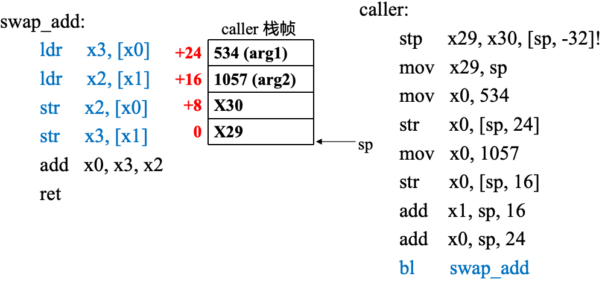
</div>

# 特权态 ISA

> 特权态 ISA 与用户态 ISA 最核心的区别在于**特权级别不同**。用户态程序通常运行在 `EL0`，内核运行在高特权级的 `EL1`。**OS 代码**本身也存放在内存中，也有自己的运行栈；在 AArch64 中，用户态常用的栈指针是 `SP_EL0`，内核态常用的栈指针是 `SP_EL1`。
> 此外，程序状态寄存器 `PSTATE` 中包含**条件码、异常屏蔽、执行状态**等信息，其中涉及特权控制的部分普通程序无权访问或修改，只能通过**系统调用、异常、中断**等机制陷入内核。
> 用户态（`EL0`）程序只能用用户 ISA，内核态（`EL1`）程序可以同时用用户 ISA 和内核 ISA。而 OS 往往同时含有**内核态和用户态代码**。

## 特权级切换

> 已知的两种改变控制流的方式：**跳转指令、调用与返回**，然而这两种方式并不能切换模式，因此，`svc/eret` 指令来实现控制流跳转的同时进行**特权级切换**。

## 异常

> 1. 由当前**正在执行的指令**触发的异常称 “同步异常”，包括用户主动发起的 **svc 指令**和程序执行出现的**意外错误**（如除零错误、缺页错误等）。
> 2. 与当前正在执行的指令无关，CPU 收到外部的**中断信号**称 “异步异常”，包括从外设发来的中断，CPU 的时钟中断等。
> 3. 异常处理完毕后，将通过以下方式**转移控制权**：
>    - 回到异常发生时**正在执行的指令**（Faults）
>    - 回到异常发生时**下一条指令**（Trap 或中断）
>    - 结束当前进程并切换到**其他进程**执行（Aborts 或 Faults）

## 异常向量表

> 1. 异常向量表是内核预先准备好的一组**异常入口地址**。当 CPU 发生异常或中断并从 `EL0` 进入 `EL1` 时，硬件会根据异常来源、类型以及当前栈指针，自动跳转到异常向量表中的对应入口。
> 2. 在 AArch64 中，`EL1` 异常向量表的基地址存放在寄存器 `VBAR_EL1` 中。`VBAR_EL1` 属于**特权寄存器**，普通用户态程序无权访问或修改，只能由内核在初始化阶段设置。
> 3. 异常发生时，硬件自动保存一些**关键上下文**到 `EL1` 的寄存器中：
>    - `ELR_EL1`：异常返回地址，即异常处理结束后 `eret` 跳回的位置。
>    - `SPSR_EL1`：异常发生前的 `PSTATE`，用于恢复原来的执行状态。
>    - `ESR_EL1`：异常原因，比如是 `svc`、缺页异常，还是非法指令等。
>    - `FAR_EL1`：在地址相关异常中存出错的虚拟地址，比如缺页或非法访存地址。
> 4. 完成对异常向量表的设置是**内核初始化**（如 `msr vbar_el1, x0`）的核心工作之一，通常发生在**开启中断和启动首个应用之前**。否则，一旦异常或中断到来，CPU 就不知道应该跳到哪里处理。
> 5. 如果内核自身运行出错，也会触发异常并进入异常向量表中对应的 `EL1` 异常入口。但这类异常通常比用户态异常严重，因为内核不能简单地“杀掉自己”；如果无法恢复，往往会打印错误信息并进入 **panic** 或停止运行。

## 用户态与内核态切换

<div align="center">
  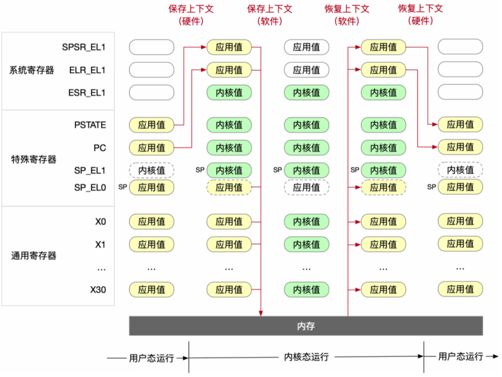
</div>

> “用户态 → 内核态 → 用户态” 的过程分成四个阶段：
> 1. **用户态运行**  
>    程序在 `EL0`，此时 `PC` 指向用户程序指令，`PSTATE` 表示当前处于用户态，用户栈指针 `SP_EL0`。通用寄存器 `X0~X30` 中保存的是应用程序正在用的值。
> 2. **保存上下文（硬件完成）**  
>    当用户程序执行 `svc`，或者发生中断、缺页、非法指令等异常时，CPU 自动完成一部分现场保存：
>    - 将异常返回地址 `PC` 保存到 `ELR_EL1`；
>    - 将异常发生前的 `PSTATE` 保存到 `SPSR_EL1`；
>    - 将异常原因记录到 `ESR_EL1`；
>    - 如果是地址相关异常，还把出错地址记录到 `FAR_EL1`。
>    以上操作必须由硬件完成，因为一旦进入内核，`PC` 被改成内核异常入口地址，`PSTATE` 也切换到内核态；如果不提前保存，内核就不知道异常来自哪里，也不知道处理完后该如何返回。
> 3. **保存上下文（软件完成）**  
>    硬件仅存**最核心的控制状态**，不自动存所有通用寄存器。因此，进入异常向量表后，**内核入口代码**把 `X0~X30` 等通用寄存器存到当前进程的**内核栈或进程控制块中**。
>    此时 CPU 已运行在 `EL1`，控制流已经跳到 `VBAR_EL1` 指向的异常入口，并且内核开始用自己的内核栈（**栈指针的切换也由硬件完成**）。之后，内核根据 `ESR_EL1` 判断异常类型，并分发到对应具体执行逻辑。
> 4. **恢复上下文并返回用户态**  
>    内核执行完成后，按**相反顺序恢复现场**：先由内核软件恢复之前保存的 `X0~X30` 等通用寄存器，再通过 `eret` 指令让硬件恢复核心控制状态。`eret` 根据 `ELR_EL1` 恢复用户态 `PC`，根据 `SPSR_EL1` 恢复原来的 `PSTATE`，从而完成从 `EL1` 回到 `EL0` 的切换。

## 系统调用

<div align="center">
  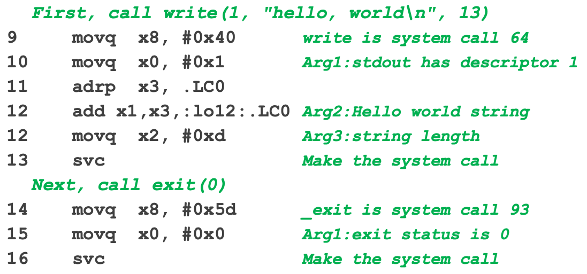
</div>

> `svc` 本身**无任何参数**，所有参数在执行 `svc` 之前就已放入通用寄存器中。对 AArch64 Linux 来说：
>   - `x8`：调用号；
>   - `x0~x7`：相关参数；
>   - `x0`：返回值。
>
> 比如，`write(1, "hello, world\n", 13)` 的含义是向标准输出写入 13 个字节。执行到 `svc` 时，CPU 会从 `EL0` 陷入 `EL1`，跳转到内核的异常向量入口。内核取 `x8` 得知这是 `write` 调用，再从 `x0~x2` 取出文件描述符、buffer 地址和长度，完成输出后把返回值放回 `x0`。
>
> `exit(0)` 用来结束当前进程。

### 返回值

> 返回值通常写回 `x0`，用户态程序恢复执行后就可以从 `x0` 中获取结果。比如 `write(1, "hello, world\n", 13)`，如果写入成功，`x0` 通常**返回写入的字节数**，如果写入失败，`x0` 返回 `-1`，并设置 `errno`（具体的错误值）。

### VDSO

> **获取当前时间、CPU 信息、进程状态**等操作，如果每次都执行 `svc`，将产生用户态和内核态切换、异常入口处理、上下文保存与恢复等开销。
>
> **VDSO**（Virtual Dynamic Shared Object）就解决这类问题。它是内核映射到每个进程用户地址空间中的一小段**代码和数据**。C 库可以跳到 VDSO 中执行，从而在**用户态完成查询（不可修改）**，不必真的执行 `svc` 进入内核。

### FLEX-SC

<div align="center">
  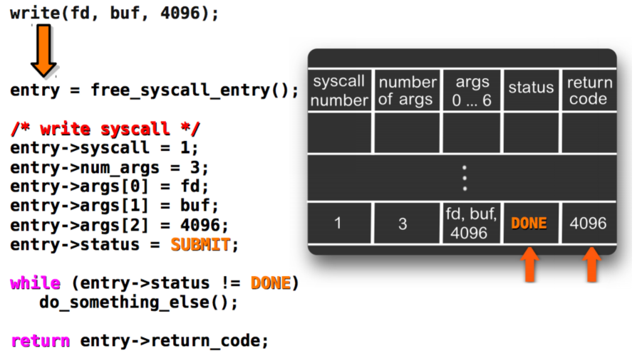
</div>

> **FLEX-SC**（Flexible System Call）也是一种优化调用开销的思想。
>
> 普通调用是**同步**的：用户线程执行 `svc` 后立刻陷入内核，必须等本次**调用处理完**，才能返回用户态执行。
>
> FLEX-SC 的思路是把请求写到一块**用户态和内核共享的内存区域**中，然后由内核中的专门线程**批量处理**这些请求。此时用户线程可以执行其他工作，不必阻塞。

# 操作系统架构

> OS 所承担的功能的**复杂性**必然导致其**结构设计**的困难性，其必须权衡不同目标之间的冲突。一个核心的设计原则：**策略（设计）与机制（实现）的分离**。

<div align="center">
  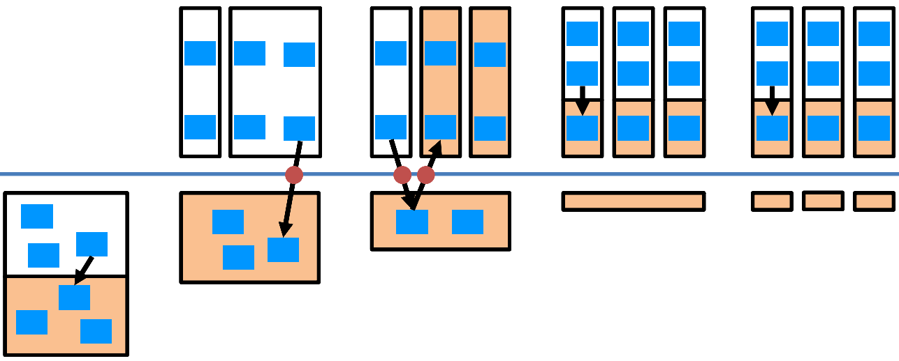
</div>

> 图中 OS 架构从左到右依次：简单内核、宏内核、微内核、外核、多内核

# 进程

> 1. **分时复用**：多个应用程序轮流占用 CPU，通过**高频切换**，让用户产生多个他们在 “同时运行” 的感觉。
> 2. **进程**是一个正在执行的**程序实例**。程序本身是**静态可执行文件**，而进程还包含运行时的 CPU 状态、地址空间、打开的文件等**动态信息**。
> 3. 通常**一个应用至少对应一个进程**。在 shell 中输入可执行文件名称后，将新创一个进程，并在该进程中装入和执行指定程序。当然，一个应用也可能由多个进程共同组成。

## 进程控制块

内核中记录了每个进程的运行信息，这些信息通常保存在 **进程控制块**（Process Control Block，PCB）中。PCB 一般包括：

- **进程标识号 PID**：唯一标识一个进程；
- **进程状态**：运行、就绪、阻塞、退出等；
- **CPU 上下文**：PC 、栈指针、通用寄存器等；
- **地址空间信息**：页表、代码段、堆和栈等；
- **打开的文件**：该进程持有的文件描述符；
- **调度信息**：优先级、时间片、所属优先级队列等；
- **进程关系**：父进程、子进程等。

进程相关的典型调用包括：

- 新创进程；
- 让进程执行指定的二进制文件；
- 等待子进程结束；
- 退出进程；
- 进程间通信（IPC）。

## 进程状态

进程在生命周期中处于不同状态，常见状态包括：

- **运行态（Running）**：正在某个 CPU 核上执行；
- **就绪态（Ready）**：已经具备运行条件，只是在等待 CPU；
- **阻塞态（Blocked）**：正在等待某个事件，如磁盘 I/O、网络包或锁；
- **终止态（Terminated）**：进程已经结束，等待资源回收。

## 进程间切换

当 CPU 从一个进程转而运行另一个进程时，就得进行**进程上下文切换**。其核心是保存当前进程的运行现场，并恢复下一个进程之前保存的运行现场。

常见触发原因包括：

- 当前进程**时间片耗尽**；
- 当前进程**主动阻塞**，如等待 I/O；
- 当前进程**退出**；
- **高优先级**进程进入就绪状态；
- 当前 CPU 收到**时钟中断或其他中断**，切换进程。

> **时钟中断**是内核获得控制权并**检查进程运行时间**的机制，时间片耗尽则是检查后得到的结果。
> 比如，时钟中断是 **1 ms**，而进程的时间片是 **5 ms**，那么前 4 次中断到来时，内核检查后发现时间片尚未耗尽，返回并交由进程执行；最后中断到来时，才发现它已经运行满 5 ms，并可能触发进程切换。或者，内核在进程开始运行时把**硬件定时器**设置为 **5 ms 后中断**，中断到来时通常就意味着该进程的时间片已经用完。

### CPU 上下文

**CPU 上下文**是进程恢复执行最小的一组 CPU 状态，通常包括：

- `PC`：下一条要执行的指令地址；
- 栈指针 `SP`；
- 通用寄存器；
- 状态寄存器，如 AArch64 中的 `PSTATE`；

进行进程切换时，大致经过以下步骤：

1. 进程 A 通过**中断、异常或 svc** 进入**内核**；
2. 进程 A 的用户态寄存器存到其**内核栈或 PCB**（PCB 不属于内核栈）；
3. 进程切换前，将部分**内核态执行现场**存到进程 A 的内核栈；
4. 选择下一个处于**就绪态**的进程 B；
5. 切换**地址空间**，比如切换页表基址；
6. 恢复进程 B 之前存的用**户态和内核态上下文**；
7. 通过异常返回指令回到进程 B 的**用户态执行**。

> 区分：**用户态与内核态切换不一定发生进程切换**。

## 相关接口

### GetPID

> `pid_t getpid()` 获取**当前进程**的 PID，`pid_t getppid()` 获取当前进程的**父进程**的 PID。

### Exit

> `void exit(int status)` **终止进程**并将**退出状态码 status** 暂存到内核，之后可由父进程**获取**。

### Fork

> `pid_t fork()` 在父进程中**调用一次**，在父子两个进程中**各返回一次**，其中**子进程返回 0**，**父进程返回子进程的 PID**，如果出现错误则返回 -1。

### Execve

> `int execve(const char *filename, char *const argv[], char *const envp[])` 用于让**当前进程**加载并执行一个新的可执行文件。
>
> - `filename`：将执行的可执行文件路径；
> - `argv`：传参列表；
> - `envp`：环境变量列表。

`execve()` 将当前进程以下内容换掉：

- 代码段；
- 堆；
- 用户栈；
- 用户态寄存器状态等。

执行成功后，当前进程的 PID 不变，但它开始从**新程序的入口地址**执行。因此，`execve()` 成功时**不会返回**到原程序；只有执行失败时才返回 `-1`，并设置 `errno`。

```c
pid_t pid = fork();

if (pid == 0) {
    char *argv[] = {"ls", "-l", NULL};
    char *envp[] = {NULL};

    execve("/bin/ls", argv, envp);

    // 当 execve 执行失败时，才返回到这
    _exit(1);
}
```

> **僵尸进程**是指子进程已经执行结束，但父进程尚未调用 `wait()` 或 `waitpid()` 获取其退出状态，因此**内核暂时保留**该子进程的一小部分信息。
>
> 子进程退出后，其用户地址空间、打开的文件等**大部分资源都被释放**，但内核仍维护：
>
> - PID；
> - 退出状态码；
> - 少量进程统计信息；
> - 供父进程查找的进程表项。
>
> 此时该子进程已经**不能再执行**，但仍在进程表中，等待父进程回收。父进程调用 `wait()` 或 `waitpid()` 后，**内核将退出状态交给父进程**，并彻底删除该子进程的剩余信息，僵尸进程随之消失。
>
> 如果父进程一直不调用 `wait()`，僵尸进程就会一直占用进程表项；长此以往，可能耗尽 PID 或进程表资源。若父进程先退出，僵尸子进程通常被 `init` （`init` 进程的 PID 等于 1，内核初始化时启动）或其他**子收割进程回收**。
>
> 区分：**僵尸进程是已经退出但尚未被父进程回收，孤儿进程是仍在运行但父进程已经退出。**

### WaitPID

> `pid_t wait(int *status)` 用于等待**任意一个**子进程结束；`pid_t waitpid(pid_t pid, int *status, int options)` 用于等待**指定**子进程，或**一组**子进程结束。

当子进程退出后，父进程调用 `wait()` 或 `waitpid()`，内核完成两件事：

- 把子进程的退出状态写入 `status` 指向的内存；
- 回收该子进程的 PCB、PID 和进程表项等资源。

`wait()` 的原型：

```c
pid_t wait(int *status);
```

- 若有子进程已经退出，则立即返回该子进程的 PID；
- 若子进程全在运行，默认阻塞父进程，直到某个子进程退出；
- 若没有可等待的子进程，则返回 `-1`，`errno=ECHILD`。
- 若等待被中断，则返回 `-1`，`errno=EINTR`。

`waitpid()` 的原型：

```c
pid_t waitpid(pid_t pid, int *status, int options);
```

其中：

- `pid > 0`：等待 PID 等于 `pid` 的指定子进程；
- `pid == -1`：等待任意一个子进程，效果与 `wait()` 类似；
- `options`：控制**等待方式**，传 `0` 表示默认阻塞等待，传 `WNOHANG` 表示没有子进程结束时立刻返回。

```c
int status;
pid_t child = waitpid(pid, &status, 0);

if (child > 0) {
    if (WIFEXITED(status)) {
        printf("exit code = %d\n", WEXITSTATUS(status));
    }
}
```

这里的 `status` 不是子进程退出码本身，而是内核写入的一组**编码后的状态信息**，通常借助宏进行解析：

- `WIFEXITED(status)`：判断子进程正常调用 `exit()` 或从 `main` 返回；
- `WEXITSTATUS(status)`：获取正常退出时的退出状态码；
- `WIFSIGNALED(status)`：子进程是否因信号而终止；
- `WTERMSIG(status)`：获取导致子进程终止的信号编号。

# 内存

## ELF 文件

ELF（Executable and Linkable Format）是 Linux 等类 Unix 中常用的一种**结构化二进制文件格式**。ELF 并不等同于 “可执行文件”，可执行文件、目标文件等都可以采用 ELF 格式。其本质上仍是一串二进制字节，只不过这些字节依照 **ELF 规范进行组织**，而不是随意排列。

ELF 文件开头通常包含如下 $Magic\ Number$：

```text
7f 45 4c 46
   E  L  F
```

其中后三个字节对应字符 E、L、F，相关工具通常根据文件开头内容即可判断文件格式，而不是依靠文件后缀。**常见的 ELF 文件类型**包括：

* 可重定位目标文件：通常是 .o 文件，已经完成编译和汇编，但还未最终链接；
* 可执行文件：已经完成链接，可加载并执行；
* 共享目标文件：通常是 .so 动态链接库；
* Core Dump 文件：记录进程崩溃时的内存和寄存器状态，调试可用。

一个 ELF 文件包含以下结构：

* ELF Header：记录文件类型、目标机器架构、程序入口地址和其他表的位置；
* Program Header Table：描述程序运行时，哪些内容被映射到进程的虚拟地址空间；
* Section Header Table：描述各个 Section 的名称、位置、大小和属性；
* 具体的 Section：保存机器指令、符号表和重定位信息等内容。

常见的 Section 包括：

* .text：机器指令；
* .rodata：`Read-Only` 常量和字符串；
* .data：已经**初始化**且初值通常非零的全局变量和静态变量；
* .bss：**未初始化**或初始化为零的全局变量和静态变量；
* .symtab：符号表；
* .strtab：字符串表；
* .rela.*：重定位信息。

<div align="center">
  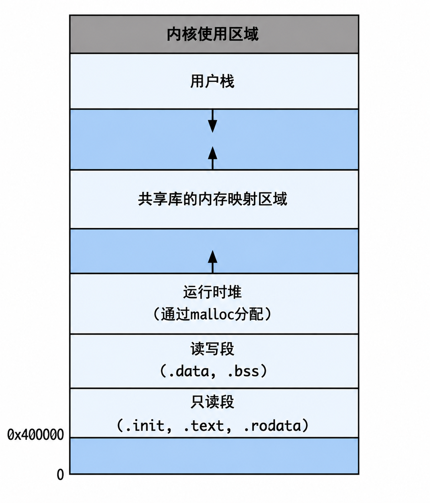
</div>

从源代码到程序运行，大致有**以下过程**：

C 源文件
   ↓ 编译、汇编
可重定位 ELF 目标文件（.o）
   ↓ 链接
ELF 可执行文件
   ↓ 加载
映射到进程虚拟地址空间
   ↓ 页表和 MMU
访问物理内存

## 内存地址翻译

> 内存通常字节寻址，一个地址对应一个字节。比如，32 位物理地址共有 $2^{32}$ 个不同取值，因此最多可以表示：$2^{32}\text{ B}=4\text{ GiB}$ 的物理地址空间。
>
> 这里表示的是**最多能区分多少个物理字节地址**，并不意味着机器一定装了 4 GiB 内存，也不意味整个地址空间都用于内存条，其中一部分地址还可能分配给显卡、PCI 设备等内存映射 I/O。
### 虚拟地址与物理地址

每个进程通常都有自己独立的虚拟地址空间，进程 A 和进程 B 都可以访问虚拟地址：`0x400000`，但这两个相同的虚拟地址可以分别映射到不同的物理地址：

进程 A：0x400000 → 物理地址 0x123000
进程 B：0x400000 → 物理地址 0x8A7000

> 注意：物理地址空间 ！= 物理内存空间，前者通常指 **Bus 地址空间**。在 Bus 中，设备都占有一块地址空间，而**内存空间**占了这个空间的 $99\%$。
>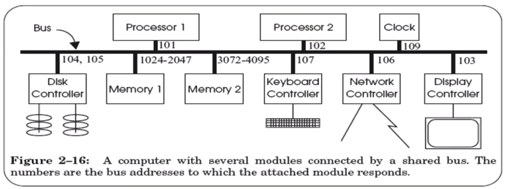

### 分页机制
 
虚拟地址空间和物理地址空间都被**划分为固定大小的块**：

* 虚拟地址空间中的块称**虚拟页**（Virtual Page）；
* 物理内存中的块称**物理页框**（Physical Page Frame）；
* 虚拟页和物理页框**大小相同**。

常见页面大小为：$4\ KiB = 4096\ B = 2^{12} B$。因此，一个虚拟地址可以拆成两部分：虚拟地址 = 虚拟页号 VPN + 页内偏移 Offset

其中：

* 虚拟页号 VPN：说明访问的是哪一个虚拟页；
* 页内偏移 Offset：说明访问该页的字节偏移。

地址翻译时，仅**转换虚拟页**，页内偏移不变。因此，物理地址 = 物理页框号 PPN + 页内偏移 Offset。

<div align="center">
  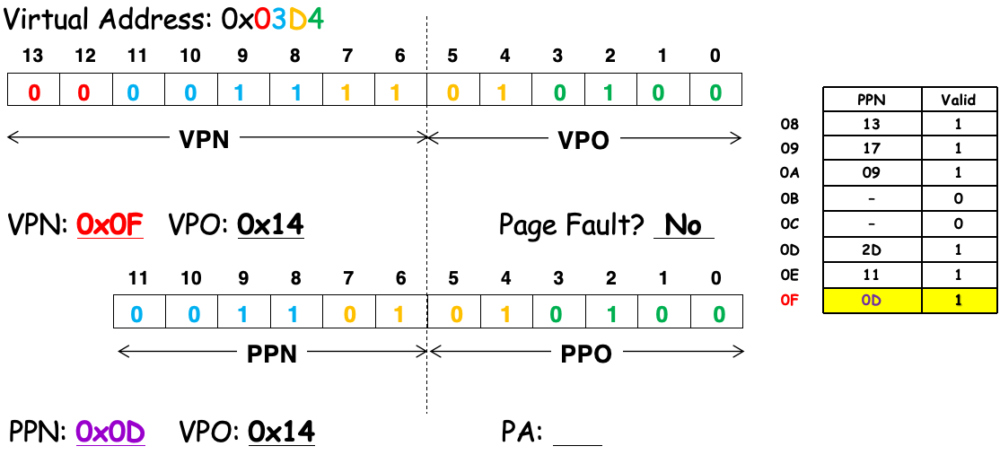
</div>

其中**页表**（Page Table）用于记录虚拟页号 → 物理页框号的映射。每个进程通常拥有自己的页表，因此同一个虚拟地址在不同进程中可以翻译成不同的物理地址。

页表中的每一项称**页表项**（Page Table Entry，PTE），一个页表项通常不仅有物理页框号，还有一些**控制信息**，比如：

* 物理页框号；
* 页面是否有效；
* 页面当前是否在物理内存中；
* 是否允许写；
* 是否允许执行；
* 用户态是否允许访问；
* 页面是否被访问过；
* 页面是否被修改过。

可以简单理解成：**页表项 = 物理页框号 + 权限信息 + 状态信息**。页表本身也放在内存中。CPU 中有专门的**页表基址寄存器**，用于记录当前页表的位置。在 AArch64 中，常见的页表基址寄存器包括：TTBR0_EL1 和 TTBR1_EL1。

### MMU

**MMU**（Memory Management Unit）是 CPU 内部负责完成**地址翻译和权限检查**的硬件。

一次访存大致以下流程：

1. CPU 执行 ldr、str 等访存指令；
2. 指令产生一个虚拟地址；
3. MMU 从虚拟地址中拆出虚拟页号和页内偏移；
4. MMU 查询页表，找到虚拟页对应的物理页框；
5. MMU 检查当前访问是否合法；
6. 将物理页框号与原来的页内偏移组合成物理地址；
7. 根据物理地址访问 Cache 或物理内存。

## 多级页表
如果只有单级页表，在 32 位虚拟地址空间中，页面大小为 4 KiB，页表项大小为 4 B，那么虚拟页有 $\frac{2^{32}}{2^{12}}=2^{20}$ 页。因此，对应有 $2^{20}$ 个页表项，整个页表大小为：
$$
2^{20}\times4\text{ B}=2^{22}\text{ B}=4\text{ MiB}
$$
也就是说，**每个进程仅页表本身就占 4 MiB 内存**。但进程很多时候都用不完 4 GiB 虚拟地址空间，也就不必给所有虚拟页都准备页表项。

下面以常见的四级页表分析。假设：

* 实际使用 48 位虚拟地址（高 16 位全 0 或全 1）；
* 页面大小为 4 KiB，即 $2^{12}$ B；
* 每个页表项占 8 B；
* 每张页表本身占一页，也就是 4 KiB。

一张页表中可以容纳的页表项：

$$
\frac{4\text{ KiB}}{8\text{ B}}=512=2^9 个
$$

因此，可以将虚拟页号分成 4 份，每份占 9 位，其中：

* L0、L1、L2 页表项保存下一级页表的**物理地址**；
* L3 页表项保存**最终物理页框号和权限、有效位等控制信息**；
* 页内偏移在地址翻译过程中保持不变。

<div align="center">
  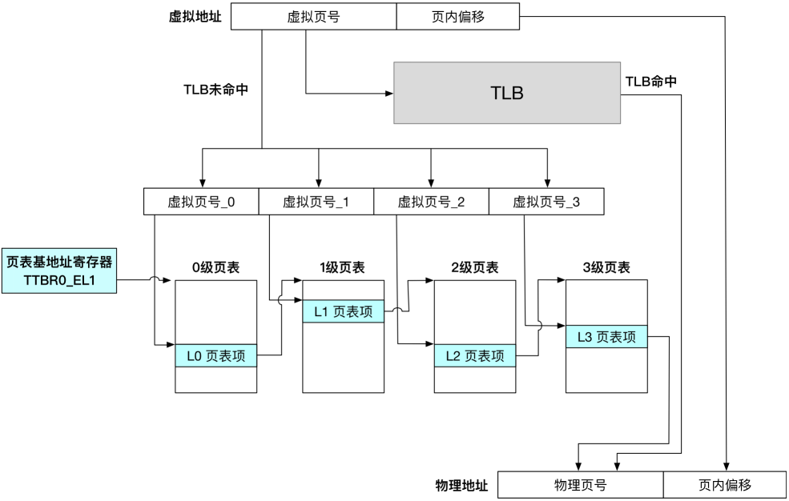
</div>

最后一级的一个页表项映射一个 4 KiB 页面。因此，一个 L3 页表项覆盖：$4\text{ KiB}$，而一张 L3 页表有 512 项，因此覆盖：$512\times4\text{ KiB}=2\text{ MiB}$。同理，一张 L2 页表有 512 项，每项指向一张 L3 页表，因此覆盖：$512\times2\text{ MiB}=1\text{ GiB}$；一张 L1 页表覆盖：$
512\times1\text{ GiB}=512\text{ GiB}$；一张完 L0 页表覆盖：$
512\times512\text{ GiB}=256\text{ TiB}$。

### 页表基地址寄存器

页表放在物理内存中，CPU 通过**页表基地址寄存器**找到当前页表的**顶级页表**。在 AArch64 中，常有两个页表基地址寄存器：

* TTBR0_EL1：通常用于**低地址**区域，在 Linux 中指向当前进程的页表；
* TTBR1_EL1：通常用于**高地址**区域，在 Linux 中指向内核页表。

MMU 根据虚拟地址选择对应的寄存器，可以近似理解成：

* 虚拟地址最高位为 0：TTBR0_EL1；
* 虚拟地址最高位为 1：TTBR1_EL1。

进程切换时，不同进程的用户页表不同，因此通常得**修改 TTBR0_EL1**；内核页表通常由**所有进程共享**，所以 TTBR1_EL1 一般不变。在 x86-64 中，页表基地址寄存器是 CR3。CR3 指向当前地址空间的顶级页表，进程切换时通常得修改 CR3。

### 页表使能

机器上电后通常**先处于物理寻址模式**，OS 初始化页表并设置页表基地址寄存器后，再通过**控制寄存器**开启地址翻译。在 AArch64 中：

* SCTLR_EL1 是 EL1 的控制寄存器；
* 将其中首位置 1，开启 EL0 和 EL1 的阶段一地址翻译；
* 开启前，内核必须先准备好页表，并正确配置 TTBR0_EL1、TTBR1_EL1 和 TCR_EL1，否则使能后可能立即发生地址翻译异常。

OS 开启分页后，通常也使用虚拟地址。MMU 将内核使用的虚拟地址翻译成物理地址。仅有在启动早期、分页尚未开启时，内核才依靠物理地址或恒等映射运行。

### 页表项

AArch64 的页表项通常占 64 位。**末级页表项**除了保存物理页框号 PFN，还有页面的**有效性、访问权限和执行权限**等属性。

<div align="center">
  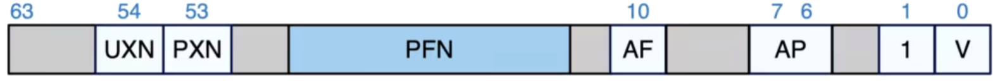
</div>

* V（Valid）：有效位，0 表示页表项无效，访问时触发地址翻译异常。
* bit[1]：在末级页表项中必须置 1，和 V=1 组合后表示这是一个指向 4 KiB 页面的**页描述符**；在非末级页表中，表示页表项类型，0 指**块描述符**，1 指**表描述符**。
* PFN（Physical Frame Number）：物理页框号。
* UXN（Unprivileged Execute Never）：1 表示用户态 EL0 不允许执行该页面。
* PXN（Privileged Execute Never）：1 表示内核态 EL1 不允许执行该页面。
* AF（Access Flag）：访问标志，表示页面是否已被访问。
* AP（Access Permissions）：控制用户态和内核态对本页面的 RW 权限。
* DBM（Dirty Bit Modifier）：记录页面是否被修改（脏页）。

**非末级页表项**中的 PFN 通常指向下一级页表页，故称作 “**表描述符**”。此外，非末级页表项也可以映射**一整块大物理内存**，形成 2 MiB 或 1 GiB 的大页，从而减少页表和 TLB 压力。

<div align="center">
  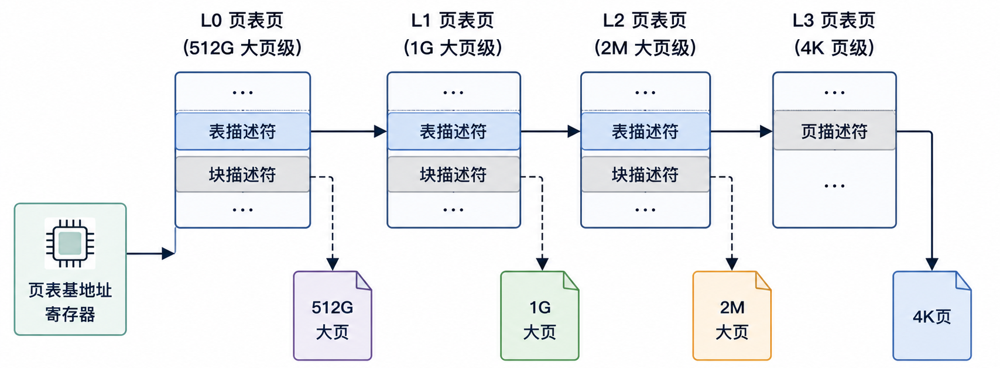
</div>

## TLB

<div align="center">
  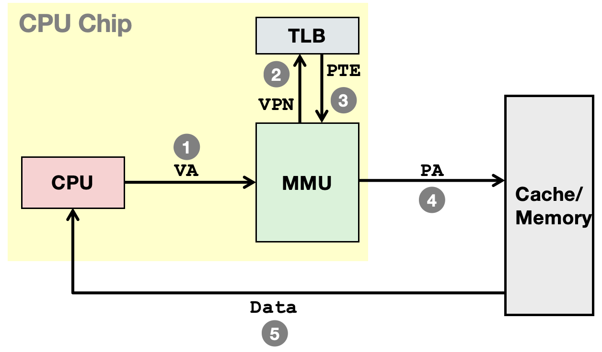
</div>

TLB（Translation Lookaside Buffer）存最近的：虚拟页号 → 物理页框号。访存到达时，CPU 通常先查询 TLB。TLB 命中，MMU 可以拿到物理地址，不再访问页表；TLB 未命中，MMU 查询页表并把映射填入 TLB。

### TLB 刷新

如果页表发生变化，而 TLB 中仍是旧映射，CPU 就可能根据旧映射访问内存，此时必须将相关 TLB 表项刷新。常见刷新 TLB 的情况包括：

* **切换进程**地址空间：不同进程的相同虚拟地址可能映射到不同物理地址；
* 修**改页表项**：如删除映射、修改页面权限、页面换入换出；
* 回收并复用 ASID：新的进程可能复用了旧进程的地址空间标识；
* 修改**内核共享映射**：可能同步清除其他 CPU 核上的旧 TLB 表项。

如果不区分不同进程，切换页表时必须**清空整个 TLB**，导致大量访存发生 TLB Miss，开销较大。AArch64 利用 **ASID（Address Space Identifier，地址空间标识符**）向不同进程的 TLB 表项加标签。加标签后的 TLB 中的内容可以近似理解：

ASID + 虚拟页号 → 物理页框号

AArch64 通常将用户地址空间和内核地址空间分开：

* TTBR0_EL1：通常指向当前进程的用户页表，并携带该进程的 ASID；
* TTBR1_EL1：通常指向**所有进程共享的内核页表**。

普通调用从**用户态进入内核态**时，属同一个进程，内核可以用 TTBR1_EL1 对应的**共享内核映射**，因此不用切换页表。

AArch64 中常见的 TLB **失效指令**包括：

```bash
TLBI VMALLE1IS   // 清除 EL1 阶段一的全部相关 TLB 表项
TLBI ASIDE1IS    // 清除 ASIDE1IS 对应的 TLB 表项
TLBI VAE1IS      // 清除虚拟地址 VAE1IS 对应的 TLB 表项
```

其中 IS 表示 Inner Shareable，即失效操作会传播到**同一共享域内的其他 CPU 核**。在多核 OS 中，一个页表可能被多个 CPU 核共享，某个 CPU 修改页表后，必须通知**其他 CPU 清除**旧的 TLB 表项，这一过程称为 TLB Shootdown。

> Cortex-A53 CPU
> 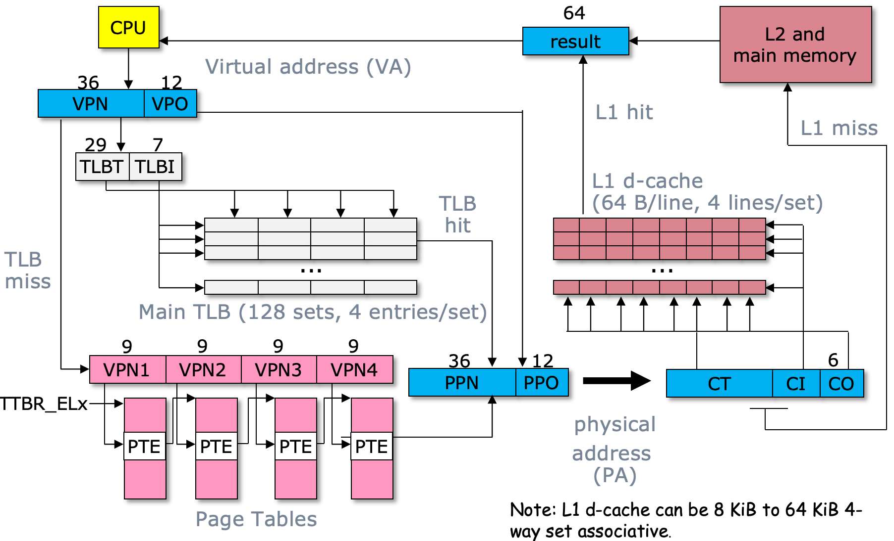

# 系统初始化

## 基本流程

计算机从上电到 OS 内核开始运行，大致有以下三个阶段：

1. BIOS 执行

上电后，CPU 开始执行 **BIOS ROM** 中的代码，完成：

* 执行 POST（Power-On Self Test，上电自检），检查 CPU 和内存；
* 初始化早期硬件；
* 寻找首个**可启动设备**；
* 将**可启动设备**的首个**扇区**，即 MBR（Master Boot Record，主引导记录），加载到内存中的**固定地址**；
* 跳转到 MBR 中 bootloader 的入口地址执行。

2. Bootloader 执行

Bootloader 是固件和 OS 内核的引导程序，常见的 Bootloader 有 GRUB。其核心工作包括：

* 从**可启动设备**中找到**内核二进制文件**；
* 将**内核加载**到内存中；
* 如果内核文件被压缩，则对其进行解压；
* 跳转到内核入口地址，将 CPU **控制权交由内核**。

3. 内核开始执行

内核获得控制权后，完成：

* 初始**页表**并开启虚拟内存；
* 初始化**异常向量表、中断和定时器**；
* 初始化**内存管理**、**进程管理**和**驱动**；
* 初始化并**挂载 FS（File System）**；
* 启动首个**用户态进程**，如 Linux 中的 init 或 systemd；
* 由首个用户态进程往下执行。

## ChCore

ChCore 的启动过程含两部分代码：

* kernel/arch/aarch64/boot/raspi3：树莓派 3 平台相关的早期启动代码；
* kernel/arch/aarch64：内核初始化入口。

目录大致如下：

```bash
kernel/arch/aarch64
├── boot
├── head.S
├── main.c
├── plat
└── tools.S

kernel/arch/aarch64/boot/raspi3
├── firmware
├── include
├── init
└── peripherals
```

其中：

* firmware：与树莓派固件、Bootloader 相关的代码；
* init：启动阶段最早执行的汇编和 C 代码；
* peripherals：UART 等**早期外设**初始化代码；
* include：启动阶段的头文件。

编译后，boot/raspi3 下的**启动代码**被放入**内核镜像的 .init 段**，位于较低的物理地址；**正式内核代码**被放入 **.text 段**，并映射到高虚拟地址。完整的启动流程如下：

树莓派固件**加载 ChCore 镜像**
        ↓
从低物理地址执行 **.init 段**
        ↓
进入 **_start**
        ↓
选出主 CPU
        ↓
将 CPU 从 **EL3/EL2 切到 EL1**
        ↓
设置**临时启动栈**
        ↓
进入 **init_c**
        ↓
清空 BSS、初始化串口和页表
        ↓
开启 MMU
        ↓
跳转到**高虚拟地址 start_kernel**
        ↓
切到**正式内核栈**
        ↓
进入 main

### 内核镜像的起始地址

ChCore 在头文件中定义了内核虚拟地址和启动代码的**偏移**。文件：`kernel/arch/aarch64/boot/raspi3/include/image.h`，代码：

```c
#pragma once
#define SZ_16K       0x4000
#define SZ_64K       0x10000
#define KERNEL_VADDR 0xffffff0000000000
#define TEXT_OFFSET  0x80000
```

其中 `#define KERNEL_VADDR 0xffffff0000000000` 表示 ChCore 内核所处的**高虚拟地址空间基地址**；`#define TEXT_OFFSET 0x80000` 表示**启动镜像**被加载到物理地址 0x80000 附近。

### 启动代码被放入 .init 段

`boot/raspi3/CMakeLists.txt` 中指定了启动阶段编译的源文件，代码大致如下：

```cmake
list(
    APPEND
    _init_sources
    init/start.S
    init/mmu.c
    init/tools.S
    init/init_c.c
    peripherals/uart.c
)
set(init_objects
    ${_init_objects}
    PARENT_SCOPE
)
```

这些源文件编译后形成 init_objects，**链接脚本**将它们放到 .init 段。其中 `init/start.S` 是最早执行的**内核启动入口**。

### 链接脚本排布启动代码

文件：`kernel/arch/aarch64/boot/linker.tpl.ld`，代码：

```c
#include "../boot/image.h"
SECTIONS
{
    . = TEXT_OFFSET;
    img_start = .;
    .init : {
        ${init_object}
    }
    . = ALIGN(SZ_16K);
    init_end = ABSOLUTE(.);
}
```

代码从上到下：
1. 设当前位置 . 等于 TEXT_OFFSET（即 0x80000）；
2. 记录镜像起始地址 `img_start = .`；
3. 将前面 CMake 收集到的**启动目标文件**放入 .init 段。因此，start.S、init_c.c、启动页表初始化等代码都将被放在镜像开头的低地址区域；
4. 将当前位置向上对齐到 16 KiB；
5. 记录 .init 段结束地址。

### 内核执行的首行代码：_start

文件：`kernel/arch/aarch64/boot/raspi3/init/start.S`，核心代码如下：

```s
BEGIN_FUNC(_start)
    mrs x8, mpidr_el1        /* move core ID to x8 */
    and x8, x8, #0xFF        /* mask */
    cbz x8, primary          /* compare branch zero */
```

代码从上到下：
1. 将 CPU 核心的相关信息放入 x8；
2. 将 MPIDR_EL1 的低 8 位取出，近似视作 CPU 核心的编号；
3. 主 CPU 跳转，仅有主 CPU 才能进入初始化，其余 CPU 等待被主 CPU 唤醒。

### 主 CPU 的启动流程

primary 核心代码如下：

```s
primary:
    /* Turn to el1 from other exception levels. */
    bl arm64_elX_to_el1
    /* Prepare stack pointer and jump to C. */
    adr x0, boot_cpu_stack
    add x0, x0, #0x1000
    mov sp, x0
    bl init_c
    /* Should never be here */
    b .
```

代码从上到下：
1. 跳转到 arm64_elX_to_el1（检查 CPU 当前所处的**异常级别**，并最终保证 CPU 在 EL1 中运行）；
2. boot_cpu_stack 表示**栈空间**的低地址，再加上 0x1000（$0x1000=4096B=4KiB$），让 x0 指向栈顶；
3. 将 x0 写入栈指针 sp，栈正式生效；
4. init_c 最终进入正式内核，**不该再返回**到 _start。如果意外返回则通过 `bl .` 一直跳转到自己，而非执行未知内容。

> 注：从汇编代码进入 C 代码前，**必须先设置**一个可用的栈？

### 将 CPU 从 EL3 或 EL2 切到 EL1

代码大致如下：

```s
BEGIN_FUNC(arm64_elX_to_el1)
    mrs x9, CurrentEL
    /* Check the current exception level. */
    cmp x9, CURRENTEL_EL1
    beq .Ltarget
    cmp x9, CURRENTEL_EL2
    beq .Lin_el2
    /* Otherwise, we are in EL3. */
    mrs x9, scr_el3
    mov x10, SCR_EL3_NS | SCR_EL3_HCE | SCR_EL3_RW
    orr x9, x9, x10
    msr scr_el3, x9
    /* Set the return address and exception level. */
    adr x9, .Ltarget
    msr elr_el3, x9
    mov x9, SPSR_ELX_DAIF | SPSR_ELX_EL1H
    msr spsr_el3, x9
    isb
    eret
.Ltarget:
    ret
END_FUNC(arm64_elX_to_el1)
```

核心目标：无论 CPU 当前在 EL3、EL2 还是 EL1，最终都进入 EL1。

### 临时启动栈

**启动栈**定义在：`kernel/arch/aarch64/boot/raspi3/init/init_c.c`，相关代码如下：

```c
#include "boot.h"
#include "image.h"
typedef unsigned long u64;
#define INIT_STACK_SIZE 0x1000
char boot_cpu_stack[PLAT_CPU_NUMBER][INIT_STACK_SIZE]
    ALIGN(16);
```

比如树莓派 3 有 4 个 CPU 核，且栈大小为 4 KiB，则整体布局：

boot_cpu_stack[0]：CPU 0 的临时启动栈
boot_cpu_stack[1]：CPU 1 的临时启动栈
boot_cpu_stack[2]：CPU 2 的临时启动栈
boot_cpu_stack[3]：CPU 3 的临时启动栈

### 启动代码 init_c

init_c 的代码代码大致如下：

```c
void init_c(void)
{
    /* Clear the bss area for the kernel image */
    clear_bss();
    /* Initialize UART before enabling MMU. */
    early_uart_init();
    uart_send_string("boot: init_c\r\n");
    wakeup_other_cores();
    /* Initialize Boot Page Table. */
    uart_send_string("[BOOT] Install boot page table\r\n");
    init_boot_pt();
    /* Enable MMU. */
    el1_mmu_activate();
    uart_send_string("[BOOT] Enable el1 MMU\r\n");
    /* Call Kernel Main. */
    uart_send_string("[BOOT] Jump to kernel main\r\n");
    start_kernel(secondary_boot_flag);
    /* Never reach here */
}
```

代码从上到下：
1. clear_bss()：清空 .bss 段
2. early_uart_init()：初始化早期串口，并通过 uart_send_string 输出日志
3. wakeup_other_cores()：**唤醒其他 CPU 核**
4. init_boot_pt()：初始化早期页表
5. el1_mmu_activate()：开启 MMU
6. start_kernel(secondary_boot_flag)：跳转到正式内核入口

### start_kernel 代码

文件：`kernel/arch/aarch64/head.S`，代码如下：

```s
BEGIN_FUNC(start_kernel)     // high memory addr
    /*
     * Code in bootloader specified only the primary
     * cpu with MPIDR = 0 can boot here. So we directly
     * set the TPIDR_EL1 to 0, which represent the logical
     * cpuid in the kernel
     */
    mov x3, #0
    msr TPIDR_EL1, x3
    ldr x2, =kernel_stack    // high memory addr
    add x2, x2, KERNEL_STACK_SIZE
    mov sp, x2               // switch stack, important
    bl main
END_FUNC(start_kernel)
```

代码从上到下：
1. 前面的**启动代码**规定仅有主 CPU 能进入这里，将主 CPU 的编号置 0，即 TPIDR_EL1 = 0；
2. 将 kernel_stack 的**地址加载**到 x2，由于 MMU 已开启，此时 kernel_stack 是高虚拟地址；
3. 将栈起始地址加上栈大小，得到栈顶地址；
4. 将正式**内核栈的栈顶地址**写入 sp。由此前启动阶段的临时栈 boot_cpu_stack 切成正式的内核栈 kernel_stack。

### 启动页表初始化

启动页表初始化含两部分：

* TTBR0_EL1：负责低虚拟地址区域，即将低虚拟地址 → 相同的低物理地址（恒等映射）；
* TTBR1_EL1：负责高虚拟地址区域，即将内核高虚拟地址 → 内核实际所在的低物理地址。

```c
/* The number of entries in one page table page */
#define PTP_ENTRIES 512
/* The size of one page table page */
#define PTP_SIZE 4096
#define ALIGN(n) __attribute__((__aligned__(n)))
u64 boot_ttbr0_l0[PTP_ENTRIES] ALIGN(PTP_SIZE);
u64 boot_ttbr0_l1[PTP_ENTRIES] ALIGN(PTP_SIZE);
u64 boot_ttbr0_l2[PTP_ENTRIES] ALIGN(PTP_SIZE);
u64 boot_ttbr1_l0[PTP_ENTRIES] ALIGN(PTP_SIZE);
u64 boot_ttbr1_l1[PTP_ENTRIES] ALIGN(PTP_SIZE);
u64 boot_ttbr1_l2[PTP_ENTRIES] ALIGN(PTP_SIZE);
```

这里一共定义了两个启动页表：`boot_ttbr0_*` 用于低地址映射，`boot_ttbr1_*` 用于高地址映射。页大小 4096B，即 4KiB。单张页表能容纳 512 个页表项。

> 注：在**启动阶段**，L2 页表项是块描述符，映射一个 2 MiB 大页。目的是简单、高效，正式开启 MMU 之后才精细化成 4KB 的页。

```c
void init_boot_pt(void)
{
    u32 start_entry_idx;
    u32 end_entry_idx;
    u32 idx;
    u64 kva;
    /* TTBR0_EL1 0-1G */
    boot_ttbr0_l0[0] =
        ((u64)boot_ttbr0_l1) | IS_TABLE | IS_VALID;
    boot_ttbr0_l1[0] =
        ((u64)boot_ttbr0_l2) | IS_TABLE | IS_VALID;
    /* Usable memory: PHYSMEM_START ~ PERIPHERAL_BASE */
    start_entry_idx = PHYSMEM_START / SIZE_2M;
    end_entry_idx = PERIPHERAL_BASE / SIZE_2M;
    /* Map each 2M page */
    for (idx = start_entry_idx; idx < end_entry_idx; ++idx) {
        boot_ttbr0_l2[idx] =
            (PHYSMEM_START + idx * SIZE_2M)
            | UXN
            | ACCESSED
            | INNER_SHARABLE
            | NORMAL_MEMORY
            | IS_VALID;
    }
    /*
     * TTBR1_EL1 0-1G
     * KERNEL_VADDR: L0 pte index: 510,
     *               L1 pte index: 0,
     *               L2 pte index: 0.
     */
    kva = KERNEL_VADDR;
    boot_ttbr1_l0[GET_L0_INDEX(kva)] =
        ((u64)boot_ttbr1_l1) | IS_TABLE | IS_VALID;
    boot_ttbr1_l1[GET_L1_INDEX(kva)] =
        ((u64)boot_ttbr1_l2) | IS_TABLE | IS_VALID;
    start_entry_idx = GET_L2_INDEX(kva);
    /* Note: assert(start_entry_idx == 0); */
    end_entry_idx =
        start_entry_idx + PHYSMEM_BOOT_END / SIZE_2M;
    /* Note: assert(end_entry_idx < PTP_ENTRIES); */
    /*
     * Map each 2M page
     * Usable memory: PHYSMEM_START ~ PERIPHERAL_BOOT_END
     */
    for (idx = start_entry_idx; idx < end_entry_idx; ++idx) {
        boot_ttbr1_l2[idx] =
            (PHYSMEM_START + idx * SIZE_2M)
            | UXN
            | ACCESSED
            | INNER_SHARABLE
            | NORMAL_MEMORY
            | IS_VALID;
    }
}
```

#### 初始化 TTBR0 页表

1. 设置 L0/L1 页表项

boot_ttbr0_l0[0] = ((u64)boot_ttbr0_l1) | IS_TABLE | IS_VALID;

即 boot_ttbr0_l0[0] 指向 boot_ttbr0_l1（L1 页表的物理基地址）;IS_TABLE 表示该页表项是表描述符；IS_VALID 表示该页表项有效。于是低地址翻译路径如下：

TTBR0_EL1
    ↓
boot_ttbr0_l0[0]
    ↓
boot_ttbr0_l1[0]
    ↓
boot_ttbr0_l2[index]
    ↓
最终物理地址

2. 恒等映射

核心地址部分是：

$$boot\_ttbr0\_l2[idx]=PHYSMEM\_START + idx * SIZE\_2M$$

即：
虚拟地址 0x00000000 → 物理地址 0x00000000；
虚拟地址 0x00200000 → 物理地址 0x00200000；
虚拟地址 0x00400000 → 物理地址 0x00400000。

#### 初始化 TTBR1 高地址页表

TTBR0 从虚拟地址 0 开始，而 TTBR1 从 KERNEL_VADDR 开始。

```c
#define GET_L0_INDEX(x) (((x) >> (12 + 9 + 9 + 9)) & 0x1ff)
#define GET_L1_INDEX(x) (((x) >> (12 + 9 + 9)) & 0x1ff)
#define GET_L2_INDEX(x) (((x) >> (12 + 9)) & 0x1ff)
```

于是高地址页表翻译路径如下：

KERNEL_VADDR
    ↓
boot_ttbr1_l0[510]
    ↓
boot_ttbr1_l1[0]
    ↓
boot_ttbr1_l2[0]
    ↓
低物理地址

KERNEL_VADDR + 0 → PHYSMEM_START + 0；
KERNEL_VADDR + 2 MiB → PHYSMEM_START + 2 MiB；
KERNEL_VADDR + 4 MiB → PHYSMEM_START + 4 MiB。

<div align="center">
  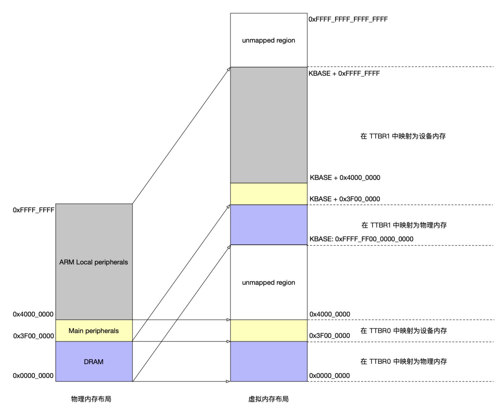
</div>

也就是说，同一块**低物理内存**可能同时有两个虚拟地址，来保证开启 MMU 瞬间 PC 有效。开启 MMU 和跳转到高地址不是同一条指令完成的，中间还有一小段代码。

### 开启 MMU

el1_mmu_activate() 必须操作**特权寄存器**：

* MAIR_EL1；
* TCR_EL1；
* TTBR0_EL1；
* TTBR1_EL1；
* SCTLR_EL1；
* TLB 和 Cache 控制指令。

特权汇编指令，普通 C 语言无法表达，因此必须**汇编实现**。此外，开启 MMU 的瞬间，**地址翻译方式**发生根本变化，控制指令顺序和屏障由汇编代码较可靠。

```s
BEGIN_FUNC(el1_mmu_activate)
    stp x29, x30, [sp, #-16]!
    mov x29, sp
    bl invalidate_cache_all
    /* Invalidate TLB */
    tlbi vmalle1is
    isb
    dsb sy
    /* Initialize Memory Attribute Indirection Register */
    ldr x8, =MMU_MAIR_ATTR1 | MMU_MAIR_ATTR2 | MMU_MAIR_ATTR3
    msr mair_el1, x8
    /* Initialize TCR_EL1 */
    /*
     * Set cacheable attributes on translation walk.
     * SMP extensions: non-shareable, inner write-back write-allocate.
     */
    ldr x8, =MMU_TCR_FLAGS1 | MMU_TCR_FLAGS0
              | MMU_TCR_IPS | MMU_TCR_AS
    msr tcr_el1, x8
    isb
    /* Write TTBR with physical address of the translation table */
    adrp x8, boot_ttbr0_l0
    msr ttbr0_el1, x8
    adrp x8, boot_ttbr1_l0
    msr ttbr1_el1, x8
    isb
    mrs x8, sctlr_el1
    /* Enable MMU */
    orr x8, x8, #SCTLR_EL1_M
    /* Disable alignment checking */
    bic x8, x8, #SCTLR_EL1_A
    bic x8, x8, #SCTLR_EL1_SA0
    bic x8, x8, #SCTLR_EL1_SA
    orr x8, x8, #SCTLR_EL1_nAA
    /* Data accesses Cacheable */
    orr x8, x8, #SCTLR_EL1_C
    /* Instruction access Cacheable */
    orr x8, x8, #SCTLR_EL1_I
    msr sctlr_el1, x8
    ldp x29, x30, [sp], #16
    ret
END_FUNC(el1_mmu_activate)
```

1. 压栈：x29 原帧指针；x30 返回地址 LR
2. 清理 Cache，清空 TLB
3. 置**内存属性寄存器** MAIR_EL1

ldr x8, =MMU_MAIR_ATTR1 | MMU_MAIR_ATTR2 | MMU_MAIR_ATTR3
msr mair_el1, x8

4. 置**地址翻译控制寄存器** TCR_EL1

ldr x8, =MMU_TCR_FLAGS1 | MMU_TCR_FLAGS0 | MMU_TCR_IPS | MMU_TCR_AS
msr tcr_el1, x8

5. 将两个页表基地址**分别写入** TTBR*_EL1

adrp x8, boot_ttbr0_l0
msr ttbr0_el1, x8
adrp x8, boot_ttbr1_l0
msr ttbr1_el1, x8

6. 开启 MMU

SCTLR_EL1.M 是 MMU 开关位，M = 1：开启地址翻译。但此时是修改了 x8 中的临时值，MMU 尚未真正开启，真正生效得等到：`msr sctlr_el1, x8` 执行。

7. 配置地址对齐检查；开启 Data Cache、指令 Cache
8. MMU 生效：msr sctlr_el1, x8，执行这条指令之后，PC 和所有访存地址都得过 MMU 翻译
9. 恢复现场并返回

### 异常向量表初始化

基本流程如下：

内核 main
  ↓
arch_interrupt_init()
  ↓
arch_interrupt_init_per_cpu()
  ↓
关闭 IRQ
  ↓
set_exception_vector()
  ↓
将 el1_vector 地址写入 VBAR_EL1
  ↓
CPU 发生异常
  ↓
根据异常来源和类型跳转到对应异常入口
  ↓
保护上下文
  ↓
函数
  ↓
恢复上下文并 eret 返回

`kernel/main.c` 中，内核完成锁、串口和各种管理初始化后，进入 `arch_interrupt_init()`：

```c
void main(paddr_t boot_flag)
{
    u32 ret = 0;
    /* Init big kernel lock */
    kernel_lock_init();
    kinfo("[ChCore] lock init finished\n");
    BUG_ON(ret != 0);
    /* Init uart: no need to init the uart again */
    uart_init();
    kinfo("[ChCore] uart init finished\n");
#ifdef CHCORE_KERNEL_TEST
    lab2_test_kernel_vaddr();
#endif
    /* Init mm */
    mm_init();
    kinfo("[ChCore] mm init finished\n");
#ifdef CHCORE_KERNEL_TEST
    void lab2_test_kmalloc(void);
    lab2_test_kmalloc();
    void lab2_test_page_table(void);
    lab2_test_page_table();
#endif
    /* Init exception vector */
    arch_interrupt_init();
}
```

#### arch_interrupt_init

代码如下：

```c
void arch_interrupt_init_per_cpu(void)
{
    disable_irq();
    /* platform dependent init */
    set_exception_vector();
    plat_interrupt_init();
}
void arch_interrupt_init(void)
{
    arch_interrupt_init_per_cpu();
    memset(irq_handle_type, HANDLE_KERNEL, MAX_IRQ_NUM);
}
```

`void arch_interrupt_init_per_cpu(void)` 表示**其中的初始化工作**是各个 CPU 核必须单独完成的。原因是**某些寄存器**是 CPU 核私有的，比如**异常向量表基地址** VBAR_EL1，必须由各个 CPU 自己设置。

#### 关闭 IRQ

`disable_irq()` 在异常向量表和中断控制器尚未完全初始化之前，先**关闭普通中断** IRQ。否则，如果初始化过程中收到中断，而异常入口尚未完成，CPU 可能跳转到错误地址。

#### 设置异常向量表

`set_exception_vector()` 将异常向量表的基地址写入 VBAR_EL1：

```s
BEGIN_FUNC(set_exception_vector)
    adr x0, el1_vector
    msr vbar_el1, x0
    ret
END_FUNC(set_exception_vector)
```

其中 el1_vector 是 ChCore 的 EL1 异常向量表基地址。

#### 初始化平台中断控制器

`plat_interrupt_init()` 这部分与具体平台有关，可能初始化：

* 中断控制器；
* 定时器中断；
* UART 中断；
* CPU 本地中断；
* 中断屏蔽和优先级。

#### 异常向量表

代码如下：

```s
EXPORT(el1_vector)
/* Current EL with SP_EL0 */
exception_entry sync_el1t
exception_entry irq_el1t
exception_entry fiq_el1t
exception_entry error_el1t
/* Current EL with SP_ELx */
exception_entry sync_el1h
exception_entry irq_el1h
exception_entry fiq_el1h
exception_entry error_el1h
/* Lower EL using AArch64 */
exception_entry sync_el0_64
exception_entry irq_el0_64
exception_entry fiq_el0_64
exception_entry error_el0_64
/* Lower EL using AArch32 */
exception_entry sync_el0_32
exception_entry irq_el0_32
exception_entry fiq_el0_32
exception_entry error_el0_32
```

AArch64 的 EL1 异常向量表一共有 16 个入口。常见的 svc #0 进入 sync_el0_64。其中 sync 表示同步异常，而 irq 表示普通中断，fiq 表示快速中断（优先级高），error 表示错误。

异常入口本质上即一个**宏跳转指令**：

```s
.macro exception_entry label
    /* Each entry should be 0x80 aligned */
    .align 7
    b \label
.endm
```

其中 .align 7 表示以 2^7 = 128 B = 0x80 B 对齐，即异常向量表中所有入口占用固定的 0x80 B 空间。

#### 同步异常入口

当 64 位 EL0 出现同步异常时，进入 sync_el0_64，代码如下：

```s
sync_el0_64:
    /* Since we cannot touch x0-x7, we need some extra work here */
    exception_enter
    mrs x25, esr_el1
    lsr x24, x25, #ESR_EL1_EC_SHIFT
    cmp x24, #ESR_EL1_EC_SVC_64
    b.eq el0_syscall
    /* Not supported exception */
    mov x0, SYNC_EL0_64
    mrs x1, esr_el1
    mrs x2, elr_el1
    bl handle_entry_c
    bl unlock_kernel
    exception_exit
```

其中 exception_enter 用来保护用户态进入内核前的 CPU 上下文，代码如下：

```s
.macro exception_enter
    sub sp, sp, #ARCH_EXEC_CONT_SIZE
    stp x0, x1,   [sp, #16 * 0]
    stp x2, x3,   [sp, #16 * 1]
    stp x4, x5,   [sp, #16 * 2]
    stp x6, x7,   [sp, #16 * 3]
    stp x8, x9,   [sp, #16 * 4]
    stp x10, x11, [sp, #16 * 5]
    stp x12, x13, [sp, #16 * 6]
    stp x14, x15, [sp, #16 * 7]
    stp x16, x17, [sp, #16 * 8]
    stp x18, x19, [sp, #16 * 9]
    stp x20, x21, [sp, #16 * 10]
    stp x22, x23, [sp, #16 * 11]
    stp x24, x25, [sp, #16 * 12]
    stp x26, x27, [sp, #16 * 13]
    stp x28, x29, [sp, #16 * 14]
    mrs x10, sp_el0
    mrs x11, elr_el1
    mrs x12, spsr_el1
    stp x30, x10, [sp, #16 * 15]
    stp x11, x12, [sp, #16 * 16]
.endm
```

相反地，exception_exit 用来恢复异常上下文，代码如下：

```s
.macro exception_exit
    ldp x11, x12, [sp, #16 * 16]
    ldp x30, x10, [sp, #16 * 15]
    msr sp_el0, x10
    msr elr_el1, x11
    msr spsr_el1, x12
    ldp x0, x1,   [sp, #16 * 0]
    ldp x2, x3,   [sp, #16 * 1]
    ldp x4, x5,   [sp, #16 * 2]
    ldp x6, x7,   [sp, #16 * 3]
    ldp x8, x9,   [sp, #16 * 4]
    ldp x10, x11, [sp, #16 * 5]
    ldp x12, x13, [sp, #16 * 6]
    ldp x14, x15, [sp, #16 * 7]
    ldp x16, x17, [sp, #16 * 8]
    ldp x18, x19, [sp, #16 * 9]
    ldp x20, x21, [sp, #16 * 10]
    ldp x22, x23, [sp, #16 * 11]
    ldp x24, x25, [sp, #16 * 12]
    ldp x26, x27, [sp, #16 * 13]
    ldp x28, x29, [sp, #16 * 14]
    add sp, sp, #ARCH_EXEC_CONT_SIZE
    eret
.endm
```

SysCall 代码如下：

```s
el0_syscall:
    sub sp, sp, #16 * 8
    stp x0, x1,   [sp, #16 * 0]
    stp x2, x3,   [sp, #16 * 1]
    stp x4, x5,   [sp, #16 * 2]
    stp x6, x7,   [sp, #16 * 3]
    stp x8, x9,   [sp, #16 * 4]
    stp x10, x11, [sp, #16 * 5]
    stp x12, x13, [sp, #16 * 6]
    stp x14, x15, [sp, #16 * 7]
    bl lock_kernel
    ldp x0, x1,   [sp, #16 * 0]
    ldp x2, x3,   [sp, #16 * 1]
    ldp x4, x5,   [sp, #16 * 2]
    ldp x6, x7,   [sp, #16 * 3]
    ldp x8, x9,   [sp, #16 * 4]
    ldp x10, x11, [sp, #16 * 5]
    ldp x12, x13, [sp, #16 * 6]
    ldp x14, x15, [sp, #16 * 7]
    add sp, sp, #16 * 8
    adr x27, syscall_table
    uxtw x16, w8
    ldr x16, [x27, x16, lsl #3]
    blr x16
    /* Ret from syscall */
    str x0, [sp]
    bl unlock_kernel
```

# 内存管理

## 虚拟内存管理

### 内核页表

OS 启动时将一段**可用物理内存**映射到内核虚拟地址空间，一般通过直接映射：

$$
\text{内核虚拟地址}=\text{物理地址}+\text{固定偏移}
$$

比如：物理地址 `0x00100000` 加上 `KERNEL_OFFSET` → 内核虚拟地址 `KERNEL_OFFSET + 0x00100000`，这样内核可以快速进行转化：

```c
vaddr = paddr_to_vaddr(paddr);
paddr = vaddr_to_paddr(vaddr);
```

### 进程页表

进程通常拥有独立的用户页表，内核在**进程控制结构**中维护该进程的顶级页表物理地址（页表基地址）：

```c
struct process {
    struct context *ctx;
    u64 pgtbl;
    ...
};
```

注意：开启 MMU 后，不能用物理地址寻址，包括 OS。所以内核在修改页表时，必须先通过直接映射把 `pgtbl` 转成虚拟地址（指针）再访问：

```c
u64 *pgtbl_page = (u64 *)paddr_to_vaddr(process->pgtbl);
pgtbl_page[index] = next_pgtbl_pa | TABLE_DESC | VALID;
```

### 立即映射

立即映射指在初始化进程虚拟地址空间时，立即**分配物理页**和对应的页表映射。以下代码展示进程如何添加虚拟地址 va 到物理地址 pa 的映射：

```c
void add_mapping(struct process *p,
                 u64 va,
                 u64 pa,
                 u64 permission)
{
    u64 *pgtbl_page;
    u32 index;
    pgtbl_page =
        (u64 *)paddr_to_vaddr(p->pgtbl);

    index = L0_INDEX(va);
    pgtbl_page =
        get_next_pgtbl_page(pgtbl_page, index);
    index = L1_INDEX(va);
    pgtbl_page =
        get_next_pgtbl_page(pgtbl_page, index);
    index = L2_INDEX(va);
    pgtbl_page =
        get_next_pgtbl_page(pgtbl_page, index);
    index = L3_INDEX(va);

    pgtbl_page[index] =
        pa | permission | PAGE_DESC | VALID;
}
```

虚拟地址 va
   │
   ├── L0_INDEX(va) → 查找 L0 页表项
   ├── L1_INDEX(va) → 查找 L1 页表项
   ├── L2_INDEX(va) → 查找 L2 页表项
   └── L3_INDEX(va) → 填写最终页表项

get_next_pgtbl_page() 的作用是获取下一级页表。如果对应页表项空，就先**分配一个新的页表页**：

```c
u64 *get_next_pgtbl_page(u64 *pgtbl,
                         u32 index)
{
    u64 entry;
    u64 next_pgtbl_pa;
    u64 *next_pgtbl_va;
    entry = pgtbl[index];
    if (!(entry & VALID)) {

        next_pgtbl_pa = alloc_pgtbl_page();
        next_pgtbl_va =
            (u64 *)paddr_to_vaddr(next_pgtbl_pa);
        memset(next_pgtbl_va, 0, PAGE_SIZE);

        pgtbl[index] =
            next_pgtbl_pa | TABLE_DESC | VALID;
        entry = pgtbl[index];
    }

    // extract the physical address portion.
    next_pgtbl_pa = PTE_ADDR(entry);
    return (u64 *)paddr_to_vaddr(next_pgtbl_pa);
}
```

删除映射时，找到对应的末级页表项并将其置无效即可：

void delete_mapping(struct process *p, u64 va)
{
    // 逐级查找 va 对应的 L3 页表项
    // 将页表项标记无效
    // 释放对应物理页（可选）
    // 刷新该虚拟地址对应的 TLB 表项
}

### 延迟映射

延迟映射核心思想是：先给进程分配虚拟地址范围，当进程**实际访问**某个虚拟页时，才给它分配物理页并完成页表映射。此时，虚拟页分配与物理页分配被**解耦**。

当进程访问尚未映射的虚拟页时，MMU 查询页表失败，CPU 触发缺页异常。内核首先检查该地址是否属于**合法虚拟内存区域**。如果合法，则分配物理页并将映射写入页表、刷新相关 TLB 表项；反之，地址非法或权限错误，则向进程发送 SIGSEGV 并终止，终端可能显示：Segmentation fault (core dumped)。

### 虚拟内存区域

**虚拟内存区域**是由 OS 维护的**软件信息**，用于描述：

- 哪些虚拟地址**属于**进程
- 这些地址**允许如何**访问
- 页面内容来自**哪里**

在 Linux 中，一个**虚拟内存区域**通常由 vm_area_struct 描述，简称 VMA。在 ChCore-Lab 中，对应的结构通常称 vmregion 或 vmr：

```c
struct process {
    struct context *ctx;
    // process's virtual address space
    struct vmspace *vmspace;
    ...
};
struct vmspace {
    // physical address of the process's top-level page table
    u64 pgtbl;
    // process-owned virtual memory regions
    list vmregions;
};
struct vmregion {
    // [start, end)
    u64 start;
    u64 end;
    // access permissions
    u64 perm;
    ...
};
```

VMA 可以通过两种方式加入进程的虚拟地址空间：

1. 进程**创立时**由 OS 添加
2. 进程**运行时**动态添加或修改
  - `mmap()`：添加匿名映射或文件映射；
  - `munmap()`：删除一段虚拟内存映射；
  - `brk()`：扩大或缩小堆区域；
  - 栈增长：OS 在满足一定条件时扩展栈 VMA。

#### mmap

`mmap()` 用于在进程虚拟地址空间中添加一段新的**虚拟内存区域**。它既可以映射文件，也可以添加不对应任何文件的匿名映射。

```c
void *mmap(void *addr,
           size_t length,
           int prot,
           int flags,
           int fd,
           off_t offset);
```

其中：

* addr：期望映射的虚拟地址（内核可以选择其他合适的虚拟地址）；
* length：映射区域的长度；
* prot：访问权限，如 PROT_READ、PROT_WRITE、PROT_EXEC；
* flags：映射类型，如 MAP_PRIVATE、MAP_SHARED、MAP_ANONYMOUS；
* fd：被映射文件的文件描述符，匿名映射通常传入 -1；
* offset：从文件的哪个偏移位置开始映射。

mmap() 成功时返回新区域的虚拟地址，失败时返回 MAP_FAILED。

##### 匿名映射

匿名映射不对应任何文件，常用于申请一段初始内容 0 的空间：

```c
char *buf;
buf = mmap((void *)0x500000000,
           0x2000,
           PROT_READ | PROT_WRITE,
           MAP_ANONYMOUS | MAP_PRIVATE,
           -1,
           0);
if (buf == MAP_FAILED) {
    perror("mmap");
    return 1;
}
strcpy(buf, "Hello mmap");
printf("%s\n", buf);
```

其中 0x2000 表示申请 8 KiB 的虚拟地址区域。执行成功后，进程的 VMA 集合中增加一段新的匿名区域。延迟映射时，mmap() 返回成功通常代表虚拟地址区域已分配，并不代表全部物理页已分配。

##### mmap 映射文件

mmap() 也可以把一个文件或文件的一部分映射到进程虚拟地址空间：

```c
int fd;
struct stat sb;
char *addr;
fd = open("hello.txt", O_RDONLY);
fstat(fd, &sb);
addr = mmap(NULL,
            sb.st_size,
            PROT_READ,
            MAP_PRIVATE,
            fd,
            0);
if (addr == MAP_FAILED) {
    perror("mmap");
    close(fd);
    return 1;
}
write(STDOUT_FILENO, addr, sb.st_size);
munmap(addr, sb.st_size);
close(fd);
```

映射成功后，就可以像访问**普通内存**一样访问**文件内容**。

#### munmap

munmap() 用于解除一段虚拟地址区域的映射：`int munmap(void *addr, size_t length)`。执行 munmap() 后，OS 通常：

1. 删除指定范围内的页表映射；
2. 刷新相应的 TLB 表项；
3. 释放不再用的物理页或文件页引用；
4. 修改对应的 VMA。

#### brk 与堆 VMA

brk() 用于修改进程堆的结束地址，从而扩大或缩小堆区域。

原来的堆 VMA：
heap_start ---------------- heap_end
执行 brk 扩大堆后：
heap_start ------------------------- new_heap_end

因此，brk() 通常不添加一个完全独立的新 VMA，而是修改已有堆 VMA 的结束位置。与 mmap() 类似，扩大堆的虚拟地址范围不一定立即分配所有物理页。

### 缺页异常合法性

在 AArch64 中，访问暂无有效映射的虚拟地址时，通常表现 **Instruction Abort** 或 **Data Abort**，它们都属于同步异常。异常发生后，硬件记录：
- `ESR_EL1`：异常类型和具体原因，比如地址翻译失败、权限检查失败；
- `FAR_EL1`：本次访问发生异常的虚拟地址；
- `ELR_EL1`：发生异常时的 PC。

### 写时复制

写时复制（Copy-on-Write，COW）的核心思想是：多个地址空间首先**共享同一个物理页**，当某个进程写入该页时，才给它复制一份新的物理页。

<div align="center">
  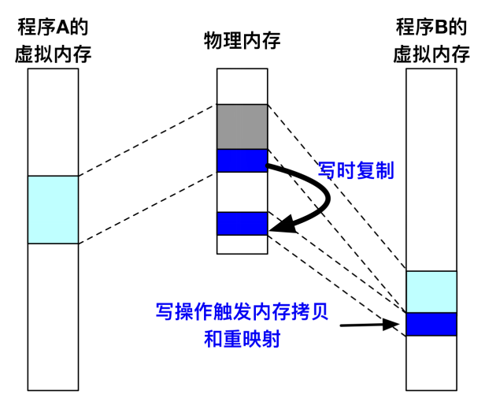
</div>

一个很典型的应用场景就是 fork()。fork() 子进程后，父子进程的**虚拟地址空间内容几乎相同**（但各自独立）。如果立即复制所有物理页，时间和内存开销较大。当他们想写入某个**共享页**时，由于页表项设成 `Read_Only`，CPU 触发权限异常，于是分配一个新的物理页并将原物理页的内容复制到新物理页，同时刷新映射。

## 物理内存管理


