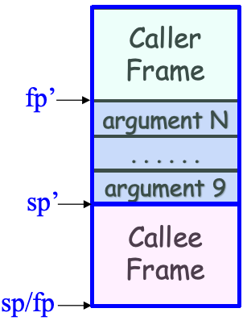

<h1 style="font-family: '仿宋', 'FangSong', 'Times New Roman', serif; color: orange; font-size: 2em; font-weight: bold; text-align: center; border-bottom: none; margin-bottom: 0;">操作系统进阶</h1>
<p style="font-family: 'Times New Roman', serif; font-size: 1em; text-align: right; margin-top: 0;">Livia Tassel</p>
<div style="font-family: 'Times New Roman', 'FangSong', '仿宋', serif;">

[TOC]

---

# 操作系统简介

> 1. 操作系统的定义？
  操作系统的边界是相对的，除去**应用、硬件**之外的都可以称为操作系统。例如 Java 虚拟机跑在安卓上就属于操作系统的一部分，而跑在 Linux 上就属于应用。
> 2. 操作系统的功能？
>   - **服务**应用、**管理**应用
>   - **管理**硬件、**抽象**硬件

# ARM 汇编基础

> 1. ARM AArch64 里通常有 **31 个 64 位通用寄存器 X0\~X30**，W0\~W30 是它们的低 32 位视图，不是另外独立的 31 个寄存器。
> 2. 在 ARM 中，**简单算式**可以作为某些汇编指令的**源操作数**，如 `add x2, x2, x2, lsl #1` 等价于 `x2 = x2 + (x2 << 1)`。
> 3. 内存通常由**字节**寻址，常见的寻址模式有**基地址模式**和**基地址加偏移量模式**。前者格式 [$r_b$]，后者格式 [$r_b, offset$]。如 `ldr  x2, [x0, x1, lsl #3]`，表示基地址是 `x2`，偏移量是 `x0 + (x1 << 3)`，此处偏移量左移 3 位是假定单个元素占 8 字节。
> 4. 在 ARM 中，条件跳转是否发生由**条件码**决定。条件码是一组**标志位**的统称，由 `PSTATE` 寄存器维护，包括 `N`、`Z`、`C`、`V` 四个标志位。
>    - `N`（Negative）：结果负时置 1。
>    - `Z`（Zero）：结果 0 时置 1。
>    - `C`（Carry）：无符号运算产生进位或借位时置 1。
>    - `V`（Overflow）：有符号运算发生溢出时置 1。
>    - 普通的 `add`、`sub` 通常不会改变条件码；带 `s` 后缀的指令会改变条件码，如 `adds`、`subs`。`cmp x0, x1` 本质上等价于执行一次 `subs` 但不存结果。所以，b.eq、b\.ne、b\.lt 这种条件跳转，跳不跳都取决于 “**最近一次改变条件码的指令**”。
>    - 比如：
>      ```asm
>      cmp x0, x1      // 比较 x0 和 x1，置条件码
>      b.eq label      // 如果 x0 == x1，则跳转到 label
>      b.lt label      // 如果 x0 < x1，则跳转到 label
>      b.lo label      // 如果 x0 < x1，则跳转到 label
>      ```

## 函数调用

> 函数调用是另一种形式的**无条件跳转**。但也有其特别之处，比如调用后返回，涉及传参与返回值，局部变量等。

### 调用指令

- `bl label` 或 `blr Rn`，其中 Rn 表示一个寄存器，即跳转到 Rn 寄存器中存储的地址去。
- **返回地址**存储在 LR 寄存器（通用寄存器 x30 的别名）中。

### 返回指令

- `ret` 跳转到 LR 指向的返回地址。

### 栈帧

CPU 里只有一个 LR，当出现**多级调用**时，新的 `bl` 将覆盖原来的 LR。因此，对于**非叶子函数**，调用前必须把 LR 的值存到栈帧上。**栈帧**是函数在运行时开辟的一段内存空间，存放返回地址、上一个栈帧位置以及局部变量等。

> 高地址
 ┌────────────────────┐
 │ main 的栈帧
 ├────────────────────┤
 │ f(3) 的栈帧
 ├────────────────────┤
 │ f(2) 的栈帧
 ├────────────────────┤
 │ f(1) 的栈帧
 ├────────────────────┤
 │ f(0) 的栈帧
 └────────────────────┘
  低地址

因此，栈帧可以类比成一个没有字段名的**结构体**，但注意真实机器上并不以结构体形式存储，编译器仅用固定偏移访问栈帧中的不同位置：
```c
struct StackFrame {
    uint64_t saved_x29;
    uint64_t saved_lr;
    uint64_t local_variables;
    uint64_t temporary_values;
};
```

压栈代码：
```asm
stp x29, x30, [sp, #-16]!
mov x29, sp
```

其中，x29 通常作为**帧指针 FP**。stp x29, x30, [sp, #-16]! 表示先移动栈顶指针，再把旧的 x29 和 x30 依次存到当前栈帧中。注意，栈指针 sp 值随程序执行上下浮动，帧指针 fp 赋值后通常不动。

返回代码：
```asm
ldp x29, x30, [sp], #16
ret
```
其中，ldp 表示从栈帧中恢复旧的 x29 和 x30。ret 默认跳转到 x30 中存的地址。

### 传参与返回值

> Caller 利用 **X0\~X7 进行传参**，Callee 利用 **X0 收返回值**。然而，当 Caller 传参数大于 8 个时，可以借助栈帧来传剩余参数。 Callee 通过 “sp + 偏移量” 来访问。

<div align="center">
  
</div>

### 寄存器保存

> 不同的函数可以共同访问一批**通用寄存器**，因此容易实现传参和返回。不过，也容易出现**冲突覆盖**，若调用一次就将所有 31 个寄存器都压入栈中显然性能极差。

规定 **X9\~X15** 由 Caller 在调用前自行将**有效值**保存到栈帧中；**X19\~X28** 由 Callee 返回前自行将**修改前的有效值**从栈帧中恢复。即前者 Callee 可以随意使用且返回前不用保证和原值一致，后者如果 Callee 想用就必须先保存后恢复。

### 局部变量

